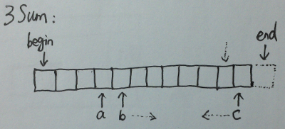

# 3Sum Closest

Given an array S of n integers, find three integers in S such that the sum is closest to a given number, target. Return the sum of the three integers. You may assume that each input would have exactly one solution.

    For example, given array S = {-1 2 1 -4}, and target = 1.

    The sum that is closest to the target is 2. (-1 + 2 + 1 = 2).

**Analysis:**
```
This issue is similar with 3Sum, but don't need to skip duplicate item.
```

**Java:**
```java
public class Solution {
    public int threeSumClosest(int[] nums, int target) {
        int ret = 0;
        int delta = Integer.MAX_VALUE;
        Arrays.sort(nums);

        for (int a = 0; a < nums.length - 2; a++) {
            int b = a + 1;
            int c = nums.length - 1;

            while (b < c) {
                int sum = nums[a] + nums[b] + nums[c];
                if (Math.abs(sum - target) < Math.abs(delta)) {
                    delta = sum - target;
                    ret = sum;
                }

                if (sum == target) return ret;
                else if (sum > target) c--;
                else b++;
            }
        }

        return ret;
    }
}
```

**C++:**



```c++
class Solution {
public:
    int threeSumClosest(vector<int> &num, int target) {
        int result = 0;
        int min_gap = INT_MAX;
        sort(num.begin(), num.end());

        for (auto a = num.begin(); a < prev(num.end(), 2); a++) {
            auto b = next(a);
            auto c = prev(num.end());

            while (b < c) {
                const int sum = *a + *b + *c;
                const int gap = abs(sum - target);

                if (gap < min_gap) {
                    result = sum;
                    min_gap = gap;
                }

                if (sum < target) b++;
                else c--;
            }
        }
        return result;
    }
};
```
