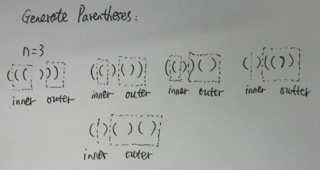

# Generate Parentheses

Given n pairs of parentheses, write a function to generate all combinations of well-formed parentheses.

    For example,

    given n = 3, a solution set is:

    "((()))", "(()())", "(())()", "()(())", "()()()"

**Java: (resursive)**



```java
public class Solution {
    public List<String> generateParenthesis(int n) {
        ArrayList<String> result = new ArrayList<>();
        if (n == 0) {
            result.add("");
            return result;
        }
        if (n == 1) {
            result.add("()");
            return result;
        }

        for (int i = 0; i < n; i++)
            for (String inner : generateParenthesis(i))
                for (String outer : generateParenthesis(n - 1 - i))
                    result.add("(" + inner + ")" + outer);
        return result;
    }
}
```

**Java: (backtracking)**
```java
public class Solution {
    public List<String> generateParenthesis(int n) {
        List<String> list = new ArrayList<>();
        backtrack(list, "", 0, 0, n);
        return list;
    }

    private void backtrack(List<String> list, String str, int open, int close, int max) {
        if (str.length() == max * 2) {
            list.add(str);
            return;
        }

        if (open < max) backtrack(list, str + "(", open + 1, close, max);
        if (close < open) backtrack(list, str + ")", open, close + 1, max);
    }
}
```

**C++:**
```c++
class Solution {
public:
    vector<string> generateParenthesis(int n) {
        if (n == 0) return vector<string>(1, "");
        if (n == 1) return vector<string>(1, "()");
        vector<string> result;

        for (int i = 0; i < n; i++)
            for (auto inner : generateParenthesis(i))
                for (auto outer : generateParenthesis(n - 1 - i))
                    result.push_back("(" + inner + ")" + outer);
        return result;
    }
};
```
