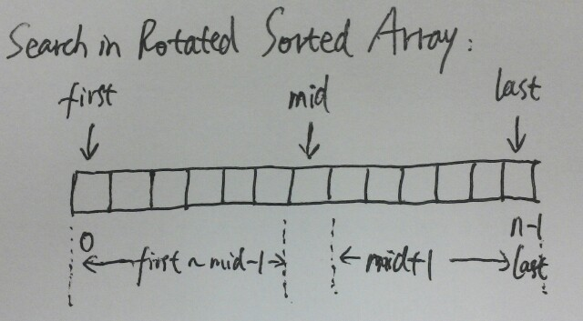

# Search in Rotated Sorted Array

Suppose a sorted array is rotated at some pivot unknown to you beforehand.

    (i.e., 0 1 2 4 5 6 7 might become 4 5 6 7 0 1 2).

You are given a target value to search. If found in the array return its index, otherwise return -1.

You may assume no duplicate exists in the array.

**Analysis:**

Solution 1:

The idea is that when rotating the array, there must be one half of the array that is still in sorted order.

For example, 6 7 1 2 3 4 5, the order is disrupted from the point between 7 and 1.

So when doing binary search, we can make a judgement that which part is ordered and whether the target is in that range, if yes, continue the search in that half, if not continue in the other half.

Solution 2:

Let's say nums looks like this: [12, 13, 14, 15, 16, 17, 18, 19, 0, 1, 2, 3, 4, 5, 6, 7, 8, 9, 10, 11]

Because it's not fully sorted, we can't do normal binary search. But here comes the trick:

    If target is let's say 14, then we adjust nums to this, where "inf" means infinity:
    [12, 13, 14, 15, 16, 17, 18, 19, inf, inf, inf, inf, inf, inf, inf, inf, inf, inf, inf, inf]

    If target is let's say 7, then we adjust nums to this:
    [-inf, -inf, -inf, -inf, -inf, -inf, -inf, -inf, 0, 1, 2, 3, 4, 5, 6, 7, 8, 9, 10, 11]

And then we can simply do ordinary binary search.

Of course we don't actually adjust the whole array but instead adjust only on the fly only the elements we look at. And the adjustment is done by comparing both the target and the actual element against nums[0].

**Java: (Solution 1)**
```java
public class Solution {
    public int search(int[] nums, int target) {
        int first = 0;
        int last = nums.length - 1;

        while (first <= last) {
            int mid = first + (last - first) / 2;
            if (nums[mid] == target) return mid;

            if (nums[first] <= nums[mid]) {
                if (nums[first] <= target && target <= nums[mid]) {
                    last = mid - 1;
                } else {
                    first = mid + 1;
                }
            } else {
                if (nums[mid] <= target && target <= nums[last]) {
                    first = mid + 1;
                } else {
                    last = mid - 1;
                }
            }
        }

        return -1;
    }
}
```

**Java: (Solution 2)**
```java
public class Solution {
    public int search(int[] nums, int target) {
        int lo = 0;
        int hi = nums.length - 1;

        while (lo <= hi) {
            int mid = (lo + hi) / 2;
            if (nums[mid] == target) return mid;

            // if nums[mid] and target are "on the same side" of nums[0], we just take nums[mid].
            int num;
            if ((nums[mid] < nums[0]) == (target < nums[0])) {
                num = nums[mid];
            } else {
                num = target < nums[0] ? Integer.MIN_VALUE : Integer.MAX_VALUE;
            }

            if (num < target) lo = mid + 1;
            else hi = mid - 1;
        }

        return -1;
    }
}
```

**C++:**



```c++
class Solution {
public:
    int search(int A[], int n, int target) {
        int first = 0;
        int last = n - 1;
        while (first <= last) {
            int mid = (first + last) / 2;
            if (A[mid] == target) return mid;

            if (A[first] <= A[mid]) {
                if (A[first] <= target && target <= A[mid])
                    last = mid - 1;
                else
                    first = mid + 1;
            } else {
                if (A[mid] <= target && target <= A[last])
                    first = mid + 1;
                else
                    last = mid - 1;
            }
        }
        return -1;
    }
};
```
