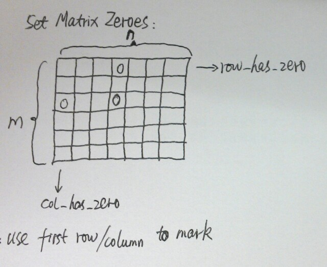

# Set Matrix Zeroes

Given a m x n matrix, if an element is 0, set its entire row and column to 0. Do it in place.

Follow up:

    Did you use extra space?
    A straight forward solution using O(mn) space is probably a bad idea.
    A simple improvement uses O(m + n) space, but still not the best solution.
    Could you devise a constant space solution?

**Java:**
```java
public class Solution {
    public void setZeroes(int[][] matrix) {
        Set<Integer> rows = new HashSet<Integer>();
        Set<Integer> cols = new HashSet<Integer>();

        for (int i = 0; i < matrix.length; i++) {
            for (int j = 0; j < matrix[0].length; j++) {
                if (matrix[i][j] == 0) {
                    rows.add(i);
                    cols.add(j);
                }
            }
        }

        for (Integer row : rows) {
            for (int m = 0; m < matrix[0].length; m++) {
                matrix[row][m] = 0;
            }
        }

        for (Integer col: cols) {
            for (int m = 0; m < matrix.length; m++) {
                matrix[m][col] = 0;
            }
        }
    }
}
```

**C++:**


```c++
class Solution {
public:
    void setZeroes(vector<vector<int> > &matrix) {
        const int m = (int)matrix.size();
        const int n = (int)matrix[0].size();
        bool row_has_zero = false;
        bool col_has_zero = false;

        // mark if first row has zero
        for (int i = 0; i < n; i++) {
            if (matrix[0][i] == 0) {
                row_has_zero = true;
                break;
            }
        }

        // mark if first col has zero
        for (int i = 0; i < m; i++) {
            if (matrix[i][0] == 0) {
                col_has_zero = true;
                break;
            }
        }

        // use first row/col to mark zero
        for (int i = 1; i < m; i++)
            for (int j = 1; j < n; j++)
                if (matrix[i][j] == 0) {
                    matrix[0][j] = 0;
                    matrix[i][0] = 0;
                }

        // set related item to zero
        for (int i = 1; i < m; i++)
            for (int j = 1; j < n; j++)
                if (matrix[i][0] == 0 || matrix[0][j] == 0)
                    matrix[i][j] = 0;

        if (row_has_zero)
            for (int i = 0; i < n; i++)
                matrix[0][i] = 0;

        if (col_has_zero)
            for (int i = 0; i < m; i++)
                matrix[i][0] = 0;
    }
};
```
