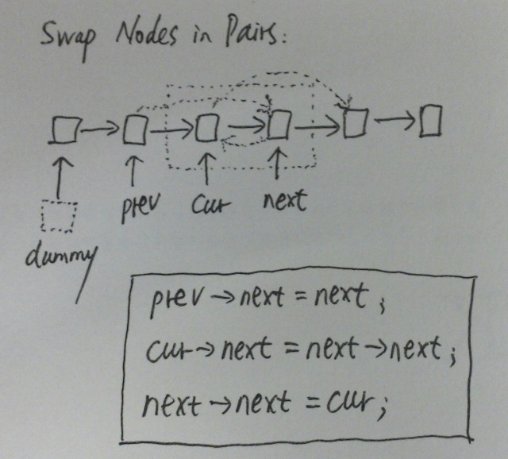

# Swap Nodes in Pairs

Given a linked list, swap every two adjacent nodes and return its head.

    For example,
    Given 1->2->3->4, you should return the list as 2->1->4->3.

Your algorithm should use only constant space. You may not modify the values in the list, only nodes itself can be changed.

**Analysis**

- Create a dummy node and point to head.
- Swap pointer
- Move to next node


    dummy--->1--->2--->3--->4
      |      |    |
     pre    node next

    dummy--->2--->1--->3--->4
      |      |    |
     pre    next node

    dummy--->2--->1--->3--->4
                  |    |    |
                 pre  node next

**Java: (modify values in list)**
```java
/**
 * Definition for singly-linked list.
 * public class ListNode {
 *     int val;
 *     ListNode next;
 *     ListNode(int x) { val = x; }
 * }
 */
public class Solution {
    public ListNode swapPairs(ListNode head) {
        int index = 1; // make index start from 1
        int tmp = 0;
        ListNode node = head;

        while (node != null) {
            if (index++ % 2 == 1) {
                tmp = node.val;
                if (node.next != null) node.val = node.next.val;
            } else {
                node.val = tmp;
            }
            node = node.next;
        }

        return head;
    }
}
```

**Java: (swap nodes)**
```java
/**
 * Definition for singly-linked list.
 * public class ListNode {
 *     int val;
 *     ListNode next;
 *     ListNode(int x) { val = x; }
 * }
 */
public class Solution {
    public ListNode swapPairs(ListNode head) {
        ListNode dummy = new ListNode(-1);
        dummy.next = head;
        ListNode pre = dummy;
        ListNode node = head;

        while (node != null) {
            ListNode next = node.next;
            if (next == null) return dummy.next;

            // swap pointer
            pre.next = next;
            node.next = next.next;
            next.next = node;

            // move to next round
            pre = node;
            node = node.next;
        }

        return dummy.next;
    }
}
```

**Java: (recursive)**
```java
/**
 * Definition for singly-linked list.
 * public class ListNode {
 *     int val;
 *     ListNode next;
 *     ListNode(int x) { val = x; }
 * }
 */
public class Solution {
    public ListNode swapPairs(ListNode head) {
        if (head == null || head.next == null) return head;
        ListNode second = head.next;
        ListNode third = second.next;

        second.next = head;
        head.next = swapPairs(third);

        return second;
    }
}
```
**C++:**



```c++
/**
 * Definition for singly-linked list.
 * struct ListNode {
 *     int val;
 *     ListNode *next;
 *     ListNode(int x) : val(x), next(NULL) {}
 * };
 */
class Solution {
public:
    ListNode *swapPairs(ListNode *head) {
        if (head == nullptr || head->next == nullptr) return head;
        ListNode dummy(-1);
        dummy.next = head;

        for (ListNode *prev = &dummy, *cur = prev->next, *next = cur->next;
             next;
             prev = cur, cur = cur->next, next = cur ? cur->next : nullptr)
        {
            prev->next = next;
            cur->next = next->next;
            next->next = cur;
        }

        return dummy.next;
    }
};
```
