# 数据结构 - 二叉树（Binary Tree）

## I. 树

#### 1. 树的定义

树的递归定义：树(Tree)是 n(n≥0) 个结点的有限集T，T为空时称为空树，否则它满足如下两个条件：

1. 有且仅有一个特定的称为根(Root)的结点；

2. 其余的结点可分为 m(m≥0)个互不相交的子集 Tl，T2，…，Tm，其中每个子集本身又是一棵树，并称其为根的子树(Subree)。

#### 2. 树结构的基本术语

##### （1） 结点的度 (Degree)

- 树中的一个结点拥有的子树数称为该结点的度(Degree)。
- 一棵树的度是指该树中结点的最大度数。
- 度为零的结点称为叶子(Leaf)或终端结点。
- 度不为零的结点称分支结点或非终端结点。
- 除根结点之外的分支结点统称为内部结点。
- 根结点又称为开始结点。

##### （2） 孩子 (Child) 和双亲 (Parents)

- 树中某个结点的子树之根称为该结点的孩子(Child)或儿子，相应地，该结点称为孩子的双亲(Parents)或父亲。
- 同一个双亲的孩子之间互称为兄弟(Sibling)。

##### （3）祖先 (Ancestor) 和子孙 (Descendant)

- 路径（path）
      若树中存在一个结点序列k1，k2，…，ki，使得ki是ki+1的双亲(1≤il到kj的一条路径(Path)或道路。
      路径的长度指路径所经过的边(即连接两个结点的线段)的数目，等于j-1。

  **注意：**
      若一个结点序列是路径，则在树的树形图表示中，该结点序列"自上而下"地通过路径上的每条边。
      从树的根结点到树中其余结点均存在一条惟一的路径。

- 祖先(Ancestor)和子孙(Descendant)
      若树中结点 k 到 ks 存在一条路径，则称 k 是 ks 的祖先(Ancestor)，ks 是 k 的子孙(Descendant)。
      一个结点的祖先是从根结点到该结点路径上所经过的所有结点，而一个结点的子孙则是以该结点为根的子树中的所有结点。

  **约定：**
    　结点 k 的祖先和子孙不包含结点 k 本身。

##### （4）结点的层数 (Level) 和树的高度 (Height)

- 结点的层数(Level)从根起算：
      根的层数为1
      其余结点的层数等于其双亲结点的层数加1。
      双亲在同一层的结点互为堂兄弟。
- 树中结点的最大层数称为树的高度(Height)或深度(Depth)。
  **注意:** 很多文献中将树根的层数定义为0。

##### （5）有序树 (OrderedTree) 和无序树 (UnoderedTree)

- 若将树中每个结点的各子树看成是从左到右有次序的(即不能互换)，则称该树为有序树(OrderedTree)；否则称为无序树(UnoderedTree)。
- 若不特别指明，一般讨论的树都是有序树。

##### （6）森林(Forest)

- 森林(Forest)是 m(m≥0) 棵互不相交的树的集合。
- 树和森林的概念相近。删去一棵树的根，就得到一个森林；反之，加上一个结点作树根，森林就变为一棵树。

#### 3. 树的存储结构

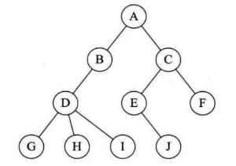

- **双亲表示法**
在每个结点中，附设一个指示器指示其双亲结点的位置

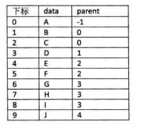

- **孩子表示法**
每个结点有多个指针域，其中每个指针指向一颗子树的根结点

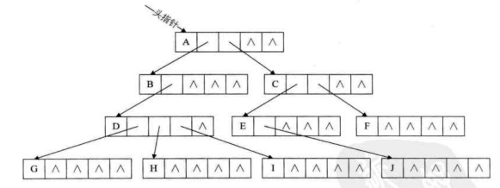

- **孩子兄弟表示法**
设置两个指针，分别指向该结点的第一个孩子和此结点的兄弟

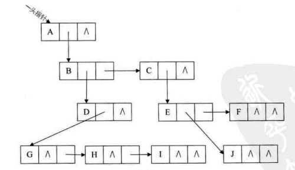

## II. 二叉树

#### 1. 二叉树的定义

最多有两棵子树的有序树，称为二叉树。二叉树是一种特殊的树。

递归定义：二叉树是 n(n>=0)个有限结点构成的集合。N=0 称为空二叉树；n>0 的二叉树由一个根结点和两互不相交的，分别称为左子树和右子树的二叉树构成。

二叉树中任何结点的第1个子树称为其左子树，左子树的根称为该结点的左孩子；二叉树中任何结点的第2个子树称为其右子树，左子树的根称为该结点的右孩子。

#### 2. 二叉树的分类

**斜树**：所有的结点都只有左子树的二叉树叫左斜树，所有的结点都只有右子树的二叉树叫右斜树。

**满二叉树**：除最后一层无任何子节点外，每一层上的所有结点都有两个子结点。

**完全二叉树**：除了最下面一层，其他层结点都是饱满的，并且最下层上的结点都集中在该层最左边的若干位置上。（满二叉树也是完全二叉树）

**非完全二叉树**：既不是满二叉树，也非完全二叉树。

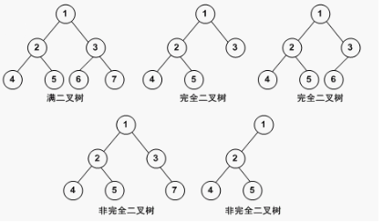

#### 3. 二叉树的遍历

前序遍历（先根遍历）：根左右。

后序遍历（后根遍历）：左右根。

中序遍历（中根遍历）：左根右。

层次遍历：一层一层自左向右。

> 实例：

> 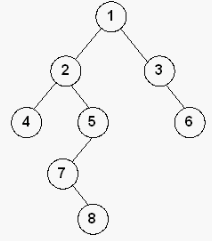

> 图中前序遍历结果是：1,2,4,5,7,8,3,6；

> 图中中序遍历结果是：4,2,7,8,5,1,3,6；

> 图中后序遍历结果是：4,8,7,5,2,6,3,1；

> 图中层次遍历结果是：1,2,3,4,5,6,7,8；

已知前序遍历序列和中序遍历序列， 可以唯一确定一颗二叉树。

已知后序遍历序列和中序遍历序列， 可以唯一确定一颗二叉树。

已知前序遍历序列和后序遍历序列， *不能唯一确定*一颗二叉树。

#### 4. 二叉树的一些重要特性

1. 在二叉树的第 i 层上最多有 2^(n-1)^ 个结点（i>=1）；
       以图1为例：任一图中第2层，最多只能有2个结点。验证正确！

2. 深度为k的二叉树最多有 2^k^ - 1 个结点（K>=1）；
       以图1为例：图中所有二叉树深度为3，因此，该些二叉树最多有2^3 -1 = 7个结点，验证正确！

3. 对任何一颗二叉树，如果其叶子结点数为 n0，度为 2 的结点数为 n2，则 n0 = n2 + 1；
       以图1为例：看最后一个非完全二叉树，图中所示，叶子结点n0 = 2；度为2的结点n2 = 1(结点2)；则2 = 1 + 1。验证正确！

4. 具有 n 个结点的完全二叉树的深度为 ⌊log~2~n⌋ + 1 （⌊x⌋ 表示不大于x的最大整数）

5. 如果对一颗有 n 个结点的完全二叉树（其深度为 ⌊log~2~n⌋ + 1）的结点按层序编号（从第1层到 ⌊log~2~n⌋ + 1层，每层从左到右），则对任一结点 i(1<=i<=n)，（⌊⌋ 向下取整符号） 有：

    > 如果 i=1，则结点 i 无父节点，是二叉树的根；如果 i>1，则父节点是 ⌊i/2⌋ ；
       以图1左侧的完全二叉树为例：若i = 3，则i > 1，⌊3/2⌋ = 1，3的根结点为1。验证正确！

    > 如果 2i>n，则结点 i 为叶子结点，无左子结点；否则，其左子结点是结点 2i；
       以图1左侧的完全二叉树为例：若i = 3，因 n = 5，则2i>n，由此推出3为叶子结点。若i = 2，因 n = 5，则2i<n，由此推出2的左子结点为4。验证正确！

    > 如果 2i+1>n，则结点 i 无右子结点，否则，其右子结点是结点 2i + 1。
       以图1左侧的完全二叉树为例：上一条否命题求出了左子树结点，而这条正好求出了右子树结点。结点i=2的右子树结点为5，验证正确！

## III. 树、森林和二叉树的转换

#### 1. 树转换为二叉树

- 加线：在各兄弟结点之间用虚线相连。可理解为每个结点的兄弟指针指向它的一个兄弟。

- 抹线：对每个结点仅保留它与其最左一个孩子的连线，抹去该结点与其他孩子之间的连线。可理解为每个结点仅有一个孩子指针，让它指向自己的长子。

- 层次整理：把虚线改为实线从水平方向向下旋转45℃，成右斜下方向。原树中实线成左斜下方向。这样就树的形状成呈现出一棵二叉树。

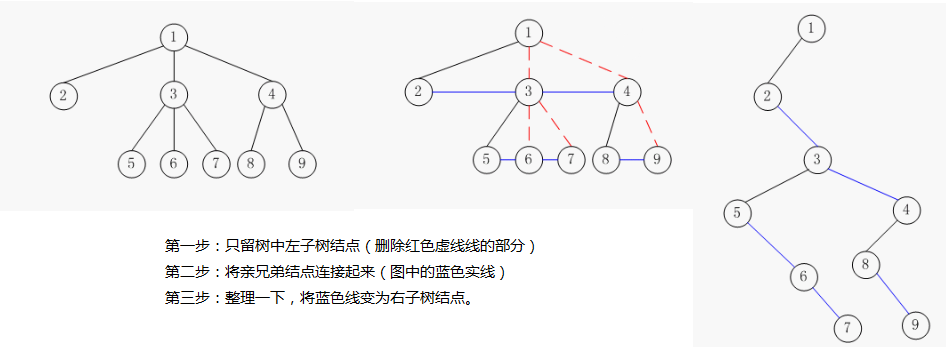

#### 2. 森林转换为二叉树

- 将森林中的每棵树变为二叉树。
- 因为转换所得的二叉树的根结点的右子树均为空，故可将各二叉树的根结点视为兄弟从左至右连在一起，就形成了一棵二叉树。

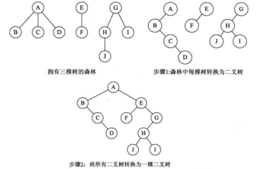

#### 3. 二叉树转换为树

- 加线：若某结点i是双亲结点的左孩子，则将该结点i的右孩子以及当且仅当连续地沿着右孩子的右链不断搜索到所有右孩子，都分别与结点i的双亲结点用虚线连接。

- 抹线：把原二叉树中所有双亲结点与其右孩子的连线抹去。这里的右孩子实质上是原一般树中结点的兄弟，抹去的连线是兄弟间的关系。

- 层次整理：把虚线改为实线，把结点按层次排列。

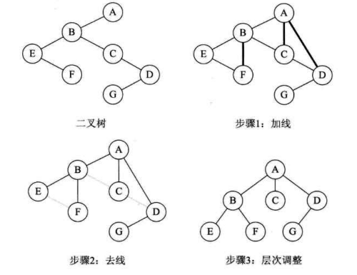

#### 4. 二叉树转换为森林

- 抹线：将二叉树根结点与其右孩子之间的连线，以及沿着此右孩子的右链连续不继搜索到的右孩子间的连线抹掉。这样就得到了若干棵根结点没有右子树的二叉树。

- 将得到的这些二叉树用前述方法分别转化成一般树。

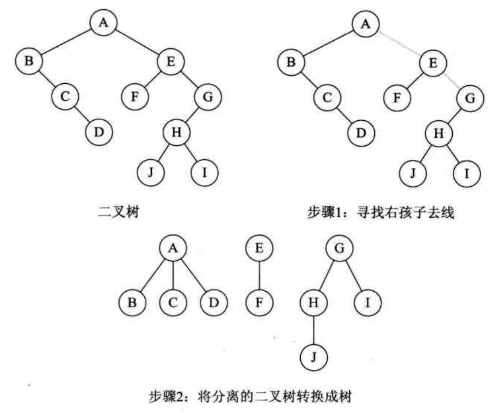

## IV. 几种特殊的二叉树

#### 1. 二叉排序树 - BST

二叉排序树(Binary Sort Tree)又称二叉查找树(Binary Search Tree)。

其定义为：二叉排序树或者是空树，或者是满足如下性质的二叉树：
- 若它的左子树非空，则左子树上所有结点的值均小于根结点的值；
- 若它的右子树非空，则右子树上所有结点的值均大于根结点的值；
- 左、右子树本身又各是一棵二叉排序树。

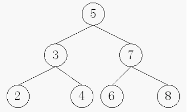

**对二叉排序树的一些操作**

- **查找**

      若根结点的关键字值等于查找的关键字，成功。
      否则，若小于根结点的关键字值，递归查左子树。
      若大于根结点的关键字值，递归查右子树。
      若子树为空，查找不成功。

- **插入**

      如果相同键值的结点已在查找二叉树中，则不再插入；
      如果查找二叉树为空树，则以新结点为查找二叉树；
      将要插入结点的键值与插入后的父结点的键值比较，就能确定新结点是父结点的左子结点，还是右子结点，并进行相应插入，新插入的结点一定是一个新添加的叶子结点。

- **删除**

      若待删除的结点p是叶子结点，则直接删除该结点；
      若待删除的结点p只有一个子节点，则将这个子结点与待删除结点的父结点直接连接，然后删除节点p；
      若待删除的结点p有两个子结点，则在其左子树上，用中序遍历寻找关健值最大的结点s，用结点s的值代替结点p的值，然后删除节点s。

#### 2. 最优二叉树 - 哈夫曼树（Huffman tree）

最优二叉树是带权路径长度最小的二叉树。

**基本术语**

- 树的路径长度：是从树根到树中每一个结点的路径长度之和。在结点数目相同的二叉树中，完全二叉树的路径长度最短。
- 结点的权：根据应用的需要给树的结点赋的权值。
- 带权路径长度：结点到树根之间的路径长度与该结点上权的乘积，称为结点的带权路径长度。
- 树的带权路径长度（树的代价）:树中所有叶结点的带权路径长度之和，称为树的代价。

**构造哈夫曼树**

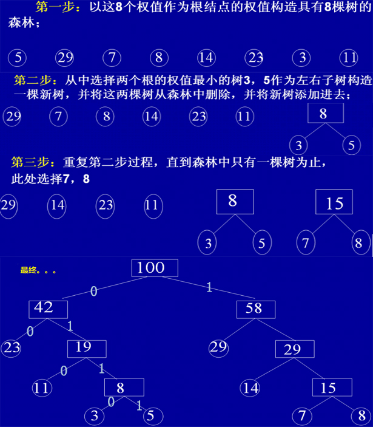

**哈夫曼编码**

求出哈夫曼树后，以上图为例，只需人为规定左侧为0，右侧为1，那么结点23的编码是：00；结点11的编码是：010。哈夫曼编码是一种应用广泛且非常有效的数据压缩技术，该技术一般可将数据文件压缩掉20%-90%，其压缩效率取决于被压缩文件的特征。

#### 3. 线索二叉树 - Threaded Binary Tree

二叉树的遍历本质上是将一个复杂的非线性结构转换为线性结构，使每个结点都有了唯一前驱和后继（第一个结点无前驱，最后一个结点无后继）。

对于二叉树的一个结点，查找其左右子女是方便的，其前驱后继只有在遍历中得到。为了容易找到前驱和后继，有两种方法。一是在结点结构中增加向前和向后的指针fwd和bkd，这种方法增加了存储开销，不可取；二是利用二叉树的空链指针。

现将二叉树的结点结构重新定义如下：

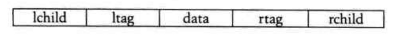

对于标志域规定如下：

Lbit=0，Lchild是通常的指针；Lbit=1，Lchild是线索；
Rbit=0，Rchild是通常的指针；Rbit=1，Rchild是线索；

**将二叉树转化为线索二叉树**

第一步：将二叉树的前序遍历、中序遍历、后序遍历的顺序写下来:

下图前序遍历顺序：A B D E H C F G I
中序遍历：D B H E A F C G I
后序遍历：D H E B F I G C A

第二步：参照遍历的顺序，找到各个结点对应的前驱和后驱，如下图：

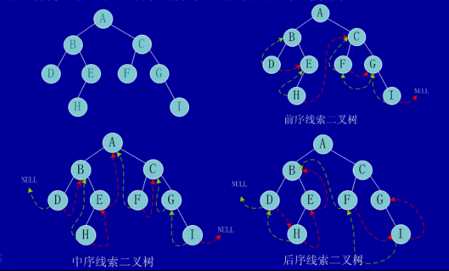

绿色线表示前驱；红色线表示后驱。

#### 4. 平衡二叉树 - AVL

**平衡二叉树的定义**

一棵空树或它的左右两个子树的高度差的绝对值不超过1，并且左右两个子树都是一棵平衡二叉树。平衡二叉树的提出大大降低了操作的时间复杂度。

**动态调平衡**

LL型平衡旋转（单向右旋平衡处理）

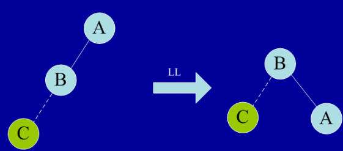

RR型平衡旋转（单向左旋转平衡处理）

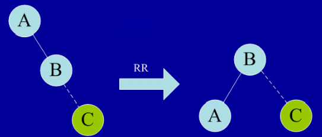

LR型平衡旋转（双向旋转，先左后右）

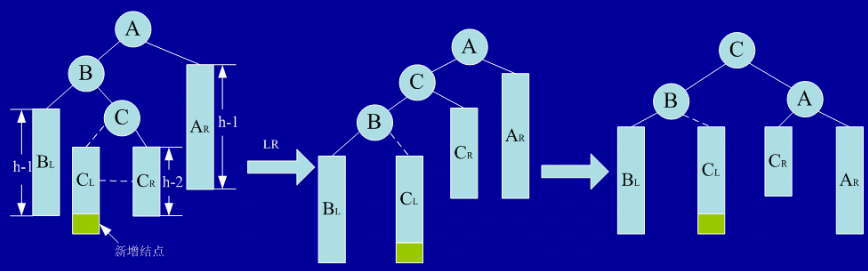

RL型平衡旋转（双向旋转，先右后左）

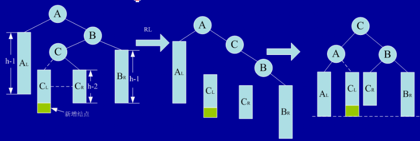

**平衡二叉树性能分析**

- 性能优势：
平衡二叉树的优势在于不会出现普通二叉查找树的最差情况。其查找的时间复杂度为O(logN)。

- 缺陷：
      (1) 很遗憾的是，为了保证高度平衡，动态插入和删除的代价也随之增加。解决这一问题可以采用《红黑树》这种更加高效的查找结构。

      (2) 所有二叉查找树结构的查找代价都与树高是紧密相关的，能否通过减少树高来进一步降低查找代价呢。我们可以通过《多路查找树/B-树/B+树》的结构来做到这一点。

      (3) 在大数据量查找环境下(比如说系统磁盘里的文件目录，数据库中的记录查询等)，所有的二叉查找树结构(BST、AVL、RBT)都不合适。如此大规模的数据量（几G数据），全部组织成平衡二叉树放在内存中是不可能做到的。那么把这棵树放在磁盘中吧。问题就来了：假如构造的平衡二叉树深度有1W层。那么从根节点出发到叶子节点很可能就需要1W次的硬盘IO读写。大家都知道，硬盘的机械部件读写数据的速度远远赶不上纯电子媒体的内存。查找效率在IO读写过程中将会付出巨大的代价。在大规模数据查询这样一个实际应用背景下，平衡二叉树的效率就很成问题了。对这一问题可以通过《多路查找树/B-树/B+树》的结构来优化。

#### 5. 红黑树 - Red-Black Tree

**红黑树的定义**

红黑树是一种“平衡的”二叉查找树，它是一种经典高效的算法，能够保证在最坏的情况下动态集合操作的时间为O(lgn)红黑树上每个结点内含五个域，color，key，left，right，p。如果相应的指针域没有，则设为NIL。

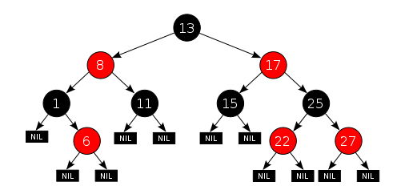

红黑树满足以下全部性质：

    1）每个结点要么是红的，要么是黑的。
    2）根结点是黑的。
    3）每个叶结点，即空结点（NIL）是黑的。
    4）如果一个结点是红的，那么它的俩个儿子都是黑的。
    5）对每个结点，从该结点到其子孙结点的所有路径上包含相同数目的黑结点。

#### 6. 堆 - Heap

堆是一种特殊的二叉完全树。

**堆的正式定义**

一个二叉树V是一个堆，当且仅当它满足以下条件：

- V从根节点至h-1层是完全树
- 所有的叶子节点只存在于h与h-1层上
- 所有到达h层叶子节点的路劲都在到达h-1层叶子节点路径的左侧

**堆有两种：最大堆和最小堆**

最小堆（小顶堆）中每个节点的优先级小于或者等于它的子节点；最大堆（大顶堆）则相反，每个节点的优先级都大于或者等于它的子节点。

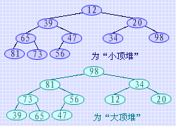

**堆的存储结构**

堆可以使用数组来表示

**堆的应用**
- 优先队列
- 堆排序
