# 数据结构 - 线性表（Linear List）

## I. 数据结构的分类

数据结构是计算机存储、组织数据的方式。常见的数据结构分类方式如下图：

常用的线性结构有：==顺序表(一维数组)，栈，队列，循环队列==。其中，栈和队列只是属于逻辑上的概念，具体实现时可以用顺序存储结构或链式存储结构实现。

## II. 顺序表 - Sequence List

顺序表将元素一个接一个的存入一组连续的存储单元中，在内存物理上是连续的。如下图：

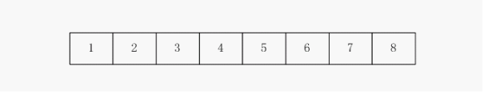

顺序表存储密度较大，节省空间；但需要事先确定容量，在时间性能方面，读运算较快，时间复杂度为O(1)；查找运算为O(n/2)，和链表同样；插入运算和删除运算如果要操作中间一个元素，比如3，那么就需要把3后面的元素全部进行移动，因此时间复杂度相对链表要大一些，插入时间复杂度最好为O(0)或最坏为O(n)；删除时间复杂度为O([n-1]/2)；

## III. 链表 - Linked List

链表拥有很多结点，每个结点前半部分是数据域，后半部分是指针域，指针域指针指向下一个结点；链表可分为==单链表、循环链表和双链表==。

#### 1. 单链表 - Single Linked List

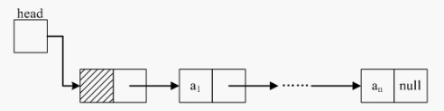

单链表的上一个结点指针指向下一个结点，最后一个结点的指针域为null。

##### 结点的删除

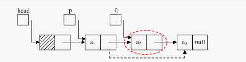

删除一个结点，如删除上图中q结点，只需将p结点中的指针域指向a3，然后将a2释放掉（free）即可。

##### 结点的插入

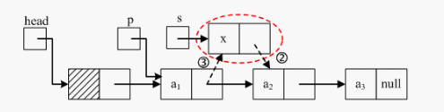

插入一个结点，如插入上图中s结点，首先将s的指针域指向a2（也就是把s的next赋值为p的next），然后将p结点的指针域指向x即可（p的next指向x）。

#### 2. 循环单链表 - Circular Linked List

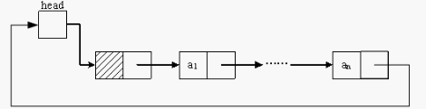

循环链表与单链表唯一不同之处是，循环链表的最后一个结点指针不为空，而是指向头结点。结点的插入和删除和单链表非常相似，就不再示范了。

#### 3. 双链表 - Double Linked List

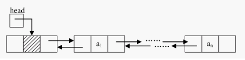

双链表拥有一前一后两个指针域，从两个不同的方向把链表连接起来，如此一来，从两个不同的方向形成了两条链，因此成为双链表。因此，双链表的灵活度要大于单链表。

##### 结点的删除

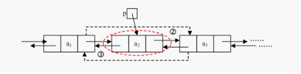

双链表的操作比单链表要稍显复杂（按照单链表思路来做其实也不难），如上图，要删除p节点，首先需要将a1的后驱指向a3，然后将a3的前驱指向a1，最后将p节点释放掉即可。

##### 结点的插入

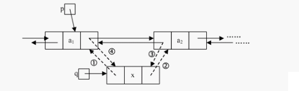

双链表的插入操作如上图所示

#### 4. 循环双链表 - Circular Double Linked List

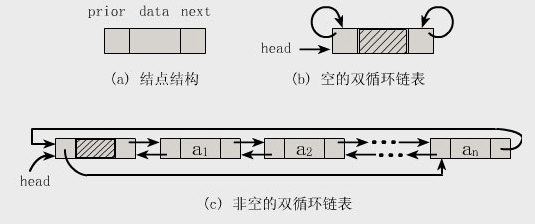

循环双链表与循环单链表唯一不同之处是，循环双链表的最后一个结点指针不为空，而是指向头结点。

#### 5. 静态链表 - Static Linked List
用数组描述的链表叫静态链表。

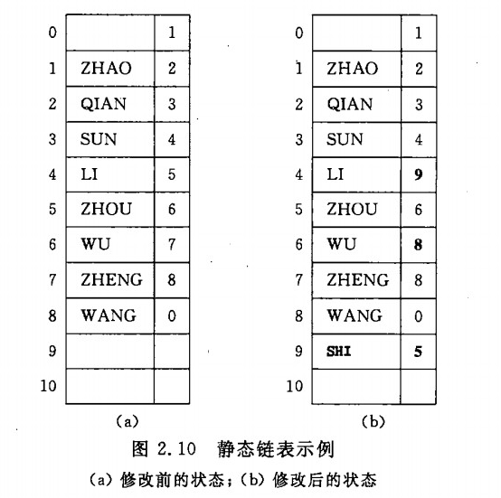

==从空间性能来看，链表的存储密度要差一些，但在容量分配上更灵活一些。从时间性能来看，查找运算与顺序存储相同，插入运算和删除运算的时间复杂度为O(1)，要更优于顺序存储，但读运算则弱一些，为O([n+1]/2)，最好为1，最坏为n==。

## IV. 栈 - Stack

栈属于一个逻辑概念，栈的实现可以用顺序也可以用链式。栈是限定仅在表尾进行插入和删除操作的线性表。它遵循后进先出（Last In First Out）原则，如下图：

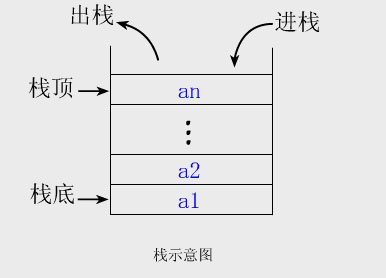

## V. 队列 - Queue

队列是只允许在一端进行插入操作，而在另一端进行删除操作的线性表。它遵循先进先出（Fist In First Out）的原则。

#### 1. 队列 - Queue

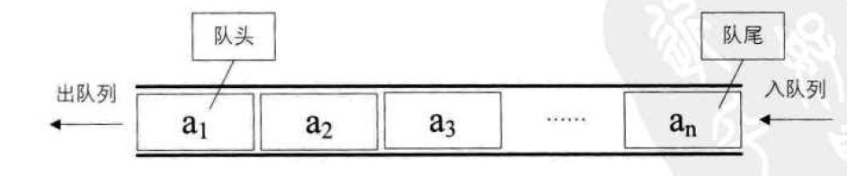

#### 2. 循环队列 - Circular Queue

队列还有一种形式为循环队列，如下图：

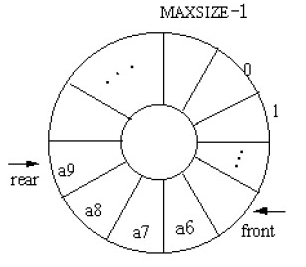

循环队列有两个指针，头指针head和尾指针tail，尾指针一般指向的不是队尾元素实际地址，而是指向实际地址的下一个空地址，因此，循环队列一般牺牲最后一个空间，用来计算该队列是否满了，判断方式是tail+1 = head，既该队列已满。

#### 3. 双端队列 - Deque

双端队列（deque，全名double-ended queue）是一种具有队列和栈的性质的数据结构。双端队列中的元素可以从两端弹出，其限定插入和删除操作在表的两端进行。

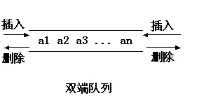

#### 4. 受限的双端队列 - Limited Deque

允许在一端进行插入和删除，但在另一端只允许插入的双端队列叫做输出受限的双端队列，允许在一端进行插入和删除，但在另一端只允许删除的双端队列叫做输入受限的双端队列。

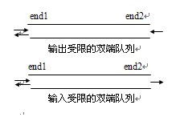

#### 5. 优先队列 - Priority Queue

在优先队列中，元素被赋予优先级。当访问元素时，具有最高优先级的元素最先删除。优先队列具有最高进先出 （largest-in，first-out）的行为特征。
