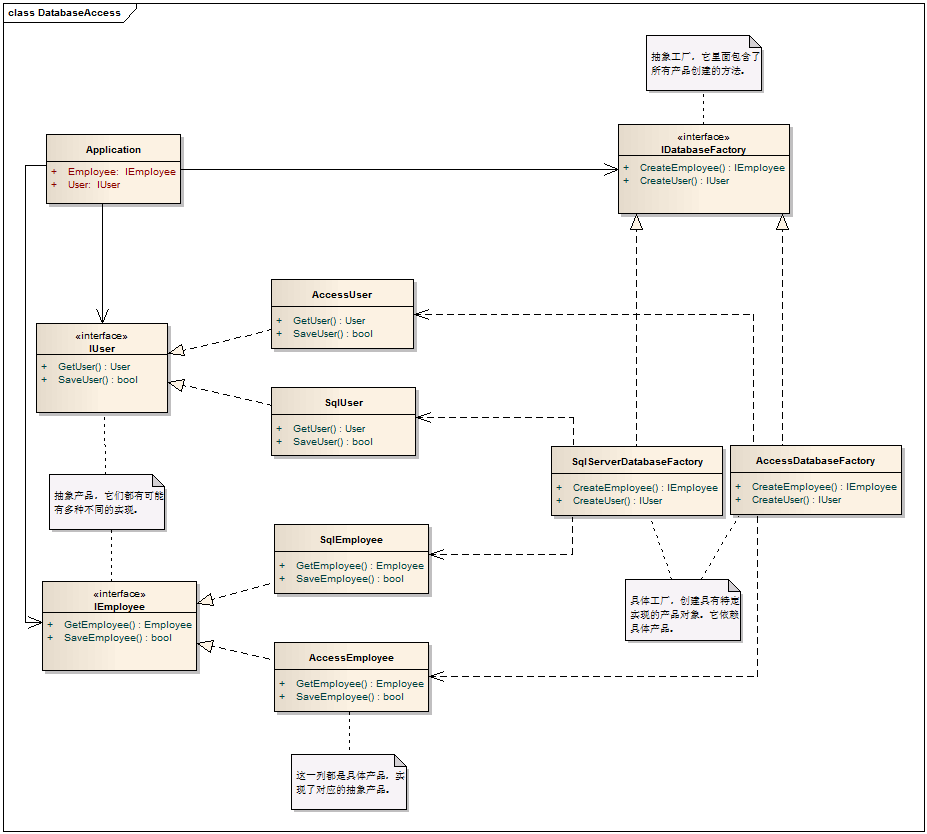

# Abstract Factory Pattern - 抽象工厂模式

#### 1.　概述

　　抽象工厂模式为一个产品家族提供了统一的创建接口。当需要这个产品家族的某一系列的时候，可以从抽象工厂中选出相对应的系列来创建一个具体的工厂类别。

#### 2.　抽象工厂模式中的角色

 　　2.1 抽象工厂（AbstractFactory）：担任这个角色的是工厂方法模式的核心，它是与应用系统商业逻辑无关的。

 　　2.2 具体工厂（ConcreteFactory）：这个角色直接在客户端的调用下创建产品的实例。这个角色含有选择合适的产品对象的逻辑，而这个逻辑是与应用系统的商业逻辑紧密相关的。

 　　2.3 抽象产品（AbstractProduct）：担任这个角色的类是工厂方法模式所创建的对象的父类，或它们共同拥有的接口。

 　　2.4 具体产品（ConcreteProduct）：抽象工厂模式所创建的任何产品对象都是某一个具体产品类的实例。这是客户端最终需要的东西，其内部一定充满了应用系统的商业逻辑。

#####  　　抽象工厂模式的一般化类图


#### 3.　实例：更换数据库

现有系统使用的是SqlServer数据库，它的Licence是付费的，有的客户想使用免费的数据库服务，如Access。有的客户拥有其它数据库服务商的Licence，他们也不想使用还要另付费的SqlServer。

##### 　　3.1 实例分析

解决这个问题的根本是将应用程序与数据库解耦，使得应用程序不再依赖某一个具体的数据库。抽象工厂给我们提供了解决方案。

##### 　　3.2 实现类图



##### 　　3.3 实现代码

　　　　3.3.1 抽象工厂类，提供了创建一组相关或相互依赖的对象的接口。

```c
    /// <summary>
    /// 抽象工厂类
    /// </summary>
    public interface IDatabaseFactory
    {
        IEmployee CreateEmployee();
        IUser CreateUser();
    }
```
　　　　3.3.2 具体工厂类，提供了创建SqlServer,或Access具体产品的实现
```c
    /// <summary>
    /// 与SqlServer相关产品的实现
    /// </summary>
    public class SqlServerDatabaseFactory : IDatabaseFactory
    {
        public IEmployee CreateEmployee()
        {
            return new SqlEmployee();
        }

        public IUser CreateUser()
        {
            return new SqlUser();
        }
    }


    /// <summary>
    /// 与Access相关产品的实现
    /// </summary>
    public class AccessDatabaseFactory : IDatabaseFactory
    {

        public IEmployee CreateEmployee()
        {

            return new AccessEmployee();
        }

        public IUser CreateUser()
        {

            return new AccessUser();
        }

    }
```
　　　　3.3.3 两个抽象产品，分别是IUser和IEmployee

```c
    /// <summary>
    /// 抽象产品
    /// </summary>
    public interface IUser
    {
        User GetUser();
        bool SaveUser();
    }

    /// <summary>
    /// 抽象产品
    /// </summary>
    public interface IEmployee
    {
        Employee GetEmployee();
        bool SaveEmployee();
    }
```

　　3.3.4 具体产品的实现

```c
    /// <summary>
    /// 与SqlServer相关的具体产品User
    /// </summary>
    public class SqlUser : IUser
    {
        public User GetUser()
        {
            return null;
        }

        public bool SaveUser()
        {
            return false;
        }
    }

    /// <summary>
    /// 与SqlServer相关的具体产品Employee
    /// </summary>
    public class SqlEmployee : IEmployee
    {
        public SqlEmployee()
        {
        }

        public Employee GetEmployee()
        {
            return null;
        }

        public bool SaveEmployee()
        {
            return false;
        }
    }

    /// <summary>
    /// 与Access相关的具体产品User
    /// </summary>
    public class AccessUser : IUser
    {
        public AccessUser()
        {
        }

        public User GetUser()
        {
            return null;
        }

        public bool SaveUser()
        {
            return false;
        }
    }

    /// <summary>
    /// 与Access相关的具体产品Employee
    /// </summary>
    public class AccessEmployee : IEmployee
    {
        public AccessEmployee()
        {
        }

        public Employee GetEmployee()
        {
            return null;
        }

        public bool SaveEmployee()
        {
            return false;
        }
    }
```
#### 4.　模式总结

##### 　　4.1 优点

　　　　4.1.1 具体产品从客户代码中被分离出来

　　　　4.1.2 容易改变产品的系列（如SqlServer产品系列，Access产品系列）

　　　　4.1.3 将一个系列的产品族统一到一起创建

##### 　　4.2 缺点

　　　　在产品族中扩展新的产品是很困难的，它需要修改抽象工厂的接口，如增加一种产品Customer变得非常困难。

##### 　　4.3 实用范围

　　　　4.3.1 一个系统要独立于它的产品的创建、组合和表示时。

　　　　4.3.2 一个系统要由多个产品系列中的一个来配置时。

　　　　4.3.3 当你要强调一系列相关的产品对象的设计以便进行联合使用时。

　　　　4.3.4 当你提供一个产品类库，而只想显示它们的接口而不是实现时。
