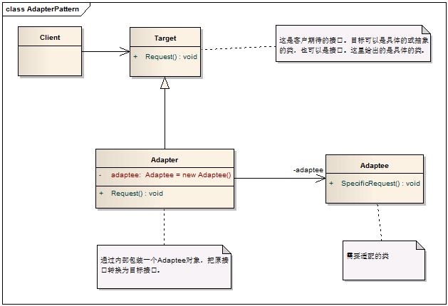

# Adapter Pattern - 适配器模式

#### 1. 概述

　　将一个类的接口转换成客户希望的另外一个接口。Adapter模式使得原本由于接口不兼容而不能一起工作的那些类可以在一起工作。

#### 2. 解决的问题

　　即Adapter模式使得原本由于接口不兼容而不能一起工作的那些类可以在一起工作。

#### 3. 模式中的角色

　　3.1 目标接口（Target）：客户所期待的接口。目标可以是具体的或抽象的类，也可以是接口。

　　3.2 需要适配的类（Adaptee）：需要适配的类或适配者类。

　　3.3 适配器（Adapter）：通过包装一个需要适配的对象，把原接口转换成目标接口。

#### 4. 模式解读

　　注：在GoF的设计模式中，对适配器模式讲了两种类型，类适配器模式和对象适配器模式。由于类适配器模式通过多重继承对一个接口与另一个接口进行匹配，而C#、java等语言都不支持多重继承，因而这里只是介绍对象适配器。

##### 　　4.1 适配器模式的类图



##### 　　4.2 适配器模式的代码实现

```c
    /// <summary>
    /// 定义客户端期待的接口
    /// </summary>
    public class Target
    {
        /// <summary>
        /// 使用virtual修饰以便子类可以重写
        /// </summary>
        public virtual void Request()
        {
            Console.WriteLine("This is a common request");
        }
    }

    /// <summary>
    /// 定义需要适配的类
    /// </summary>
    public class Adaptee
    {
        public void SpecificRequest()
        {
            Console.WriteLine("This is a special request.");
        }
    }

    /// <summary>
    /// 定义适配器
    /// </summary>
    public class Adapter:Target
    {
        // 建立一个私有的Adeptee对象
        private Adaptee adaptee = new Adaptee();

        /// <summary>
        /// 通过重写，表面上调用Request()方法，变成了实际调用SpecificRequest()
        /// </summary>
        public override void Request()
        {
            adaptee.SpecificRequest();
        }
    }
```
##### 　　4.3 客户端代码

```c
    class Program
    {
        static void Main(string[] args)
        {
            // 对客户端来说，调用的就是Target的Request()
            Target target = new Adapter();
            target.Request();

            Console.Read();
        }
    }
```
　　运行结果: **This is a special request.**

#### 5. 模式总结

##### 　　5.1 优点

　　　　5.1.1 通过适配器，客户端可以调用同一接口，因而对客户端来说是透明的。这样做更简单、更直接、更紧凑。

　　　　5.1.2 复用了现存的类，解决了现存类和复用环境要求不一致的问题。

　　　　5.1.3 将目标类和适配者类解耦，通过引入一个适配器类重用现有的适配者类，而无需修改原有代码。

　　　　5.1.4 一个对象适配器可以把多个不同的适配者类适配到同一个目标，也就是说，同一个适配器可以把适配者类和它的子类都适配到目标接口。

##### 　　5.2 缺点

　　　　对于对象适配器来说，更换适配器的实现过程比较复杂。

##### 　　5.3 适用场景

　　　　5.3.1 系统需要使用现有的类，而这些类的接口不符合系统的接口。

　　　　5.3.2 想要建立一个可以重用的类，用于与一些彼此之间没有太大关联的一些类，包括一些可能在将来引进的类一起工作。

　　　　5.3.3 两个类所做的事情相同或相似，但是具有不同接口的时候。

　　　　5.3.4 旧的系统开发的类已经实现了一些功能，但是客户端却只能以另外接口的形式访问，但我们不希望手动更改原有类的时候。

　　　　5.3.5 使用第三方组件，组件接口定义和自己定义的不同，不希望修改自己的接口，但是要使用第三方组件接口的功能。

#### 6. 适配器应用举例

　　6.1 使用过ADO.NET的开发人员应该都用过DataAdapter，它就是用作DataSet和数据源之间的适配器。DataAdapter通过映射Fill和Update来提供这一适配器。

　　6.2 手机电源适配器。
