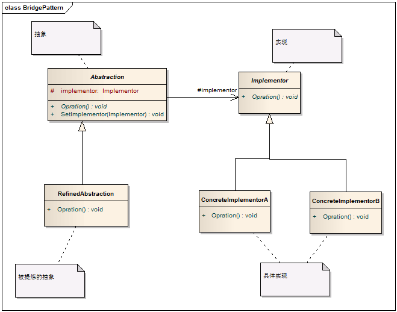
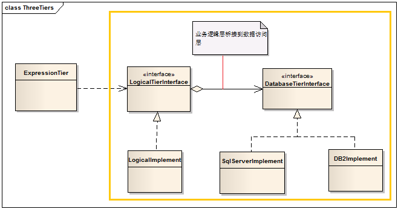

# Bridge Pattern - 桥接模式

#### 1. 概述

　　将抽象部分（Abstraction）与实现部分（Implementor）分离，使它们可以独立地变化。

#### 2. 解决的问题

　　在软件系统中，有些类型由于自身的逻辑，它具有两个或多个维度的变化。为了解决这种多维度变化，又不引入复杂度，这就要使用Bridge模式。

#### 3. 模式中的角色

　　2.1 抽象（Abstraction）：定义抽象接口，该接口中包含实现具体行为、具体特征的Implementor接口。

　　2.2 提炼的抽象（RefinedAbstraction）：继承自Abstraction的子类，依旧是一个抽象的事物名。

　　2.3 实现（Implementor）：定义具体行为，具体特征的应用接口。

　　2.4 具体实现（ConcreteImplementor）：实现Implementor。

#### 4. 模式解读

##### 　　4.1 实现要点

　　　　Bridge模式使用“对象间的组合/聚合关系”解耦了抽象和实现之间固有的绑定关系，使得抽象和实现可以沿着各自的维度来变化

##### 　　4.2 桥接模式的类图



##### 　　4.3 桥接模式的实现代码

```c
    /// <summary>
    /// 实现
    /// </summary>
    public abstract class Implementor
    {
        public abstract void Opration();
    }

    public class ConcreteImplementorA : Implementor
    {
        public override void Opration()
        {
            Console.WriteLine("具体实现A的方法执行。");
        }
    }

    public class ConcreteImplementorB : Implementor
    {
        public override void Opration()
        {
            Console.WriteLine("具体实现B的方法执行。");
        }
    }

    /// <summary>
    /// 抽象
    /// </summary>
    public abstract class Abstraction
    {
        protected Implementor implementor;

        public void SetImplementor(Implementor implementor)
        {
            this.implementor = implementor;
        }

        public abstract void Opration();
    }

    /// <summary>
    /// 被提炼的抽象
    /// </summary>
    public class RefinedAbstraction : Abstraction
    {
        public override void Opration()
        {
            implementor.Opration();
        }
    }
```
##### 　　4.4 客户端的调用

```c
    class Program
    {
        static void Main(string[] args)
        {
            Abstraction abstraction = new RefinedAbstraction();

            abstraction.SetImplementor(new ConcreteImplementorA());
            abstraction.Opration();

            abstraction.SetImplementor(new ConcreteImplementorB());
            abstraction.Opration();

            Console.Read();
        }

    }
```
　　输出结果：

　　具体实现A的方法执行。
　　具体实现B的方法执行。

#### 5. 桥接模式的应用：三层架构

　　桥接模式是个比较复杂的模式，在对它总结之前，先看一个大家都非常熟悉的应用：三层架构



　　解读：三层架构中的业务逻辑层（LogicalTierInterface)桥接到了数据访问层(DatabaseTierInterface)，大家可以比较一下这个图和上面桥接模式的图是多么的一致。大家往往会在数据库访问这端做扩展，比如现在增加对MySql的支持；往往只对业务逻辑层的实现（LogicalImplement)做一些内部修改，而不是扩展一个新的实现。如果你的应用确实需要对业务逻辑层做一个扩展(比如NewLogicalImplement)，那么这个三层架构对桥接模式的应用就算是比较完整的了。

#### 6. 模式总结

##### 　　6.1 优点

　　　　6.1.1 降低了沿着两个或多个维度扩展时的复杂度，防止类的过度膨胀。

　　　　6.1.2 解除了两个或多个维度之间的耦合，使它们沿着各自方向变化而不互相影响。

##### 　　6.2 缺点

　　　　还未发现

##### 　　6.3 适用场景

　　　　6.3.1 当一个对象有多个变化因素时，可以考虑使用桥接模式，通过抽象这些变化因素，将依赖具体实现修改为依赖抽象。

　　　　6.3.2 当我们期望一个对象的多个变化因素可以动态变化，而且不影响客户端的程序使用时。

　　　　6.3.3 如果使用继承的实现方案，会导致产生很多子类，任何一个变化因素都需要产生多个类来完成，就要考虑桥接模式。
