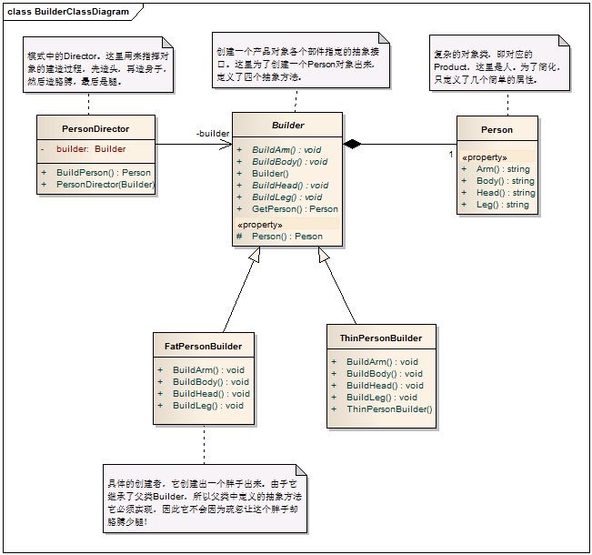

# Builder Pattern - 建造者模式

#### 1. 概述

　　将一个复杂对象的构造与它的表示分离，使同样的构建过程可以创建不同的表示，这样的设计模式被称为建造者模式。

#### 2. 建造者模式中的角色

　　2.1 建造者（Builder）：为创建一个产品对象的各个部件指定抽象接口。

　　2.2 具体建造者（ConcreteBuilder）：实现Builder的接口以构造和装配该产品的各个部件，定义并明确它所创建的表示，并 提供一个检索产品的接口。

　　2.3 指挥者（Director）：指挥并构造一个使用Builder接口的对象。

　　2.4 产品（Product）：表示被构造的复杂对象。ConcreteBuilder创建该产品的内部表示并定义它的装配过程，包含定义组成部件的类，包括将这些部件装配成最终产品的接口。

#####  　　建造者模式的一般化类图


#### 3. 实例：

　　创建一个人，这个人可以有不同的特点，可以是胖子，可以是瘦子，可以是高个子，也可以是矮个子。

　　3.1 以下是这个实例的类图，以及对类图的解读。



　　3.2 代码实现及解读:

```c
    // 要建造的产品
    public class Person
    {
        public string Head { get; set; }
        public string Body { get; set; }
        public string Arm { get; set; }
        public string Leg { get; set; }
    }

    // 定义创建者接口，实现者必须实现该接口中定义的所有抽象方法，防止实现者疏忽而遗漏某个部件的创建
    public abstract class Builder
    {
        protected Person Person { get; set; }
        public Builder()
        {
            Person = new Person();
        }

        // 建造头
        public abstract void BuildHead();
        // 建造身体
        public abstract void BuildBody();
        // 建造胳膊
        public abstract void BuildArm();
        // 建造腿
        public abstract void BuildLeg();

        // 返回生成好的对象，这是一个具体方法，每个子类都可以使用它来返回一个已经创建成功的对象
        public Person GetPerson()
        {
            return Person;
        }
    }

    // 建造者的具体实现，这里是要建造出一个瘦子
    public class ThinPersonBuilder : Builder
    {
        public ThinPersonBuilder()
        {
            Person = new Person();
        }

        public override void BuildHead()
        {
            Person.Head = "瘦子的脑袋";
        }

        public override void BuildBody()
        {
            Person.Body = "瘦子的身体";
        }

        public override void BuildArm()
        {
            Person.Arm = "瘦子的胳膊";
        }

        public override void BuildLeg()
        {
            Person.Leg = "瘦子的腿";
        }

    }

    // 建造者的具体实现，这里是要建造出一个胖子
    public class FatPersonBuilder : Builder
    {
        public override void BuildHead()
        {
            Person.Head = "胖子的脑袋";
        }

        public override void BuildBody()
        {
            Person.Body = "胖子的身体";
        }

        public override void BuildArm()
        {
            Person.Head = "胖子的胳膊";
        }

        public override void BuildLeg()
        {
            Person.Head = "胖子的腿";
        }
    }

    // 建造者模式中的指挥者
    public class PersonDirector
    {
        Builder builder;
        public PersonDirictor(Builder personBuilder)
        {
            builder = personBuilder;
        }

        // 指挥创建一个人的过程，并返回创建成功的产品
        public Person BuildPerson()
        {
            builder.BuildHead();
            builder.BuildBody();
            builder.BuildArm();
            builder.BuildLeg();

            return builder.GetPerson();
        }
    }
```
#### 4. 模式总结

##### 　　4.1 优点

　　　　4.1.1 用户只需要指定要建造的类型就可以得到它们，而具体的建造过程和细节不需要知道。

　　　　4.1.2 建造代码与表示相分离，如果要改变一个产品的内部表示，只要再定义一个新的具体的建造者就可以了。

　　　　4.1.3 建造过程由指挥者来控制，建造细节由一个抽象类来控制，对于实现建造细节的具体类来说，不会遗漏某一个步骤。

##### 　　4.2 缺点

　　　　以上例子说明，现在我要增加产品的一个细节，如把创建脚的过程也添加进来，看我们需要改哪些类。Buider,FatPersonBuilder,ThinPersonBuilder（甚至更多，如果你实现了TallPersonBuilder,ShortPersonBuilder等),PersonDirector，我们对修改也就开放了。

##### 　　4.3 使用场景

　　　　4.3.1 当创建复杂对象的算法应该独立于该对象的组成部分以及它们的装配方式时。

　　　　4.3.2 当复杂对象的部件相对稳定，不会发生变化时。
