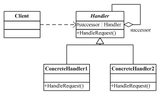
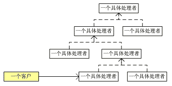

# Chain of Responsibility Pattern - 责任链模式

#### 一、 概述

责任链模式是一种对象的行为模式【GOF95】。在责任链模式里，很多对象由每一个对象对其下家的引用而连接起来形成一条链。请求在这个链上传递，直到链上的某一个对象决定处理此请求。发出这个请求的客户端并不知道链上的哪一个对象最终处理这个请求，这使得系统可以在不影响客户端的情况下动态地重新组织链和分配责任。

从击鼓传花谈起

击鼓传花是一种热闹而又紧张的饮酒游戏。在酒宴上宾客依次坐定位置，由一人击鼓，击鼓的地方与传花的地方是分开的，以示公正。开始击鼓时，花束就开始依次传递，鼓声一落，如果花束在某人手中，则该人就得饮酒。

击鼓传花便是责任链模式的应用。责任链可能是一条直线、一个环链或者一个树结构的一部分。


#### 二、 责任链模式的结构

责任链模式涉及到的角色如下所示：




抽象处理者(Handler)角色：定义出一个处理请求的接口。如果需要，接口可以定义出一个方法，以设定和返回对下家的引用。这个角色通常由一个抽象类或接口实现。

具体处理者(ConcreteHandler)角色：具体处理者接到请求后，可以选择将请求处理掉，或者将请求传给下家。由于具体处理者持有对下家的引用，因此，如果需要，具体处理者可以访问下家。


#### 三、 责任链模式的示意性源代码
```c
// Chain of Responsibility pattern -- Structural example
using System;

// "Handler"
abstract class Handler
{
  // Fields
  protected Handler successor;

  // Methods
  public void SetSuccessor( Handler successor )
  {
    this.successor = successor;
  }
  abstract public void HandleRequest( int request );
}

// "ConcreteHandler1"
class ConcreteHandler1 : Handler
{
  // Methods
  override public void HandleRequest( int request )
  {
    if( request >= 0 && request < 10 )
      Console.WriteLine("{0} handled request {1}",
        this, request );
    else
      if( successor != null )
      successor.HandleRequest( request );
  }
}

// "ConcreteHandler2"
class ConcreteHandler2 : Handler
{
  // Methods
  override public void HandleRequest( int request )
  {
    if( request >= 10 && request < 20 )
      Console.WriteLine("{0} handled request {1}",
        this, request );
    else
      if( successor != null )
      successor.HandleRequest( request );
  }
}

// "ConcreteHandler3"
class ConcreteHandler3 : Handler
{
  // Methods
  override public void HandleRequest( int request )
  {
    if( request >= 20 && request < 30 )
      Console.WriteLine("{0} handled request {1}",
        this, request );
    else
      if( successor != null )
      successor.HandleRequest( request );
  }
}

/// <summary>
/// Client test
/// </summary>
public class Client
{
  public static void Main( string[] args )
  {
    // Setup Chain of Responsibility
    Handler h1 = new ConcreteHandler1();
    Handler h2 = new ConcreteHandler2();
    Handler h3 = new ConcreteHandler3();
    h1.SetSuccessor(h2);
    h2.SetSuccessor(h3);

    // Generate and process request
    int[] requests = { 2, 5, 14, 22, 18, 3, 27, 20 };

    foreach( int request in requests )
      h1.HandleRequest( request );

  }
}
```


#### 四、 纯的与不纯的责任链模式
一个纯的责任链模式要求一个具体的处理者对象只能在两个行为中选择一个：一个是承担责任，二是把责任推给下家。不允许出现某一个具体处理者对象在承担了一部分责任后又把责任向下传的情况。

在一个纯的责任链模式里面，一个请求必须被某一个处理者对象所接收；在一个不纯的责任链模式里面，一个请求可以最终不被任何接收端对象所接收。纯的责任链模式的例子是不容易找到的，一般看到的例子均是不纯的责任链模式的实现。


#### 五、 责任链模式的实际应用案例
下面的责任链模式代码演示了不同职务的人根据所设定的权限对一个购买请求作出决策或将其交给更高的决策者。
```c
// Chain of Responsibility pattern -- Real World example
using System;

// "Handler"
abstract class Approver
{
  // Fields
  protected string name;
  protected Approver successor;

  // Constructors
  public Approver( string name )
  {
    this.name = name;
  }

  // Methods
  public void SetSuccessor( Approver successor )
  {
    this.successor = successor;
  }

  abstract public void ProcessRequest( PurchaseRequest request );
}

// "ConcreteHandler"
class Director : Approver
{
  // Constructors
  public Director ( string name ) : base( name ) {}

  // Methods
  override public void ProcessRequest( PurchaseRequest request )
  {
    if( request.Amount < 10000.0 )
      Console.WriteLine( "{0} {1} approved request# {2}",
        this, name, request.Number);
    else
      if( successor != null )
      successor.ProcessRequest( request );
  }
}

// "ConcreteHandler"
class VicePresident : Approver
{
  // Constructors
  public VicePresident ( string name ) : base( name ) {}

  // Methods
  override public void ProcessRequest( PurchaseRequest request )
  {
    if( request.Amount < 25000.0 )
      Console.WriteLine( "{0} {1} approved request# {2}",
        this, name, request.Number);
    else
      if( successor != null )
      successor.ProcessRequest( request );
  }
}

// "ConcreteHandler"
class President : Approver
{
  // Constructors
  public President ( string name ) : base( name ) {}
  // Methods
  override public void ProcessRequest( PurchaseRequest request )
  {
    if( request.Amount < 100000.0 )
      Console.WriteLine( "{0} {1} approved request# {2}",
        this, name, request.Number);
    else
      Console.WriteLine( "Request# {0} requires " +
        "an executive meeting!", request.Number );
  }
}

// Request details
class PurchaseRequest
{
  // Member Fields
  private int number;
  private double amount;
  private string purpose;

  // Constructors
  public PurchaseRequest( int number,  
    double amount, string purpose )
  {
    this.number = number;
    this.amount = amount;
    this.purpose = purpose;
  }

  // Properties
  public double Amount
  {
    get{ return amount; }
    set{ amount = value; }
  }

  public string Purpose
  {
    get{ return purpose; }
    set{ purpose = value; }
  }

  public int Number
  {
    get{ return number; }
    set{ number = value; }
  }
}

/// <summary>
///  ChainApp Application
/// </summary>
public class ChainApp
{
  public static void Main( string[] args )
  {
    // Setup Chain of Responsibility
    Director Larry = new Director( "Larry" );
    VicePresident Sam = new VicePresident( "Sam" );
    President Tammy = new President( "Tammy" );
    Larry.SetSuccessor( Sam );
    Sam.SetSuccessor( Tammy );

    // Generate and process different requests
    PurchaseRequest rs = new PurchaseRequest( 2034, 350.00, "Supplies" );
    Larry.ProcessRequest( rs );

    PurchaseRequest rx = new PurchaseRequest( 2035, 32590.10, "Project X" );
    Larry.ProcessRequest( rx );

    PurchaseRequest ry = new PurchaseRequest( 2036, 122100.00, "Project Y" );
    Larry.ProcessRequest( ry );
  }
}
```

#### 六、 责任链模式的实现

责任链模式并不创建责任链。责任链的创建必须由系统的其它部分创建出来。

责任链模式降低了请求的发送端和接收端之间的耦合，使多个对象都有机会处理这个请求。一个链可以是一条线，一个树，也可以是一个环。如下图所示，责任链是一个树结构的一部分。


