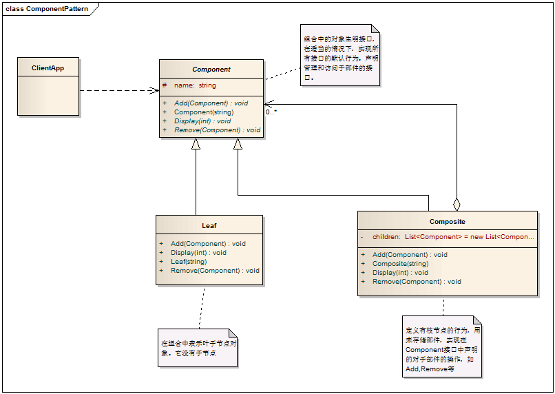
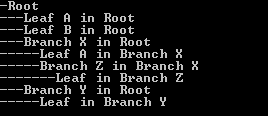

# Composite Pattern - 组合模式

#### 1. 概述

　　将对象组合成树形结构以表示“部分-整体”的层次结构。组合模式使得用户对单个对象和组合对象的使用具有一致性。

#### 2. 解决的问题

　　当希望忽略单个对象和组合对象的区别，统一使用组合结构中的所有对象（将这种“统一”性封装起来）。

#### 3. 组合模式中的角色

　　3.1 组合部件（Component）：它是一个抽象角色，为要组合的对象提供统一的接口。

　　3.2 叶子（Leaf）：在组合中表示子节点对象，叶子节点不能有子节点。

　　3.3 合成部件（Composite）：定义有枝节点的行为，用来存储部件，实现在Component接口中的有关操作，如增加（Add）和删除（Remove）。

#### 4. 模式解读

##### 　　4.1 组合模式的类图



##### 　　4.2 组合模式的实现代码

```c
    /// <summary>
    /// 一个抽象构件，声明一个接口用于访问和管理Component的子部件
    /// </summary>
    public abstract class Component
    {
        protected string name;

        public Component(string name)
        {
            this.name = name;
        }

        /// <summary>
        /// 增加一个节点
        /// </summary>
        /// <param name="component"></param>
        public abstract void Add(Component component);

        /// <summary>
        /// 移除一个节点
        /// </summary>
        /// <param name="component"></param>
        public abstract void Remove(Component component);

        /// <summary>
        /// 显示层级结构
        /// </summary>
        public abstract void Display(int level);
    }

    /// <summary>
    /// 叶子节点
    /// </summary>
    public class Leaf : Component
    {
        public Leaf(string name)
            : base(name)
        { }

        /// <summary>
        /// 由于叶子节点没有子节点，所以Add和Remove方法对它来说没有意义，但它继承自Component，这样做可以消除叶节点和枝节点对象在抽象层次的区别，它们具备完全一致的接口。
        /// </summary>
        /// <param name="component"></param>
        public override void Add(Component component)
        {
            Console.WriteLine("Can not add a component to a leaf.");
        }

        /// <summary>
        /// 实现它没有意义，只是提供了一个一致的调用接口
        /// </summary>
        /// <param name="component"></param>
        public override void Remove(Component component)
        {
            Console.WriteLine("Can not remove a component to a leaf.");
        }

        public override void Display(int level)
        {
            Console.WriteLine(new string('-',level) + name);
        }
    }

    /// <summary>
    /// 定义有枝节点的行为，用来存储部件，实现在Component接口中对子部件有关的操作
    /// </summary>
    public class Composite : Component
    {
        public Composite(string name)
            : base(name)
        { }

        /// <summary>
        /// 一个子对象集合，用来存储其下属的枝节点和叶节点
        /// </summary>
        private List<Component> children = new List<Component>();

        /// <summary>
        /// 增加子节点
        /// </summary>
        /// <param name="component"></param>
        public override void Add(Component component)
        {
            children.Add(component);
        }

        /// <summary>
        /// 移除子节点
        /// </summary>
        /// <param name="component"></param>
        public override void Remove(Component component)
        {
            children.Remove(component);
        }

        public override void Display(int level)
        {
            Console.WriteLine(new string('-', level) + name);

            // 遍历其子节点并显示
            foreach (Component component in children)
            {
                component.Display(level+2);
            }
        }
    }
```
##### 　　4.3 客户端代码

```c
    class Program
    {
        static void Main(string[] args)
        {
            // 生成树根，并为其增加两个叶子节点
            Component root = new Composite("Root");
            root.Add(new Leaf("Leaf A in Root"));
            root.Add(new Leaf("Leaf B in Root"));

            // 为根增加两个枝节点
            Component branchX = new Composite("Branch X in Root");
            Component branchY = new Composite("Branch Y in Root");
            root.Add(branchX);
            root.Add(branchY);

            // 为BranchX增加页节点
            branchX.Add(new Leaf("Leaf A in Branch X"));

            // 为BranchX增加枝节点
            Component branchZ = new Composite("Branch Z in Branch X");
            branchX.Add(branchZ);

            // 为BranchY增加叶节点
            branchY.Add(new Leaf("Leaf in Branch Y"));

            // 为BranchZ增加叶节点
            branchZ.Add(new Leaf("Leaf in Branch Z"));

            // 显示树
            root.Display(1);

            Console.Read();
        }
    }
```
　　运行结果




#### 5. 透明方式与安全方式

　　5.1 透明方式：在Component中声明所有来管理子对象的方法，其中包括Add，Remove等。这样实现Component接口的所有子类都具备了Add和Remove方法。这样做的好处是叶节点和枝节点对于外界没有区别，它们具备完全一致的接口。

　　5.2 安全方式：在Component中不去声明Add和Remove方法，那么子类的Leaf就不需要实现它，而是在Composit声明所有用来管理子类对象的方法。

　　5.3 两种方式有缺点：对于透明方式，客户端对叶节点和枝节点是一致的，但叶节点并不具备Add和Remove的功能，因而对它们的实现是没有意义的；对于安全方式，叶节点无需在实现Add与Remove这样的方法，但是对于客户端来说，必须对叶节点和枝节点进行判定，为客户端的使用带来不便。

#### 6. 模式总结

##### 　　6.1 优点

　　　　6.1.1 使客户端调用简单，它可以一致使用组合结构或是其中单个对象，简化了客户端代码。

　　　　6.1.2 容易在组合体内增加对象部件。客户端不必因加入了新的部件而更改代码。有利于功能的扩展。

##### 　　6.2 缺点

　　　　6.2.1 需要抉择使用透明方式还是安全方式。

　　　　6.2.2 透明方式违背了面向对象的单一职责原则；安全方式增加了客户需要端判定的负担。

##### 　　6.3 适用场景

　　　　6.3.1 当想表达对象的部分-整体的层次结构时。

　　　　6.3.3 希望用户忽略组合对象与单个对象的不同，用户将统一地使用组合结构中的所有对象时。
