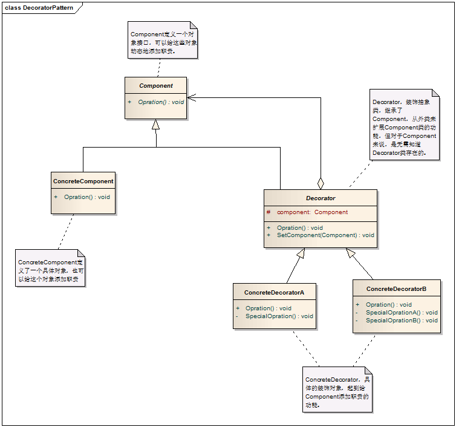
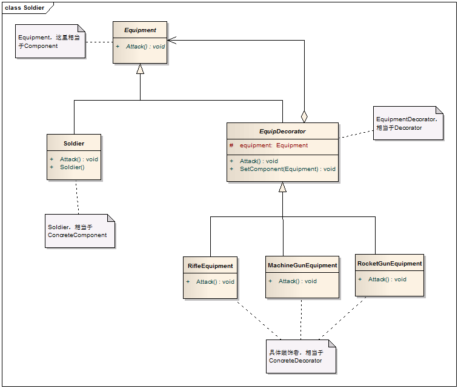

# Decorator Pattern - 装饰模式

#### 1. 概述

　　动态地给一个对象添加一些额外的职责，就增加功能来说，装饰模式比生成子类更灵活。

　　原理：增加一个修饰类包裹原来的类，包裹的方式一般是通过在将原来的对象作为修饰类的构造函数的参数。装饰类实现新的功能，但是，在不需要用到新功能的地方，它可以直接调用原来的类中的方法。修饰类必须和原来的类有相同的接口。

#### 2. 模式中的角色

　　2.1 抽象构建（Component）：定义一个抽象接口，用以给这些对象动态地添加职责。

　　2.2 具体构建（ConcreteComponent)：定义一个具体的对象，也可以给这个对象添加一些职责。

　　2.3 装饰类（Decorator): 装饰抽象类，继承了Component,从外类来扩展Component类的功能。

　　2.4 具体装饰者（ConcretorDecorator)：负责给构建对象添加职责。

#### 3. 模式解读

##### 　　3.1 装饰模式的一般化类图



##### 　　3.2 装饰模式的一般化代码

```c
    /// <summary>
    /// 定义一个对象接口，可以给这些对象动态地添加职责
    /// </summary>
    public abstract class Component
    {
        public abstract void Opration();
    }

    /// <summary>
    /// 具体对象
    /// </summary>
    public class ConcreteComponent:Component
    {

        public override void Opration()
        {
            // 具体对象的操作
        }
    }

    /// <summary>
    /// 抽象的装饰类，它不能初始化对象。
    /// </summary>
    public abstract class Decorator:Component
    {
        protected Component component;

        /// <summary>
        /// 设置Component
        /// </summary>
        /// <param name="component"></param>
        public void SetComponent(Component component)
        {
            this.component = component;
        }

        /// <summary>
        /// 重写Operation，实际执行的是Component的Operation。
        /// </summary>
        public override void Opration()
        {
            if (component != null)
            {
                component.Opration();
            }
        }
    }

    public class ConcreteDecoratorA : Decorator
    {
        private void SpecialOpration()
        {
            // 本类特有的功能
        }

        public override void Opration()
        {
            //首先运行原Component的Operation(),在执行本类的功能，相当于对原Component进行了装饰
            base.Opration();

            this.SpecialOpration();
        }
    }

    public class ConcreteDecoratorB : Decorator
    {
        private void SpecialOprationA()
        {
            // 本类特有的功能 A
        }

        private void SpecialOprationB()
        {
            // 本类特有的功能 B
        }

        public override void Opration()
        {
            //首先运行原Component的Operation(),在执行本类的功能，相当于对原Component进行了装饰
            base.Opration();

            this.SpecialOprationA();
            this.SpecialOprationB();
        }
    }
```

#### 4. 模式总结

##### 　　4.1 优点

　　　　4.1.1 每个装饰对象只关心自己的功能，不需要关心如何被添加到对象链当中。它是由Decorator的SetComponent方法来实现的，因而它们的职责是单一的。

　　　　4.1.2 类的核心职责与动态添加的职责是分离的。如果再向主类中添加新的功能，一是违反了开放封闭原则，二是增加了主类的复杂度。

　　　　4.1.3 比静态继承更灵活 与对象的静态继承相比，Decorator模式提供了更加灵活的向对象添加职责的方式，可以使用添加和分离的方法，用装饰在运行时刻增加和删除职责.

##### 　　4.2 缺点

　　　　4.2.1 产生许多小对象，采用Decorator模式进行系统设计往往会产生许多看上去类似的小对象，这些对象仅仅在他们相互连接的方式上有所不同。

##### 　　4.3 适用场景

　　　　4.3.1 当需要为已有功能动态地添加更多功能时。

　　　　4.3.2 类的核心功能无需改变，只是需要添加新的功能时。

#### 5. 应用实例：

 　　装备大兵！无任何装备时（核心功能）可以用拳脚搏击；装备了步枪，可以正常射击；装备了重机枪，可以扫射；装备了火箭筒，可以防空。

##### 　　5.1 类图设计



##### 　　5.2 代码实现

```c
    /// <summary>
    /// 装备类，相当于Component
    /// </summary>
    public abstract class Equipment
    {

        public abstract void Attack();
    }

    /// <summary>
    /// 士兵类，继承自Equipment
    /// </summary>
    public class Soldier : Equipment
    {
        public Soldier()
        {
            // 构造函数
        }

        /// <summary>
        /// 没有任何武器装备下的核心功能
        /// </summary>
        public override void Attack()
        {
            Console.WriteLine("用拳脚攻击！");
        }
    }

    public abstract class EquipDecorator : Equipment
    {
        protected Equipment equipment;

        /// <summary>
        /// 增加装备，使用该方法来动态地给士兵增加装备
        /// </summary>
        /// <param name="equipment"></param>
        public void SetComponent(Equipment equipment)
        {
            this.equipment = equipment;
        }

        /// <summary>
        /// 攻击
        /// </summary>
        public override void Attack()
        {
            //如果有装备，就用装备进行攻击
            if (equipment != null)
            {
                equipment.Attack();
            }
        }
    }

    /// <summary>
    /// 步枪
    /// </summary>
    public class RifleEquipment : EquipDecorator
    {
        public override void Attack()
        {
            base.Attack();

            Console.WriteLine("步枪射击，啪！");
        }
    }

    /// <summary>
    /// 机枪
    /// </summary>
    public class MachineGunEquipment : EquipDecorator
    {
        public override void Attack()
        {
            base.Attack();

            Console.WriteLine("机枪扫射，突突突！");
        }
    }

    /// <summary>
    /// 火箭筒
    /// </summary>
    public class RocketGunEquipment : EquipDecorator
    {
        public override void Attack()
        {
            base.Attack();

            Console.WriteLine("火箭炮射击，唰......！");
        }
    }
```

##### 　　5.3 客户端调用

```c
    class Program
    {
        static void Main(string[] args)
        {
            // 定义新兵
            Soldier soldier = new Soldier();

            // 三种装备
            RifleEquipment rifle = new RifleEquipment();
            MachineGunEquipment machineGun = new MachineGunEquipment();
            RocketGunEquipment rocketGun = new RocketGunEquipment();

            // 将三种装备全部交给新兵
            rifle.SetComponent(soldier);
            machineGun.SetComponent(rifle);
            rocketGun.SetComponent(machineGun);

            // 攻击，除了拳脚功夫外，新兵还可以使用步枪，机枪，火箭炮.最终执行的是rocketGun.Attack().
            rocketGun.Attack();

            Console.Read();
        }
    }
```
##### 　　5.4 运行结果

```
　　用拳脚攻击！
　　步枪射击，啪！
　　机枪扫射，突突突！
　　火箭炮射击，唰......！
```
