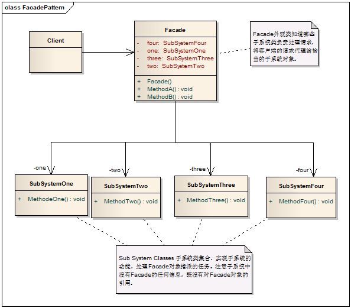
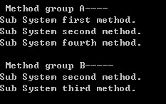
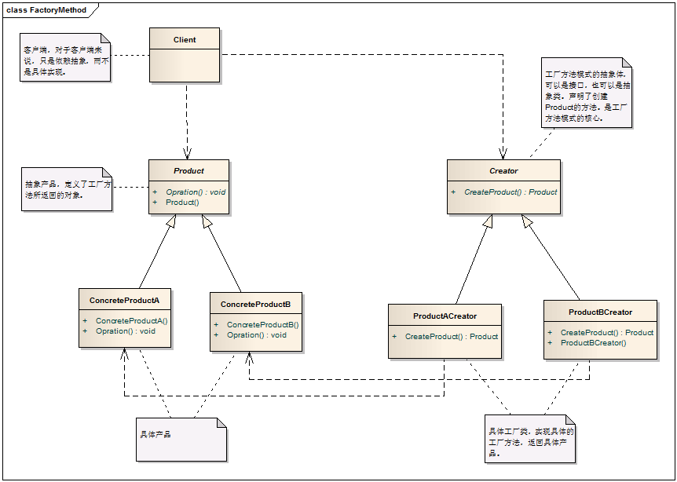

# Facade Pattern - 外观模式

#### 1. 概述

　　为子系统中的一组接口提供一个一致的界面，此模式定义了一个高层接口，这个接口使得这一子系统更加容易使用。

#### 2. 模式中的角色

　　2.1 外观类（Facade）：外观类知道哪些子系统类负责处理请求，将客户的请求代理给恰当的子系统对象。

　　2.2 子系统类集合（SubSystem Classes）：子系统类集合实现了子系统的功能，处理外观类对象指派的任务。

#### 3. 模式解读

##### 　　3.1 外观模式的类图



##### 　　3.2 外观模式的代码实现

```c
    /// <summary>
    /// 子系统中的一个类
    /// </summary>
    public class SubSystemOne
    {
        public void MethodeOne()
        {
            Console.WriteLine("Sub System first method.");
        }
    }

    /// <summary>
    /// 子系统中一个类
    /// </summary>
    public class SubSystemTwo
    {
        public void MethodTwo()
        {
            Console.WriteLine("Sub System second method.");
        }
    }

    /// <summary>
    /// 子系统中一个类
    /// </summary>
    public class SubSystemThree
    {
        public void MethodThree()
        {
            Console.WriteLine("Sub System third method.");
        }
    }

    /// <summary>
    /// 子系统中一个类
    /// </summary>
    public class SubSystemFour
    {
        public void MethodFour()
        {
            Console.WriteLine("Sub System fourth method.");
        }
    }

    /// <summary>
    /// 外观类
    /// </summary>
    public class Facade
    {
        private SubSystemOne one;
        private SubSystemTwo two;
        private SubSystemThree three;
        private SubSystemFour four;

        public Facade()
        {
            one = new SubSystemOne();
            two = new SubSystemTwo();
            three = new SubSystemThree();
            four = new SubSystemFour();
        }

        public void MethodA()
        {
            Console.WriteLine("\nMethod group A----");
            one.MethodeOne();
            two.MethodTwo();
            four.MethodFour();
        }

        public void MethodB()
        {
            Console.WriteLine("\nMethod group B----");
            two.MethodTwo();
            three.MethodThree();
        }
    }
```

#####    　3.3 客户端代码

```c
    class Program
    {
        static void Main(string[] args)
        {
            // 由于Facade的作用，客户端可以根本不知道子系统类的存在
            Facade facade = new Facade();
            facade.MethodA();
            facade.MethodB();

            Console.Read();
        }
    }
```
   　运行结果



#### 4. 模式总结

##### 　　4.1 优点

　　　　4.1.1 Facade模式降低了客户端对子系统使用的复杂性。

　　　　4.1.2 外观模式松散了客户端与子系统的耦合关系，让子系统内部的模块能更容易扩展和维护。

　　　　4.1.3 通过合理使用Facade，可以帮助我们更好的划分访问的层次。

##### 　　4.2 缺点

　　　　过多的或者是不太合理的Facade也容易让人迷惑，到底是调用Facade好呢，还是直接调用模块好。

##### 　　4.3 适用场景

　　　　4.3.1 需要将设计进行分层时考虑Facade模式。

　　　　4.3.2 在开发阶段，子系统往往因为重构变得越来越复杂，增加外观模式可以提供一个简单的接口，减少它们之间的依赖。

　　　　4.3.3 在维护一个遗留的大型系统时，可以这个系统已经非常难以维护和扩展，可以为新系统开发一个Facade类，来提供设计粗糙或高度复杂的遗留代码的比较清晰简单的接口，让新系统与Facade对象交互，Facade与遗留代码交互所有复杂的工作。

#### 5. 应用举例

　　分层开发中，对数据访问层我们增加DataAccess作为对外的接口来操作数据库子系统。

##### 　　5.1 实现类图



##### 　　5.2 实现代码

```c
    public class Employee
    {
        public string Name { get; set; }
        public int Age { get; set; }

        public Salary Salary { get; set; }
    }

    public class Salary
    {
        public DateTime From { get; set; }
        public DateTime To { get; set; }
        public decimal Amount { get; set; }
    }

    public class EmployeeDataAccess
    {
        public void SaveEmployee(Employee employee)
        {
            Console.WriteLine("Save employee to database.");
        }

        public void DeleteEmployee(Employee employee)
        {
            Console.WriteLine("Remode employee from database.");
        }
    }

    public class SalaryDataAccess
    {
        public void SaveSalary(Salary salary)
        {
            Console.WriteLine("Save salary to database.");
        }

        public void DeleteSalary(Salary salary)
        {
            Console.WriteLine("Remove salary from database.");
        }
    }

    /// <summary>
    /// DataAccess为客户端提供一个简单的接口
    /// </summary>
    public class DataAccess
    {
        private EmployeeDataAccess employeeDataAccess = new EmployeeDataAccess();
        private SalaryDataAccess salaryDataAccess = new SalaryDataAccess();

        public void SaveEmployee(Employee employee)
        {
            // 先保存员工基本信息
            employeeDataAccess.SaveEmployee(employee);

            // 保存员工薪水信息
            salaryDataAccess.SaveSalary(employee.Salary);
        }

        public void RemoveEmployee(Employee employee)
        {
            // 先删除员工薪水信息
            salaryDataAccess.DeleteSalary(employee.Salary);

            // 删除员工基本信息
            employeeDataAccess.DeleteEmployee(employee);
        }
    }
```
##### 　　5.3 客户端代码

```c
    class Program
    {
        static void Main(string[] args)
        {
            DataAccess.DataAccess dataAccess = new DataAccess.DataAccess();
            DataAccess.Employee employee = new DataAccess.Employee() { Salary = new DataAccess.Salary(), Name = "Wang Kevin", Age = 22 };

            dataAccess.SaveEmployee(employee);
            dataAccess.RemoveEmployee(employee);

            Console.Read();
        }
    }
```
　　运行结果

