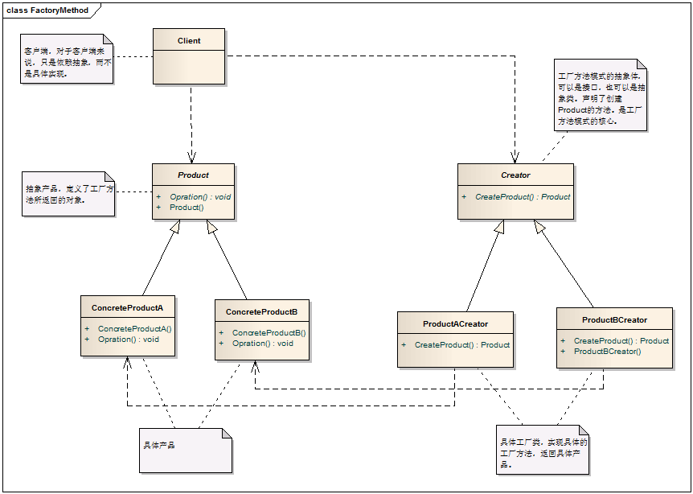

# Factory Method Pattern - 工厂方法模式

#### 1. 概述

　　定义一个用于创建对象的接口，让子类决定实例化哪一个类。工厂方法使一个类的实例化延迟到子类。

#### 2. 模式中的角色

　　2.1 抽象工厂（Creator）：这个抽象类（或接口）声明一个创建对象的工厂方法，用来返回一个Product类型的对象。

　　2.2 具体工厂（ConcreteCreator)：重定义工厂方法，返回一个具体的Concrete Product实例。

　　2.3 抽象产品（Product)：定义工厂方法所创建的对象。

　　2.4 具体产品（ConcreteProduct): 具体产品，继承自Product抽象类。

#### 3. 模式解读

##### 　　3.1 工厂方法模式的一般化类图



##### 　　3.2 工厂方法模式的代码实现
```c
    /// <summary>
    /// 抽象工厂，声明了一个创建Product的方法
    /// </summary>
    public abstract class Creator
    {
        /// <summary>
        /// 该方法用来返回Product产品
        /// </summary>
        /// <returns></returns>
        public abstract Product CreateProduct();
    }

    /// <summary>
    /// 具体产工厂，产品类 A 的创建者，继承自抽象工厂Creator
    /// </summary>
    public class ProductACreator : Creator
    {
        public override Product CreateProduct()
        {
            return new ConcreteProductA();
        }
    }

    /// <summary>
    /// 具体产工厂，产品类 B 的创建者，继承自抽象工厂Creator
    /// </summary>
    public class ProductBCreator : Creator
    {
        public ProductBCreator() { }

        public override Product CreateProduct()
        {
            return new ConcreteProductB();
        }
    }

    /// <summary>
    /// 抽象产品，定义工厂方法中所创建的对象
    /// </summary>
    public abstract class Product
    {
        public Product()
        { }

        public abstract void Opration();
    }

    /// <summary>
    /// 具体产品A，继承自Product
    /// </summary>
    public class ConcreteProductA : Product
    {
        public ConcreteProductA() { }

        public override void Opration()
        {
            // This is product A
        }
    }

    /// <summary>
    /// 具体产品B，继承自Product
    /// </summary>
    public class ConcreteProductB : Product
    {
        public ConcreteProductB() { }

        public override void Opration()
        {
            // This is product B
        }
    }
```

#### 4. 模式总结

##### 　　4.1 优点

　　　　工厂方法去除了条件分支（解除了工厂类与分支的耦合），解决了简单工厂对修改开放的问题。

##### 　　4.2 缺点

　　　　工厂方法模式实现时，客户端需要决定实例化哪个工厂来实现对具体产品的构建，选择判断依然存在，也就是说，工厂方法模式将简单工厂的逻辑判断交给客户端去处理。

　　　　对简单工厂模式来说，增加功能是要修改工厂类的；但对工厂方法模式，修改的是客户端。

##### 　　4.3 使用场景

　　　　对于某个产品，调用者清楚地知道应该使用哪个具体工厂服务，实例化该具体工厂，生产出具体的产品来。
　　　　子类的数量不固定，随时可能有新的功能子类出现。
