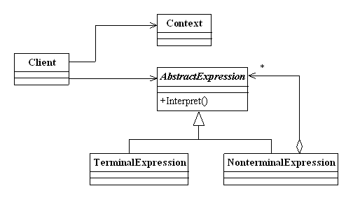

# Interpreter Pattern - 解释器模式

#### 概述：
未来机器智能化已然成为趋势，现在手机都能听懂英语和普通话，那我大中华几万种方言的被智能化也许也是趋势，我们的方言虽然和普通话相似，但是还是不一样的。这可能需要一个新的语法分析器来帮助我们。
我们的解释器模式就是描述了如何为简单的语言定义一个文法，如何在该语言中表示一个句子，以及如何解释这些句子。
但是解释一门自然语言是复杂的过程，我们以加减运算为例子来详细解释解释器模式。

#### 类图和实例：

抽象表达式角色(AbstractExpression)： 声明一个抽象的解释操作，这个接口为所有具体表达式角色都要实现的。
终结符表达式角色(TerminalExpression)： 实现与文法中的元素相关联的解释操作，通常一个解释器模式中只有一个终结符表达式，但有多个实例对应不同的终结符，
终结符就是语言中用到的基本元素，一般不能再被分解，如: x -> xa， 这里a是终结符，因为没有别的规则可以把a变成别的符号，不过x可以变成别的符号，所以x是非终结符。
非终结符表达式角色(NonterminalExpression)： 文法中的每条规则对应于一个非终结表达式， 非终结表达式根据逻辑的复杂程度而增加，原则上每个文法规则都对应一个非终结符表达式。
环境角色(Context)：包含解释器之外的一些全局信息。
实例：
```c
#include <iostream>    
#include <map>    
#include <string>    
   
using namespace std;    
  
class Context  
{  
private:  
    map<string, int> valueMap;  
  
public:  
    void addValue(string key,int value)  
    {         
        valueMap.insert(std::pair<string,int>(key,value));  
    }  
  
    int getValue(string key)  
    {  
        return valueMap[key];  
    }  
};  
  
class AbstractExpression  
{  
public :  
     virtual int interpreter(Context context) = 0;  
};  
  
class AddNonterminalExpression : public AbstractExpression  
{  
private :  
    AbstractExpression *left;  
    AbstractExpression *right;  
  
public:  
    AddNonterminalExpression(AbstractExpression *left, AbstractExpression *right)  
    {  
        this->left = left;  
        this->right = right;  
    }  
  
    int interpreter(Context context)  
    {  
        return this->left->interpreter(context) + this->right->interpreter(context);  
    }  
  
};  
  
class SubtractNonterminalExpression : public AbstractExpression  
{  
private :  
    AbstractExpression *left;  
    AbstractExpression *right;  
  
public:  
    SubtractNonterminalExpression(AbstractExpression *left, AbstractExpression *right)  
    {  
        this->left = left;  
        this->right = right;  
    }  
  
    int interpreter(Context context)  
    {  
        return this->left->interpreter(context) - this->right->interpreter(context);  
    }  
  
};  
  
class TerminalExpression : public AbstractExpression  
{  
private :  
    int i;  
  
public :  
    TerminalExpression(int i)  
    {  
        this->i = i;  
    }  
  
    int interpreter(Context context)  
    {  
        return this->i;  
    }  
};  
  
int main(){    
    //a-b+c  
    Context context;  
    context.addValue("a", 7);  
    context.addValue("b", 8);  
    context.addValue("c", 2);  
  
    SubtractNonterminalExpression *subtractValue = new SubtractNonterminalExpression(new TerminalExpression(  
        context.getValue("a")), new TerminalExpression(context.getValue("b")));  
  
    AddNonterminalExpression *addValue = new AddNonterminalExpression(subtractValue, new TerminalExpression(  
        context.getValue("c")));  
  
    cout<< addValue->interpreter(context);  
  
    return 0;    
}
```

#### 适用性：
在以下情况下可以考虑使用解释器模式：
(1) 可以将一个需要解释执行的语言中的句子表示为一个抽象语法树。
(2)  一些重复出现的问题可以用一种简单的语言来进行表达。
(3) 一个语言的文法较为简单。
(4) 执行效率不是关键问题。（注：高效的解释器通常不是通过直接解释抽象语法树来实现的，而是需要将它们转换成其他形式，使用解释器模式的执行效率并不高。）

#### 优缺点：
##### 优点：
(1) 易于改变和扩展文法。由于在解释器模式中使用类来表示语言的文法规则，因此可以通过继承等机制来改变或扩展文法。
(2) 每一条文法规则都可以表示为一个类，因此可以方便地实现一个简单的语言。
(3) 实现文法较为容易。在抽象语法树中每一个表达式节点类的实现方式都是相似的，这些类的代码编写都不会特别复杂，还可以通过一些工具自动生成节点类代码。
(4) 增加新的解释表达式较为方便。如果用户需要增加新的解释表达式只需要对应增加一个新的终结符表达式或非终结符表达式类，原有表达式类代码无须修改，符合“开闭原则”。
##### 缺点：
(1) 对于复杂文法难以维护。在解释器模式中，每一条规则至少需要定义一个类，因此如果一个语言包含太多文法规则，类的个数将会急剧增加，导致系统难以管理和维护，此时可以考虑使用语法分析程序等方式来取代解释器模式。
(2) 执行效率较低。由于在解释器模式中使用了大量的循环和递归调用，因此在解释较为复杂的句子时其速度很慢，而且代码的调试过程也比较麻烦。

#### 总论：
尽量不要在重要模块中使用解释器模式，因为维护困难。在项目中，可以使用脚本语言来代替解释器模式。