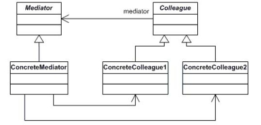

# Mediator Pattern - 中介者模式

#### 概述：
假设我们开发一个图片处理软件，里面肯定包括很多相关功能，比如说剪切，旋转，滤镜，美化等等，而我们这些功能所要处理的对象是固定的，就是我们所显示的那张图片。但是我们不能把所有的功能罗列到一个tab上，虽然这样处理方便但是不美观。这是我们可以这样子：用一个中介者类负责所有功能的初始化和具体执行，我们需要功能时直接调用中介者类即可。
    中介者模式就是定义一个中介对象来封装系列对象之间的交互。中介者使各个对象不需要显示地相互引用，从而使其耦合性松散，而且可以独立地改变他们之间的交互。

#### 类图和实例



Mediator类：抽象中介者，定义了同事对象交互的接口。
ConcreteMediator类：具体中介者对象，实现抽象类中的方法，此具体中介者对象需要知道所有具体同事类，并从具体同事接受消息，向具体同事对象发送命令。
Colleague类：抽象同事类。
ConcreteColleague类：具体同事类，实现抽象同事类中的方法。每一个同时类需要知道中介者对象；每个具体同事类只需要了解自己的行为，而不需要了解其他同事类的情况。
```c
#include <iostream>  
#include <vector>  
#include <string>  
  
using namespace std;  
  
class Colleage  
{  
private:  
    string name;  
    string content;  
public:  
    Colleage(string n = " "):name(n){};  
    void set_name(string name)  
    {  
        this->name = name;  
    }  
    string get_name()  
    {  
        return this->name;  
    }  
    void set_content(string content)  
    {  
        this->content = content;  
    }  
    string get_content()  
    {  
        if(content.size() != 0)  
            return content;  
        else return "Copy that";  
    }  
    virtual void talk(){};  
  
};  
  
class Monitor : public Colleage  
{  
public:  
    Monitor(string n = ""):Colleage(n){};  
    virtual void talk()  
    {  
        cout<<"班长 "<<get_name()<<" 说："<<get_content()<<endl;  
    }  
};  
  
class Secretary : public Colleage  
{  
public:  
    Secretary(string n = ""):Colleage(n){};  
    virtual void talk()  
    {  
        cout<<"团支书 "<<get_name()<<" 说："<<get_content()<<endl;  
    }  
};  
  
class StudentA : public Colleage  
{  
public:  
    StudentA(string n = ""):Colleage(n){};  
    virtual void talk()  
    {  
        cout<<"学生 A "<<get_name()<<" 说："<<get_content()<<endl;  
    }  
};  
  
class StudentB : public Colleage  
{  
public:  
    StudentB(string n = ""):Colleage(n){};  
    virtual void talk()  
    {  
        cout<<"学生 B "<<get_name()<<" 说："<<get_content()<<endl;  
    }  
};  
  
class Mediator  
{  
public:  
    vector<Colleage*> studentList;  
    virtual void add_student(Colleage *student)  
    {  
        studentList.push_back(student);  
    };  
    virtual void notify(Colleage *student){};      
};  
  
class QQMediator : public Mediator  
{  
public:  
    virtual void notify(Colleage *student)  
    {  
        student->talk();  
        for(int i = 0 ; i < studentList.size() ; ++i)  
        {
            if(student != studentList[i])  
            {  
                studentList[i]->talk();  
            }  
        }  
    };    
};  
  
  
int main()  
{  
    QQMediator qq;  
    Monitor *studentMonitor = new Monitor("Foxx");  
    Secretary *studentSecretary = new Secretary("TC");  
    StudentA *studentA = new StudentA("Jack");  
    StudentB *studentB = new StudentB("Frank");          
  
    qq.add_student(studentSecretary);  
    qq.add_student(studentA);  
    qq.add_student(studentB);       
  
    studentMonitor->set_content("明天开始放假！");  
    qq.notify(studentMonitor);     
    return 0;  
}
```

#### 适用性：
1.一组对象以定义良好但是复杂的方式进行通信。产生的相互依赖关系结构混乱且难以理解。
2.一个对象引用其他很多对象并且直接与这些对象通信，导致难以复用该对象。
3.想定制一个分布在多个类中的行为，而又不想生成太多的子类。

#### 优缺点：
使用中介者模式的优点：
  1.降低了系统对象之间的耦合性，使得对象易于独立的被复用。
  2.提高系统的灵活性，使得系统易于扩展和维护。
使用中介者模式的缺点：
  由于我们这个“中介“承担了较多的责任，所以一旦这个中介对象出现了问题，那么整个系统就会受到重大的影响。