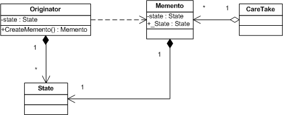
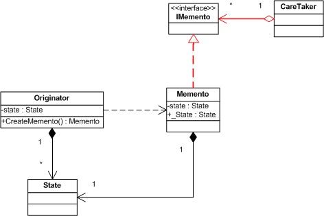

# Memento Pattern - 备忘录模式

一般想起Undo，都会想起Memento模式和Command模式，今天先说前者。

Memento模式最形象的例子是，把大脑的记忆一条条写在Blog上，其中大脑是Originator，每一条记忆信息是Memento，这条信息可以很复杂，于是可以独自作为一个类对象State，Blog这个载体就是CareTaker，负责添加与删除记忆信息。

Memento模式UML图如下：



Memento(备忘录)：保存Originator对象的内部状态(主动权在Originator)，提供宽接口给Originator，提供窄接口给CareTaker。
Originator(原发器)：控制那些内部状态要保存，防止外界对象访问Memento，自己可以访问Memento，尤其是先前状态。
CareTaker：负责保存Memento，但不能浏览Memento(从而是窄接口)。
State：状态类，用来模拟内部状态，亦可以是一个string，这里设计成类更有一般意义。

如图，CareTaker只能有一个，但是Originator可以有多个，从而实现一个本子上记多条信息。
就举Undo的例子代码，所有的Memento模式的框架都是这样子的(对状态类使用了原型模式):

```c
 using System.Collections;
    //Mementor类框架
    public class Mementor
    {
        private State state;

        public Mementor(State st)
        {
            this.state = (State)st.Clone();
        }

        public State _State
        {
            get
            {
                return state;
            }
            set
            {
                state = value;
            }
        }
    }

    //状态对象类，这里使用了原型模式复制对象
    public class State : ICloneable
    {
        private string a;

        public string A
        {
            get
            {
                return a;
            }
            set
            {
                a = value;
            }
        }

        ICloneable MembersICloneable Members
    }

    //Originator类框架
    public class Originator
    {
        private State state;

        public Originator(State st)
        {
            this.state = (State)st.Clone();
        }

        public Mementor CraeteMementor()
        {
            return new Mementor(this.state);
        }

        public void SetState(Mementor m)
        {
            this.state = m._State;
        }

    }

    //CareTaker类对象
    public class CareTaker : CollectionBase
    {
        public int Add(Mementor m)
        {
            return List.Add(m);
        }

        public Mementor this[int index]
        {
            get
            {
                return (Mementor)List[index];
            }
            set
            {
                List[index] = value;
            }
        }

        public void Remove(Mementor m)
        {
            List.Remove(m);
        }

        public Mementor Restore()
        {
            if (List.Count == 0)
                return null;

            Mementor m = (Mementor)List[List.Count - 1];
            List.Remove(m);

            return m;
        }

    }
```
回顾Memento模式定义：
在不损害封装性的前提下，捕获一个对象的内部状态，并在该对象之外保存这个状态，这样日后就可以将该对象恢复到原来的状态了。——《设计模式》

注意，不损害封装性，就是说，为了不使外界访问Memento的_State属性(当然Originator可以访问这个属性)，我们需要定义一个空的公共接口IMemento，让Memento实现它。于是，
1. CareTaker作为外界，操作IMemento这个接口，而不再是Memento类；
2. Originator仍使用Memento类对象。
这样就实现了Memento只对Originator暴露成员。
新的UML如下：



相应的在CareTaker类中，将所有的Memento改为IMemento，于是相应改动尤其是CareTaker类：

```c
    //IMementor 空接口
    public interface IMementor
    {

    }

    //Mementor类框架
    public class Mementor : IMementor
    {
       //
    }

    //CareTaker类对象
    public class CareTaker : CollectionBase
    {
        public int Add(IMementor m)
        {
            return List.Add(m);
        }

        public IMementor this[int index]
        {
            get
            {
                return (IMementor)List[index];
            }
            set
            {
                List[index] = value;
            }
        }

        public void Remove(IMementor m)
        {
            List.Remove(m);
        }

        public IMementor Restore()
        {
            if (List.Count == 0)
                return null;

            IMementor m = (IMementor)List[List.Count - 1];
            List.Remove(m);

            return m;
        }

    }
```
补注：
1.为了防止Client直接实例化Memento并将其写到CareTaker中，建议将Memento类作为Originator的内部类，这样只能通过Originator访问Memento，最终实现了安全性。

2.此外，一般一个Originator对应一个Memento。如果多个Originator都对应一个Memento，因为之前将Memento类作为Originator的内部类，所以有必要提取出这个内嵌类到一个抽象类中，然后让所有的Originator泛化它——使用Template方法做啦。

3.再举一个例子。编辑Word文档的时候，会相应生成许多隐藏文件，这些其实就是这个文档不同时期的的快照，也就是Memento，只是序列化在了硬盘上保存，为了Undo机制而存在。机器重启的时候这些隐藏文件才会清除。因为它们是基于这一次打开直至关闭而创建的Memento，所以只在关闭文档前有效存在，最后到关机的时候再彻底杀掉。当然特例是非法关机(断电或冷关机)，这时候再次打开系统，会发现这些隐藏文件还存在，那是因为上次非法关机，来不及清除这些“垃圾”。

另外一个例子是PhotoShop的Undo机制，我估计，因为是图像处理软件，所以Memento模式中，CareTaker中每一步存的是动作命令，比如说移动/放大/反转/加滤镜，因为动作是可逆的，所以不存快照而存命令。分析如下：

Memento模式的CareTaker中的Arraylist元素有两种存法（假设已经操作了N步，即ArrayList长度N)：
一种是每次存快照，即所有对象的所有状态，这样存取的对象会比较大，但是好处是，如果想Undo至第X步，都可以一次完成：直接用索引X，找到那个时候的对象状态，用Clone方法还原到那个时间点，并且设置这个Arraylist的长度为X，不再是原来的长度；
另一种是每次存新的动作，这样存取的对象会比较小，但是如果想Undo至第X步，那么要先把ArrayList中从X开始到N的所有元素都弹出，然后每次都要重新从ArrayList的第1个元素到第X个，依次执行其相应的命令，这样操作就慢了一些——命令者模式的Undo其实就是这么实现的，用Memento作为容器存命令。