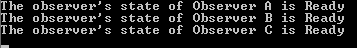
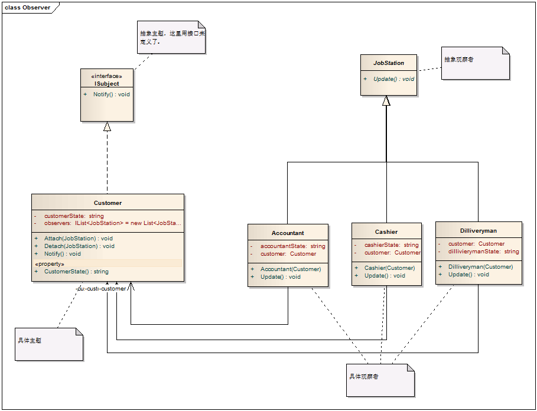
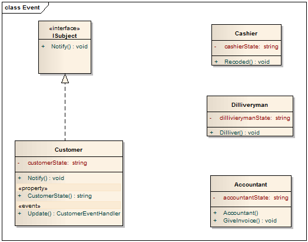

# Observer Pattern - 观察者模式

#### 1. 概述

　　有时被称作发布/订阅模式，观察者模式定义了一种一对多的依赖关系，让多个观察者对象同时监听某一个主题对象。这个主题对象在状态发生变化时，会通知所有观察者对象，使它们能够自动更新自己。

#### 2. 解决的问题

　　将一个系统分割成一个一些类相互协作的类有一个不好的副作用，那就是需要维护相关对象间的一致性。我们不希望为了维持一致性而使各类紧密耦合，这样会给维护、扩展和重用都带来不便。观察者就是解决这类的耦合关系的。

#### 3. 模式中的角色

　　3.1 抽象主题（Subject）：它把所有观察者对象的引用保存到一个聚集里，每个主题都可以有任何数量的观察者。抽象主题提供一个接口，可以增加和删除观察者对象。

　　3.2 具体主题（ConcreteSubject）：将有关状态存入具体观察者对象；在具体主题内部状态改变时，给所有登记过的观察者发出通知。

　　3.3 抽象观察者（Observer）：为所有的具体观察者定义一个接口，在得到主题通知时更新自己。

　　3.4 具体观察者（ConcreteObserver）：实现抽象观察者角色所要求的更新接口，以便使本身的状态与主题状态协调。

#### 4. 模式解读

##### 　　4.1 观察者模式的类图


##### 　　4.2 观察者模式的代码

```c
    /// <summary>
    /// 抽象主题类
    /// </summary>
    public abstract class Subject
    {
        private IList<Observer> observers = new List<Observer>();

        /// <summary>
        /// 增加观察者
        /// </summary>
        /// <param name="observer"></param>
        public void Attach(Observer observer)
        {
            observers.Add(observer);
        }

        /// <summary>
        /// 移除观察者
        /// </summary>
        /// <param name="observer"></param>
        public void Detach(Observer observer)
        {
            observers.Remove(observer);
        }

        /// <summary>
        /// 向观察者（们）发出通知
        /// </summary>
        public void Notify()
        {
            foreach (Observer o in observers)
            {
                o.Update();
            }
        }
    }

    /// <summary>
    /// 抽象观察者类，为所有具体观察者定义一个接口，在得到通知时更新自己
    /// </summary>
    public abstract class Observer
    {
        public abstract void Update();
    }

    /// <summary>
    /// 具体观察者或具体通知者，将有关状态存入具体观察者对象；在具体主题的内部状态改变时，给所有登记过的观察者发出通知。具体主题角色通常用一个具体子类实现。
    /// </summary>
    public class ConcreteSubject : Subject
    {
        private string subjectState;

        /// <summary>
        /// 具体观察者的状态
        /// </summary>
        public string SubjectState
        {
            get { return subjectState; }
            set { subjectState = value; }
        }
    }

    /// <summary>
    /// 具体观察者，实现抽象观察者角色所要求的更新接口，已是本身状态与主题状态相协调
    /// </summary>
    public class ConcreteObserver : Observer
    {
        private string observerState;
        private string name;
        private ConcreteSubject subject;

        /// <summary>
        /// 具体观察者用一个具体主题来实现
        /// </summary>
        public ConcreteSubject Subject
        {
            get { return subject; }
            set { subject = value; }
        }

        public ConcreteObserver(ConcreteSubject subject, string name)
        {
            this.subject = subject;
            this.name = name;
        }

        /// <summary>
        /// 实现抽象观察者中的更新操作
        /// </summary>
        public override void Update()
        {
            observerState = subject.SubjectState;
            Console.WriteLine("The observer's state of {0} is {1}", name, observerState);
        }
    }
```
##### 　　4.3 客户端代码

```java
    class Program
    {
        static void Main(string[] args)
        {
            // 具体主题角色通常用具体自来来实现
            ConcreteSubject subject = new ConcreteSubject();

            subject.Attach(new ConcreteObserver(subject, "Observer A"));
            subject.Attach(new ConcreteObserver(subject, "Observer B"));
            subject.Attach(new ConcreteObserver(subject, "Observer C"));

            subject.SubjectState = "Ready";
            subject.Notify();

            Console.Read();
        }
    }
```
　　运行结果



#### 5. 模式总结

##### 　　5.1 优点

　　　　5.1.1 观察者模式解除了主题和具体观察者的耦合，让耦合的双方都依赖于抽象，而不是依赖具体。从而使得各自的变化都不会影响另一边的变化。

##### 　　5.2 缺点

　　　　5.2.1 依赖关系并未完全解除，抽象通知者依旧依赖抽象的观察者。

##### 　　5.3 适用场景

　　　　5.3.1 当一个对象的改变需要给变其它对象时，而且它不知道具体有多少个对象有待改变时。

　　　　5.3.2 一个抽象某型有两个方面，当其中一个方面依赖于另一个方面，这时用观察者模式可以将这两者封装在独立的对象中使它们各自独立地改变和复用。

 

#### 6. 模式引申

　　　应用C#中的事件委托来彻底解除通知者和观察者之间的耦合。

　　　6.1 关于委托的定义：委托是一种引用方法的类型。一旦为委托分配了方法，委托将与该方法有相同的行为。委托方法可以像其它任何方法一样，具有参数和返回值。委托可以看作是对函数（方法）的的抽象，是函数的“类”，委托的实例代表一个（或多个）具体的函数，它可以是多播的。

　　　6.2 关于事件：事件基于委托，为委托提供了一种发布/订阅机制。事件的订阅与取消与我们刚才讲的观察者模式中的订阅与取消类似，只是表现形式有所不同。在观察者模式中，订阅使用方法Attach（）来进行；在事件的订阅中使用“+=”。类似地，取消订阅在观察者模式中用Dettach（），而事件的取消用“-=”。


#### 7. 实例

##### 　　7.1 实例描述

　　客户支付了订单款项，这时财务需要开具发票，出纳需要记账，配送员需要配货。

##### 　　7.2 观察者模式的实现

　　　　7.2.1 类图



　　　　7.2.2 代码实现

```c
    /// <summary>
    /// 抽象观察者
    /// </summary>
    public interface ISubject
    {
        void Notify();
    }

    /// <summary>
    /// 工作岗位，作为这里的观察者的抽象
    /// </summary>
    public abstract class JobStation
    {
        public abstract void Update();
    }

    /// <summary>
    /// 具体主题，这里是客户
    /// </summary>
    public class Customer : ISubject
    {
        private string customerState;

        private IList<JobStation> observers = new List<JobStation>();

        /// <summary>
        /// 增加观察者
        /// </summary>
        /// <param name="observer"></param>
        public void Attach(JobStation observer)
        {
            this.observers.Add(observer);
        }

        /// <summary>
        /// 移除观察者
        /// </summary>
        /// <param name="observer"></param>
        public void Detach(JobStation observer)
        {
            this.observers.Remove(observer);
        }

        /// <summary>
        /// 客户状态
        /// </summary>
        public string CustomerState
        {
            get { return customerState; }
            set { customerState = value; }
        }

        public void Notify()
        {
            foreach (JobStation o in observers)
            {
                o.Update();
            }
        }
    }

    /// <summary>
    /// 会计
    /// </summary>
    public class Accountant : JobStation
    {
        private string accountantState;
        private Customer customer;

        public Accountant(Customer customer)
        {
            this.customer = customer;
        }

        /// <summary>
        /// 更新状态
        /// </summary>
        public override void Update()
        {
            if (customer.CustomerState == "已付款")
            {
                Console.WriteLine("我是会计，我来开具发票。");
                accountantState = "已开发票";
            }
        }
    }

    /// <summary>
    /// 出纳
    /// </summary>
    public class Cashier : JobStation
    {
        private string cashierState;
        private Customer customer;

        public Cashier(Customer customer)
        {
            this.customer = customer;
        }

        public override void Update()
        {
            if (customer.CustomerState == "已付款")
            {
                Console.WriteLine("我是出纳员，我给登记入账。");
                cashierState = "已入账";
            }
        }
    }

    /// <summary>
    /// 配送员
    /// </summary>
    public class Dilliveryman : JobStation
    {
        private string dillivierymanState;
        private Customer customer;

        public Dilliveryman(Customer customer)
        {
            this.customer = customer;
        }

        public override void Update()
        {
            if (customer.CustomerState == "已付款")
            {
                Console.WriteLine("我是配送员，我来发货。");
                dillivierymanState = "已发货";
            }
        }
    }
```
　　　　7.2.3 客户端代码

```c
    class Program
    {
        static void Main(string[] args)
        {

            Customer subject = new Customer();

            subject.Attach(new Accountant(subject));
            subject.Attach(new Cashier(subject));
            subject.Attach(new Dilliveryman(subject));

            subject.CustomerState = "已付款";
            subject.Notify();

            Console.Read();
        }
    }
```
　　　　运行结果：

　　　　我是会计，我来开具发票。
　　　　我是出纳员，我给登记入账。
　　　　我是配送员，我来发货。


##### 　　7.3 事件实现

　　　　7.3.1 类图



　　　　通过类图来看，观察者和主题之间已经不存在任何依赖关系了。

　　　　7.3.2 代码实现

```c
    /// <summary>
    /// 抽象主题
    /// </summary>
    public interface ISubject
    {
        void Notify();
    }

    /// <summary>
    /// 声明委托
    /// </summary>
    public delegate void CustomerEventHandler();

    /// <summary>
    /// 具体主题
    /// </summary>
    public class Customer : ISubject
    {
        private string customerState;

        // 声明一个委托事件，类型为 CustomerEventHandler
        public event CustomerEventHandler Update;

        public void Notify()
        {
            if (Update != null)
            {
                // 使用事件来通知给订阅者
                Update();
            }
        }

        public string CustomerState
        {
            get { return customerState; }
            set { customerState = value; }
        }
    }

    /// <summary>
    /// 财务，已经不需要实现抽象的观察者类，并且不用引用具体的主题
    /// </summary>
    public class Accountant
    {
        private string accountantState;

        public Accountant()
        { }

        /// <summary>
        /// 开发票
        /// </summary>
        public void GiveInvoice()
        {
            Console.WriteLine("我是会计，我来开具发票。");
            accountantState = "已开发票";
        }
    }

    /// <summary>
    /// 出纳，已经不需要实现抽象的观察者类，并且不用引用具体的主题
    /// </summary>
    public class Cashier
    {
        private string cashierState;

        public void Recoded()
        {
            Console.WriteLine("我是出纳员，我给登记入账。");
            cashierState = "已入账";
        }
    }

    /// <summary>
    /// 配送员，已经不需要实现抽象的观察者类，并且不用引用具体的主题
    /// </summary>
    public class Dilliveryman
    {
        private string dillivierymanState;

        public void Dilliver()
        {
            Console.WriteLine("我是配送员，我来发货。");
            dillivierymanState = "已发货";
        }
    }
```
　　　　7.3.3 客户端代码

```c
    class Program
    {
        static void Main(string[] args)
        {

            Customer subject = new Customer();

            Accountant accountant = new Accountant();
            Cashier cashier = new Cashier();
            Dilliveryman dilliveryman = new Dilliveryman();

            // 注册事件
            subject.Update += accountant.GiveInvoice;
            subject.Update += cashier.Recoded;
            subject.Update += dilliveryman.Dilliver;

            /*
             * 以上写法也可以用下面代码来替换
            subject.Update += new CustomerEventHandler(accountant.GiveInvoice);
            subject.Update += new CustomerEventHandler(cashier.Recoded);
            subject.Update += new CustomerEventHandler(dilliveryman.Dilliver);
             */

            subject.CustomerState = "已付款";
            subject.Notify();

            Console.Read();
        }
    }
```
　　　　运行结果

```
　　　　我是会计，我来开具发票。
　　　　我是出纳员，我给登记入账。
　　　　我是配送员，我来发货。
```
