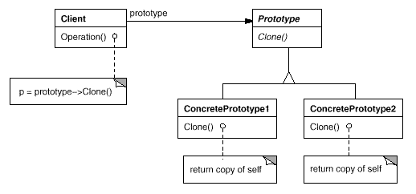
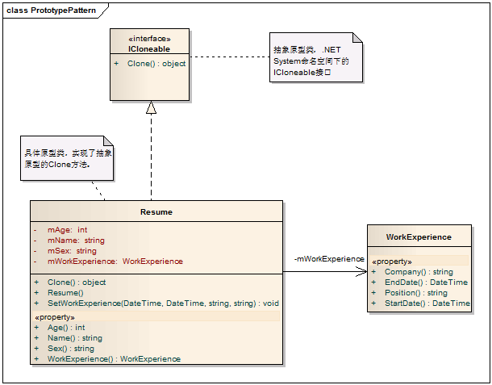

# Prototype Pattern - 原型模式

#### 1. 概述

　　通过复制一个已经存在的实例来创建一个新的实例。被复制的实例被称为原型，这个原型是可定制的。

#### 2. 原型模式中的角色

　　2.1 抽象原型类（Abstract Prototype）：提供一个克隆接口

　　2.2 具体原型类（Concrete Prototype）: 及实现了克隆接口的具体原型类

  #####  　原型模式的一般化类图

  

#### 3. 实例

　　求职网站上现在都支持多份简历，如果每创建一份简历都要从头至尾地填写一遍，那也是非常让人沮丧的事。其实针对我们的求职岗位的不同，不同的简历可能只要修改局部内容就可以了，而不用全部重新构建一份新的简历。复制一份简历，然后做局部修改是最让人省心的了！

##### 　　3.1 实现类图



　　类图解读

　　在.NET中，System命名空间已经为我们提供了一个ICloneable接口，它包含了一个方法Clone()，实现这个接口就完成了原型模式。

##### 　　3.2 深复制与浅复制

　　在写实现代码之前，先要理解一下深复制与浅复制。

　　　　3.2.1 浅复制：将原来对象中的所有字段逐个复制到一个新对象，如果字段是值类型，则简单地复制一个副本到新对象，改变新对象的值类型字段不会影响原对象；如果字段是引用类型，则复制的是引用，改变目标对象中引用类型字段的值将会影响原对象。例如, 如果一个对象有一个指向引用类型（如例子中的工作经历）的字段, 并且我们对该对象做了一个浅复制, 那麽两个对象将引用同一个引用（即同一段工作经历）。

　　　　3.2.2 深复制：与浅复制不同之处在于对引用类型的处理，深复制将新对象中引用类型字段指向复制过的新对象，改变新对象中引用的任何对象，不会影响到原来的对象中对应字段的内容。例如，如果一个对象有一个指向引用类型（如例子中的工作经历）的字段，并且对该对象做了一个深复制的话.我门将创建一个新的对象（即新的工作经历）。

##### 　　3.3 简历的浅复制实现

```c
    /// <summary>
    /// 实现了ICloneable接口的简历类
    /// </summary>
    public class Resume:ICloneable
    {
        public Resume()
        {
            mWorkExperience = new WorkExperience();
        }

        private string mName;
        private string mSex;
        private int mAge;
        private WorkExperience mWorkExperience;

        public string Name
        {
            get { return mName; }
            set { mName = value; }
        }

        public string Sex
        {
            get { return mSex; }
            set { mSex = value; }
        }

        public int Age
        {
            get { return mAge; }
            set { mAge = value; }
        }

        /// <summary>
        /// 关联了一个引用类型
        /// </summary>
        public WorkExperience WorkExperience
        {
            get { return mWorkExperience; }
        }

        public void SetWorkExperience(DateTime startDate, DateTime endDate, string company, string position)
        {
            this.mWorkExperience.Company = company;
            this.mWorkExperience.EndDate = endDate;
            this.mWorkExperience.StartDate = startDate;
            this.mWorkExperience.Position = position;
        }

        /// <summary>
        /// 实现ICloneable接口的Clone方法
        /// </summary>
        /// <returns></returns>
        public object Clone()
        {
            // .Net 为我们提供的浅复制对象的方法
            return this.MemberwiseClone();
        }
    }

    /// <summary>
    /// 工作经历类
    /// </summary>
    public class WorkExperience
    {
        public DateTime StartDate { get; set; }
        public DateTime EndDate { get; set; }
        public string Company { get; set; }
        public string Position { get; set; }
    }
```
　　下面是测试代码

```c
    public void TestShallowCopy()
    {
        Resume myFirstResume = new Resume
        {
            Age = 29,
            Name = "Kevin Wang",
            Sex = "男",
        };
        myFirstResume.SetWorkExperience(new DateTime(2006, 7, 1), new DateTime(2007, 7, 1), "My First Company", "Software Engineer");

        Resume mySecondResume = (Resume)myFirstResume.Clone();
        mySecondResume.SetWorkExperience(new DateTime(2007, 8, 1), new DateTime(2008, 8, 1), "My Second Company", "Software Engineer");

        Resume myThirdResume = (Resume)myFirstResume.Clone();
        myThirdResume.SetWorkExperience(new DateTime(2008, 8, 1), new DateTime(2009, 8, 1), "My Third Company", "Senior Software Engineer");

        Assert.AreEqual("My First Company", myFirstResume.WorkExperience.Company);
        Assert.AreEqual("My Second Company", mySecondResume.WorkExperience.Company);
        Assert.AreEqual("My Third Company", myThirdResume.WorkExperience.Company);
    }
```
　　　　这里期望的是三个断言都能运行成功，但是却是失败的，原因是：由于我们使用的是浅复制，所以myFirstResume, mySecondResume 和 myThirdResume引用的是同一个对象，因此最终的结果是 三个简历的WorkExperience.Company都是“My Third Company".

##### 　　3.4 简历的深复制实现

```c
    /// <summary>
    /// 实现了ICloneable接口的简历类
    /// </summary>
    public class Resume : ICloneable
    {
        public Resume()
        {
            mWorkExperience = new WorkExperience();
        }

        /// <summary>
        /// 这里使用一个私有的构造函数来对其连接到的引用类型进行复制
        /// </summary>
        /// <param name="workExperience"></param>
        private Resume(WorkExperience workExperience)
        {
            this.mWorkExperience = (WorkExperience)workExperience.Clone();
        }

        private string mName;
        private string mSex;
        private int mAge;
        private WorkExperience mWorkExperience;

        public string Name
        {
            get { return mName; }
            set { mName = value; }
        }

        public string Sex
        {
            get { return mSex; }
            set { mSex = value; }
        }

        public int Age
        {
            get { return mAge; }
            set { mAge = value; }
        }

        public WorkExperience WorkExperience
        {
            get { return mWorkExperience; }
        }

        /// <summary>
        /// 设置功过经历
        /// </summary>
        /// <param name="startDate"></param>
        /// <param name="endDate"></param>
        /// <param name="company"></param>
        /// <param name="position"></param>
        public void SetWorkExperience(DateTime startDate, DateTime endDate, string company, string position)
        {
            this.mWorkExperience.Company = company;
            this.mWorkExperience.EndDate = endDate;
            this.mWorkExperience.StartDate = startDate;
            this.mWorkExperience.Position = position;
        }

        /// <summary>
        /// 实现ICloneable接口的Clone方法
        /// </summary>
        /// <returns></returns>
        public object Clone()
        {
            // 这里不再使用MemberwiseClone方法进行复制了，而是新创建了一个全新的简历。它完全是在内部实现的，外部不用关心它的实现
            Resume newResume = new Resume(this.mWorkExperience);
            newResume.mSex = this.mSex;
            newResume.mName = this.mName;
            newResume.mAge = this.mAge;

            return newResume;
        }
    }

    public class WorkExperience :ICloneable
    {
        public DateTime StartDate { get; set; }
        public DateTime EndDate { get; set; }
        public string Company { get; set; }
        public string Position { get; set; }

        public object Clone()
        {
            // 使用.Net 为我们提供的浅复制对象的方法，因为这里已经没有引用对象了（string虽然是引用类型，但.NET为我们做了特别处理，可以像值类型一样使用它）。
            return this.MemberwiseClone();
        }
    }
```
　　测试代码如下

```c
    public void TestDeepCopy()
    {
        Resume myFirstResume = new Resume
        {
            Age = 29,
            Name = "Kevin Wang",
            Sex = "男",
        };
        myFirstResume.SetWorkExperience(new DateTime(2006, 7, 1), new DateTime(2007, 7, 1), "My First Company", "Software Engineer");

        Resume mySecondResume = (Resume)myFirstResume.Clone();
        mySecondResume.SetWorkExperience(new DateTime(2007, 8, 1), new DateTime(2008, 8, 1), "My Second Company", "Software Engineer");

        Resume myThirdResume = (Resume)myFirstResume.Clone();
        myThirdResume.SetWorkExperience(new DateTime(2008, 8, 1), new DateTime(2009, 8, 1), "My Third Company", "Senior Software Engineer");

        Assert.AreEqual("My First Company", myFirstResume.WorkExperience.Company);
        Assert.AreEqual("My Second Company", mySecondResume.WorkExperience.Company);
        Assert.AreEqual("My Third Company", myThirdResume.WorkExperience.Company);
    }
```
　　运行测试，测试通过，这正是我们期望的结果。

#### 4. 模式总结

##### 　　4.1 优点

　　　　4.1.1 隐藏了对象的创建细节，对有些初始化需要占用很多资源的类来说，对性能也有很大提高。

　　　　4.1.2 在需要新对象时，可以使用Clone来快速创建创建一个，而不用使用new来构建。

##### 　　4.2 缺点

　　　　4.2.1 每一个类都需要一个Clone方法，而且必须通盘考虑。对于深拷贝来说，每个关联到的类型都不许实现IClonable接口，并且每增加或修改一个字段是都需要更新Clone方法。

##### 　　4.3 适用场景

　　　　4.3.1 类初始化需要消化非常多的资源，这个资源包括数据、硬件资源等

　　　　4.3.2 通过new产生一个对象需要非常繁琐的数据准备或访问权限，则可以使用原型模式

　　　　4.3.3 一个对象需要提供给其他对象访问，而且各个调用者可能都需要修改其值时，可以考虑使用原型模式拷贝多个对象供调用者使用。
