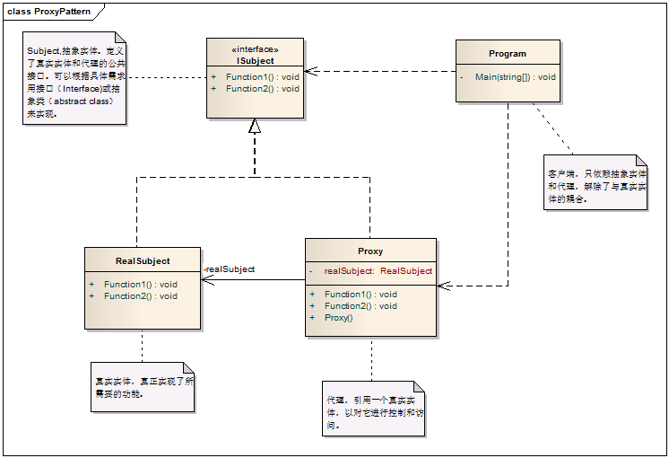
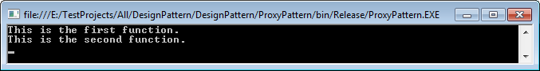

# Proxy Pattern - 代理模式

#### 1. 概述

　　为其它对象提供一种代理以控制对这个对象的访问。

　　解决的问题：如果直接访问对象比较困难，或直接访问会给使用者或系统带来一系列问题。这样对于客户端（调用者）来说，就不需要直接与真实对象进行交互，解除了调用者与真实对象的耦合。

#### 2. 模式中的角色

　　2.1 抽象实体（Subject）：定义了真实实体（RealSubject）和代理（Proxy）的公共接口，这样就在任何时候使用真实实体（RealSubject）的地方使用代理（Proxy）。

　　2.2 代理（Proxy）：保存一个引用使得代理可以直接访问真实实体，并提供一个与Subject的接口相同的接口，这样代理就可以代替真实实体。

　　2.3 真实实体（RealSubject）：定义Proxy所代表的真实实体。

#### 3. 模式解读

##### 　　3.1 代理模式的类图



##### 　　3.2 代理模式的代码实现

　　　　3.2.1 抽象实体，定义真实实体与代理的公共接口

```c
    /// <summary>
    /// 抽象实体，定义真实实体与代理的公共接口
    /// </summary>
    public interface ISubject
    {
        void Function1();
        void Function2();
    }
```
　　　　3.2.2 真实实体，真正的功能实现者

```c
    /// <summary>
    /// 真实实体，真正的功能实现者
    /// </summary>
    public class RealSubject:ISubject
    {

        public void Function1()
        {
            Console.WriteLine("This is the first function.");
        }

        public void Function2()
        {
            Console.WriteLine("This is the second function.");
        }
    }
```
　　　　3.2.3 代理，用来控制和访问真实实体

```c
    /// <summary>
    /// 代理，用来访问真实的实体
    /// </summary>
    public class Proxy : ISubject
    {
        /// <summary>
        /// 保存一个真实实体，用以在代理中访问真实实体的功能。
        /// </summary>
        private RealSubject realSubject;

        public Proxy()
        {
            realSubject = new RealSubject();
        }

        /// <summary>
        /// 实现与Subject相同的接口，实际调用的是RealSubject的Function1()
        /// </summary>
        public void Function1()
        {
            realSubject.Function1();
        }

        /// <summary>
        /// 实现与Subject相同的接口，实际调用的是RealSubject的Function2()
        /// </summary>
        public void Function2()
        {
            realSubject.Function2();
        }
    }
```
　　　　3.2.4 客户端的调用

```c
    class Program
    {
        static void Main(string[] args)
        {
            // 实例化代理
            ISubject subjectProxy = new Proxy();

            // 通过代理调用具体功能
            subjectProxy.Function1();
            subjectProxy.Function2();

            Console.Read();
        }
    }
```
　　　　3.2.5 运行结果



#### 4. 模式总结

##### 　　4.1 优点

　　　　4.1.1 对客户端来说，隐藏了真实对象的细节及复杂性。

　　　　4.1.2 实现了客户端（调用者）与真实对象的松耦合。

　　　　4.1.3 远程代理使得客户端可以访问在远程机器上的对象，远程机器可能具有更好的性能与处理速度，可以快速响应并处理客户端请求。

　　　　4.1.4 虚拟代理通过使用一个小对象来代表一个大对象，可以减少系统资源的消耗，对系统进行优化并提高运行速度。

　　　　4.1.5 安全代理可以控制对真实对象的使用权限。

##### 　　4.2 缺点

　　　　4.2.1 实现代理需要而为增加一个访问控制层，增加了额外工作。有的代理实现起来非常复杂。

##### 　　4.3 适用场景

　　　　4.3.1 远程代理： 为一个位于不同地址空间的的对象提供一个本地的代理。

　　　　4.3.2 虚拟代理：如果需要创建一个消耗较大的对象，先创建一个消耗较小的对象来表示，真实对象只在需要时才被真实创建。

　　　　4.3.3 安全代理：用来控制对真实对象的访问权限

　　　　4.3.4 智能指引：当调用真实对象时，代理提供一些额外的操作。如将对象被操作的次数记录起来等。

　　　　4.3.5 缓冲代理：为某一个目标操作提供临时的存储空间，以便更多客户端共享此结果。

　　　　4.3.6 防火墙代理：保护目标不让恶意用户接近。

　　　　4.3.7 同步化代理：使几个用户能同时使用一个对象而没有冲突。

#### 5. 应用举例

　　5.1 远程代理；.NET的WCF的远程代理

　　5.2 虚拟代理；HTML图片加载
