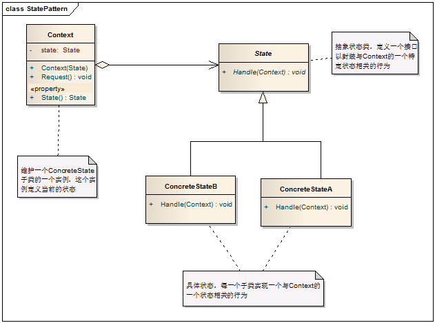
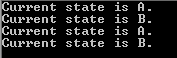
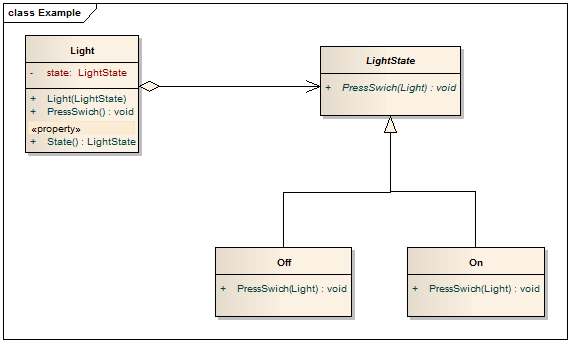
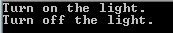

# State Pattern - 状态模式

#### 1. 概述

　　当一个对象的内在状态改变时允许改变其行为，这个对象看起来像是改变了其类。

#### 2. 解决的问题

　　主要解决的是当控制一个对象状态转换的条件表达式过于复杂时的情况。把状态的判断逻辑转移到表示不同的一系列类当中，可以把复杂的逻辑判断简单化。

#### 3. 模式中的角色

　　3.1 上下文环境（Context）：它定义了客户程序需要的接口并维护一个具体状态角色的实例，将与状态相关的操作委托给当前的Concrete State对象来处理。

　　3.2 抽象状态（State）：定义一个接口以封装使用上下文环境的的一个特定状态相关的行为。

　　3.3 具体状态（Concrete State）：实现抽象状态定义的接口。

#### 4. 模式解读

##### 　　4.1 状态模式的类图



##### 　　4.2 状态模式的代码实现

```c
    /// <summary>
    /// Context类，维护一个ConcreteState子类的实例，这个实例定义当前的状态。
    /// </summary>
    public class Context
    {
        private State state;
        /// <summary>
        /// 定义Context的初始状态
        /// </summary>
        /// <param name="state"></param>
        public Context(State state)
        {
            this.state = state;
        }

        /// <summary>
        /// 可读写的状态属性，用于读取和设置新状态
        /// </summary>
        public State State
        {
            get { return state; }
            set { state = value; }
        }

        /// <summary>
        /// 对请求做处理，并设置下一个状态
        /// </summary>
        public void Request()
        {
            state.Handle(this);
        }
    }

    /// <summary>
    /// 抽象状态类，定义一个接口以封装与Context的一个特定状态相关的行为
    /// </summary>
    public abstract class State
    {
        public abstract void Handle(Context context);
    }

    /// <summary>
    /// 具体状态类，每一个子类实现一个与Context的一个状态相关的行为
    /// </summary>
    public class ConcreteStateA : State
    {
        /// <summary>
        /// 设置ConcreteStateA的下一个状态是ConcreteStateB
        /// </summary>
        /// <param name="context"></param>
        public override void Handle(Context context)
        {
            Console.WriteLine("当前状态是 A.");
            context.State = new ConcreteStateB();
        }
    }

    public class ConcreteStateB : State
    {
        /// <summary>
        /// 设置ConcreteStateB的下一个状态是ConcreteSateA
        /// </summary>
        /// <param name="context"></param>
        public override void Handle(Context context)
        {
            Console.WriteLine("当前状态是 B.");
            context.State = new ConcreteStateA();
        }
    }
```
##### 　　4.3 客户端调用

```c
    class Program
    {
        static void Main(string[] args)
        {
            // 设置Context的初始状态为ConcreteStateA
            Context context = new Context(new ConcreteStateA());

            // 不断地进行请求，同时更改状态
            context.Request();
            context.Request();
            context.Request();
            context.Request();

            Console.Read();
        }
    }
```
　　运行结果



#### 5. 模式总结

##### 　　5.1 优点

　　　　5.1.1 状态模式将与特定状态相关的行为局部化，并且将不同状态的行为分割开来。

　　　　5.1.2 所有状态相关的代码都存在于某个ConcereteState中，所以通过定义新的子类很容易地增加新的状态和转换。

　　　　5.1.3 状态模式通过把各种状态转移逻辑分不到State的子类之间，来减少相互间的依赖。

##### 　　5.2 缺点

　　　　5.2.1 导致较多的ConcreteState子类

##### 　　5.3 适用场景

　　　　5.3.1 当一个对象的行为取决于它的状态，并且它必须在运行时刻根据状态改变它的行为时，就可以考虑使用状态模式来。

　　　　5.3.2 一个操作中含有庞大的分支结构，并且这些分支决定于对象的状态。

#### 6. 应用举例

　　电灯有两个状态，开（亮）与关（不亮），下面就用状态模式来实现对电灯的控制。

##### 　　6.1 类图



##### 　　6.2 实现代码

```c
    /// <summary>
    /// 电灯类，对应模式中的Context类
    /// </summary>
    public class Light
    {
        private LightState state;

        public Light(LightState state)
        {
            this.state = state;
        }

        /// <summary>
        /// 按下电灯开关
        /// </summary>
        public void PressSwich()
        {
            state.PressSwich(this);
        }

        public LightState State
        {
            get { return state; }
            set { state = value; }
        }
    }

    /// <summary>
    /// 抽象的电灯状态类，相当于State类
    /// </summary>
    public abstract class LightState
    {
        public abstract void PressSwich(Light light);
    }

    /// <summary>
    /// 具体状态类, 开
    /// </summary>
    public class On : LightState
    {
        /// <summary>
        /// 在开状态下，按下开关则切换到关的状态。
        /// </summary>
        /// <param name="light"></param>
        public override void PressSwich(Light light)
        {
            Console.WriteLine("Turn off the light.");

            light.State = new Off();
        }
    }

    /// <summary>
    /// 具体状态类，关
    /// </summary>
    public class Off: LightState
    {
        /// <summary>
        /// 在关状态下，按下开关则打开电灯。
        /// </summary>
        /// <param name="light"></param>
        public override void PressSwich(Light light)
        {
            Console.WriteLine("Turn on the light.");

            light.State = new On();
        }
    }
```
##### 　　6.3 客户端代码

```java
    class Program
    {
        static void Main(string[] args)
        {
            // 初始化电灯，原始状态为关
            Light light = new Light(new Off());

            // 第一次按下开关，打开电灯
            light.PressSwich();
            // 第二次按下开关，关闭电灯
            light.PressSwich();

            Console.Read();
        }
    }
```
　　执行结果


