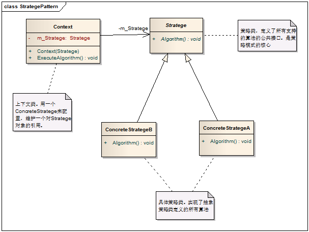
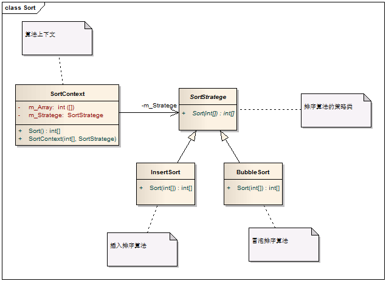

# Strategy Pattern - 策略模式

　　在讲策略模式之前，我先给大家举个日常生活中的例子，从首都国际机场到XXX酒店，怎么过去？1）酒店接机服务，直接开车来接。2）打车过去。3)机场快轨+地铁 4）机场巴士 5）公交车 6）走路过去(不跑累死的话） 等等。使用方法，我们都可以达到从机场到XXX酒店的目的，对吧。那么我所列出的从机场到XXX酒店的的方法，就是我们可以选择的策略。

　　再举个例子，就是我们使用WCF时，往往避免不了对它进行扩展，例如授权，我们可以通过自定义授权来扩展WCF。这里我们可以通过自定义AuthorizationPolicy和ServiceAuthorizationManager来实现对它的扩展，这是策略模式的一个真实应用。

#### 1. 概述

　　它定义了算法家族，分别封装起来，让它们之间可以互相替换，此模式让算法的变化不会影响到使用算法的客户端。

#### 2. 模式中的角色

　　2.1 策略类（Stratege）：定义所有支持的算法的公共接口。

　　2.2 具体策略类（Concrete Stratege）：封装了具体的算法或行为，继承于Stratege类。

　　2.3 上下文类（Context）：用一个ConcreteStratege来配置，维护一个对Stratege对象的引用。

　　对比开篇例子分析一下这个模式中的角色：

　　在从机场到XXX酒店的这个例子中，策略类中必然要包括GoToHotel这个方法。而具体策略类应该实现或继承策略类，它的实现就不用说了。上下文类，这个类很重要，也很有意思，因为它需要去选择使用哪个策略，例如这个上下我是我，我要从机场到XXX酒店，1）我根本不差钱，酒店也提供接机服务，那我必然选择酒店接机呀；2）如果酒店不提供接机我就选择打的。3）如果我囊中羞涩，就可以选择公共交通。4）如果我现在钱都花完了，连吃饭的钱都没有了，那么我只能选择走路过去了，没准半道上还得讨饭呢！

#### 3. 模式解读

　　3.1 策略模式的一般化类图



　　3.2 策略模式的代码实现

```c
    /// <summary>
    /// 策略类，定义了所有支持的算法的公共接口
    /// </summary>
    public abstract class Stratege
    {
        /// <summary>
        /// 策略类中支持的算法，当然还可以有更多，这里只定义了一个。
        /// </summary>
        public abstract void Algorithm();
    }

    /// <summary>
    /// 具体策略 A，实现了一种具体算法
    /// </summary>
    public class ConcreteStrategeA : Stratege
    {

        /// <summary>
        /// 具体算法
        /// </summary>
        public override void Algorithm()
        {
            // 策略A中实现的算法
        }
    }
    /// <summary>
    /// 具体策略 B，实现了一种具体算法
    /// </summary>
    public class ConcreteStrategeB : Stratege
    {

        /// <summary>
        /// 具体算法
        /// </summary>
        public override void Algorithm()
        {
            // 策略B中实现的算法
        }
    }


    /// <summary>
    /// Context 上下文，维护一个对Stratege对象的引用
    /// </summary>
    public class Context
    {
        private Stratege m_Stratege;

        /// <summary>
        /// 初始化上下文时，将具体策略传入
        /// </summary>
        /// <param name="stratege"></param>
        public Context(Stratege stratege)
        {
            m_Stratege = stratege;
        }

        /// <summary>
        /// 根据具体策略对象，调用其算法
        /// </summary>
        public void ExecuteAlgorithm()
        {
            m_Stratege.Algorithm();
        }
    }
```

#### 4. 模式总结

##### 　　4.1 优点

　　　　4.1.1 策略模式是一种定义一系列算法的方法，从概念上来看，所有算法完成的都是相同的工作，只是实现不同，它可以以相同的方式调用所有的算法，减少了各种算法类与使用算法类之间的耦合。

　　　　4.1.2 策略模式的Stratege类为Context定义了一系列的可供重用的算法或行为。继承有助于析取出这些算法的公共功能。

　　　　4.1.3 策略模式每个算法都有自己的类，可以通过自己的接口单独测试。因而简化了单元测试。

　　　　4.1.4 策略模式将具体算法或行为封装到Stratege类中，可以在使用这些类中消除条件分支（避免了不同行为堆砌到一个类中）。

##### 　　4.2 缺点

　　　　将选择具体策略的职责交给了客户端，并转给Context对象

##### 　　4.3 适用场景

　　　　4.3.1 当实现某个功能需要有不同算法要求时

　　　　4.3.2 不同时间应用不同的业务规则时

#### 5. 实例：
排序是我们经常接触到的算法，实现对一个数组的排序有很多方法，即可以采用不同的策略。下面给出了排序功能的策略模式的解决方案。

##### 　　5.1 实现类图



##### 　　5.2 代码实现

```c
    /// <summary>
    /// 排序算法策略
    /// </summary>
    public abstract class SortStratege
    {
        /// <summary>
        /// 排序
        /// </summary>
        /// <param name="array"></param>
        /// <returns></returns>
        public abstract int[] Sort(int[] array);
    }

    /// <summary>
    /// 冒泡排序
    /// </summary>
    public class BubbleSort : SortStratege
    {
        /// <summary>
        /// 冒泡排序算法(递增排序)
        /// </summary>
        /// <param name="array"></param>
        /// <returns></returns>
        public override int[] Sort(int[] array)
        {
            // 实现冒泡排序算法
            for (int i = 0; i < array.Length; i++)
            {
                for (int j = i + 1; j < array.Length; j++)
                {
                    if (array[i] > array[j])
                    {
                        int temp = array[j];
                        array[j] = array[i];
                        array[i] = temp;
                    }
                }
            }

            return array;
        }
    }

    /// <summary>
    /// 插入排序
    /// </summary>
    public class InsertSort : SortStratege
    {

        /// <summary>
        /// 插入排序算法(递增排序)
        /// </summary>
        /// <param name="array"></param>
        /// <returns></returns>
        public override int[] Sort(int[] array)
        {
            // 实现插入排序算法
            int temp;
            int i, j, n;
            n = array.Length;

            for (i = 1; i < n; i++)
            {
                temp = array[i];
                for (j = i; j > 0; j--)
                {
                    if (temp < array[j - 1])
                        array[j] = array[j - 1];
                    else
                        break;

                    array[j] = temp;
                }
            }
            return null;
        }
    }

    public class SortContext
    {
        private int[] m_Array;
        private SortStratege m_Stratege;

        /// <summary>
        /// 初始化时将要排序的数组和排序策略传入给Context
        /// </summary>
        /// <param name="array"></param>
        /// <param name="stratege"></param>
        public SortContext(int[] array, SortStratege stratege)
        {
            m_Array = array;
            m_Stratege = stratege;
        }

        /// <summary>
        /// 调用排序算法
        /// </summary>
        /// <returns></returns>
        public int[] Sort()
        {
            int[] result = m_Stratege.Sort(this.m_Array);

            return result;
        }
    }
```

##### 　　5.3 客户端代码

```c
    public class Program
    {
        public static void Main(Object[] args)
        {
            int[] array = new int[] { 12, 8, 9, 18, 22 };

            //使用冒泡排序算法进行排序
            SortStratege sortStratege = new BubbleSort();
            SortContext sorter = new SortContext(array, sortStratege);
            int[] result = sorter.Sort();

            //使用插入排序算法进行排序
            SortStratege sortStratege2 = new InsertSort();
            SortContext sorter2 = new SortContext(array, sortStratege2);
            int[] result2 = sorter.Sort();
        }
    }
```