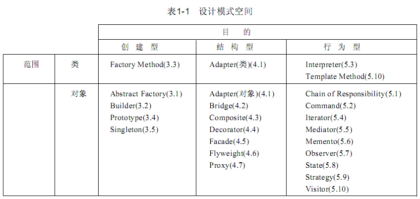
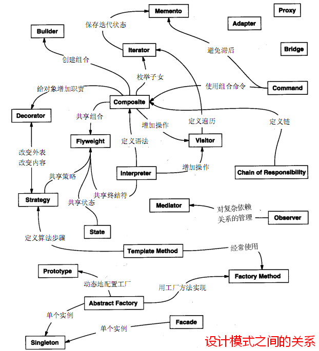
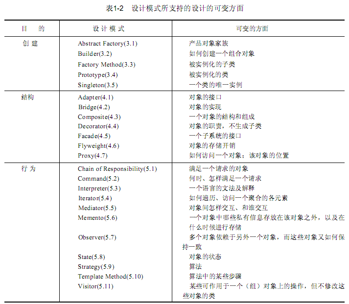

# Design Pattern Summary - 设计模式总结

#### 1. 面向对象的设计原则

##### 1.1 Open-Closed Principle - 开闭法则（OCP法则）

一个软件系统应当对扩展开放，对修改关闭

优点：

1)通过扩展已有软件系统，可以提供新的行为，以满足对软件的新的需求，使变化中的软件有一定的适应性和灵活性。

2)已有软件模块，特别是最重要的抽象层模块不能再修改，这使变化中的软件系统有一定的稳定性和延续性。

实现原则: 抽象，把抽象借口和实现分离。

##### 1.2 Liskov Substitution Principle - 里氏代换原则（LSP法则）

这是继承的特征，子类型(subtype)必须能够替换它们的基类型

##### 1.3 Dependence Inversion Principle - 依赖倒置原则（DIP法则）

原则表述：抽象不应当依赖于细节；细节应当依赖于抽象；要针对接口编程，不针对实现编程。具体讲就是：要依赖于抽象，不要依赖于具体。

实现原则：传递参数，或者在组合聚合关系中，尽量引用层次高的类。

##### 1.4 Interface Segregation Principle - 接口隔离原则（ISP原则）

原则：每一个接口应该是一种角色，不多不少，不干不该干的事，该干的事都要干。这类似编码原则中的最小权限法则。

##### 1.5 Composite/Aggregate Reuse Principle - 合成/聚合复用原则（CARP原则）

要尽量使用合成/聚合，尽量不要使用继承。这就是 有一个 和是一个的的問題

##### 1.6  Law of Demeter - 迪米特法则（LoD）又叫最少知识原则（Least Knowledge Principle或简写为LKP）

一个对象应当对其它对象有尽可能少的了解。其它表述： 这实际上就是设计高内聚低耦合的要求，有人形象地称谓“不要和陌生人讲话”

##### 1.7 Single Responsibility Principle - 单一职责原则（SRP原则）

就一个类而言，应该仅有一个引起它变化的原因

#### 2. 设计模式的3D原则

- 3D原则： Delegate, Divide, Delay

#### 3. 设计模式的分类

有两种分类模式，一是按照目的來分，分为创建型、结构型、行为型，二是按照范围来分，可分为类模式和对象模式。

#### 4. 设计模式之间的关系

