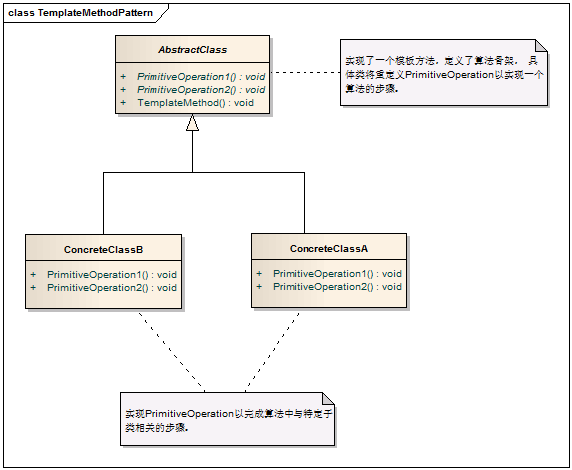
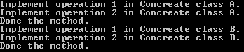
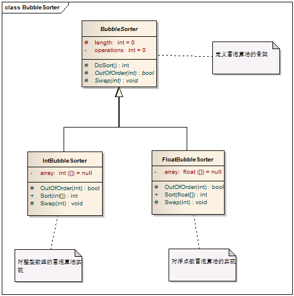
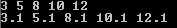

# Template Method Pattern - 模板方法模式

#### 1. 概述

　　定义一个操作中的算法的骨架，而将步骤延迟到子类中。模板方法使得子类可以不改变一个算法的结构即可重定义算法的某些特定步骤。

#### 2. 模式中的角色

　　2.1 抽象类（AbstractClass）：实现了模板方法，定义了算法的骨架。

　　2.2 具体类（ConcreteClass)：实现抽象类中的抽象方法，已完成完整的算法。

#### 3. 模式解读

##### 　　3.1 模板方法类图



##### 　　3.2 模板方法模式代码实现

```c
    /// <summary>
    /// 抽象类
    /// </summary>
    public abstract class AbstractClass
    {
        // 一些抽象行为，放到子类去实现
        public abstract void PrimitiveOperation1();
        public abstract void PrimitiveOperation2();

        /// <summary>
        /// 模板方法，给出了逻辑的骨架，而逻辑的组成是一些相应的抽象操作，它们推迟到子类去实现。
        /// </summary>
        public void TemplateMethod()
        {
            PrimitiveOperation1();
            PrimitiveOperation2();
            Console.WriteLine("Done the method.");
        }
    }

    /// <summary>
    /// 具体类，实现了抽象类中的特定步骤
    /// </summary>
    public class ConcreteClassA : AbstractClass
    {
        /// <summary>
        /// 与ConcreteClassB中的实现逻辑不同
        /// </summary>
        public override void PrimitiveOperation1()
        {
            Console.WriteLine("Implement operation 1 in Concreate class A.");
        }

        /// <summary>
        /// 与ConcreteClassB中的实现逻辑不同
        /// </summary>
        public override void PrimitiveOperation2()
        {
            Console.WriteLine("Implement operation 2 in Concreate class A.");
        }
    }

    /// <summary>
    /// 具体类，实现了抽象类中的特定步骤
    /// </summary>
    public class ConcreteClassB : AbstractClass
    {
        /// <summary>
        /// 与ConcreteClassA中的实现逻辑不同
        /// </summary>
        public override void PrimitiveOperation1()
        {
            Console.WriteLine("Implement operation 1 in Concreate class B.");
        }

        /// <summary>
        /// 与ConcreteClassA中的实现逻辑不同
        /// </summary>
        public override void PrimitiveOperation2()
        {
            Console.WriteLine("Implement operation 2 in Concreate class B.");
        }
    }
```
##### 　　3.3 客户端代码

```c
    class Program
    {
        static void Main(string[] args)
        {
            // 声明抽象类
            AbstractClass c;

            // 用ConcreteClassA实例化c
            c = new ConcreteClassA();
            c.TemplateMethod();

            // 用ConcreteClassB实例化c
            c = new ConcreteClassB();
            c.TemplateMethod();

            Console.Read();
        }
    }
```
　　运行结果



#### 5. 模式总结

##### 　　5.1 优点

　　　　5.1.1 模板方法模式通过把不变的行为搬移到超类，去除了子类中的重复代码。

　　　　5.1.2 子类实现算法的某些细节，有助于算法的扩展。

　　　　5.1.3 通过一个父类调用子类实现的操作，通过子类扩展增加新的行为，符合“开放-封闭原则”。

##### 　　5.2 缺点

　　　　5.2.1 每个不同的实现都需要定义一个子类，这会导致类的个数的增加，设计更加抽象。

##### 　　5.3 适用场景

　　　　5.1 在某些类的算法中，用了相同的方法，造成代码的重复。

　　　　5.2 控制子类扩展，子类必须遵守算法规则。

#### 6. 模式举例

　　用冒泡算法非别对整型数组、浮点数数组、日期数组实现排序。

##### 　　6.1 实现类图



##### 　　6.2 实现代码

```c
    /// <summary>
    /// 抽象类，定义冒泡排序的骨架
    /// </summary>
    public abstract class BubbleSorter
    {
        private int operations = 0;
        protected int length = 0;

        /// <summary>
        /// 冒泡排序算法
        /// </summary>
        /// <returns></returns>
        protected int DoSort()
        {
            operations = 0;
            if (length <= 1)
            {
                return operations;
            }

            for (int nextToLast = length - 2; nextToLast >= 0; nextToLast--)
            {
                for (int index = 0; index <= nextToLast; index++)
                {
                    if (OutOfOrder(index))
                    {
                        Swap(index);
                    }

                    operations++;
                }
            }

            return operations;
        }

        /// <summary>
        /// 留给子类实现的交换位置方法
        /// </summary>
        /// <param name="index"></param>
        protected abstract void Swap(int index);
        /// <summary>
        /// 留给子类实现的比较方法
        /// </summary>
        /// <param name="index"></param>
        /// <returns></returns>
        protected abstract bool OutOfOrder(int index);
    }

    /// <summary>
    /// 整型类型的冒泡算法实现
    /// </summary>
    public class IntBubbleSorter:BubbleSorter
    {
        private int[] array = null;

        /// <summary>
        /// 用冒泡算法排序
        /// </summary>
        /// <param name="theArray"></param>
        /// <returns></returns>
        public int Sort(int[] theArray)
        {
            array = theArray;
            length = array.Length;
            // 调用冒泡算法
            return DoSort();
        }

        /// <summary>
        /// 实现冒泡算法中的交换操作
        /// </summary>
        /// <param name="index"></param>
        protected override void Swap(int index)
        {
            int temp = array[index];
            array[index] = array[index + 1];
            array[index + 1] = temp;
        }

        /// <summary>
        /// 实现冒泡算法中的比较操作
        /// </summary>
        /// <param name="index"></param>
        /// <returns></returns>
        protected override bool OutOfOrder(int index)
        {
            return (array[index] > array[index + 1]);
        }
    }

    /// <summary>
    /// 浮点数类型的冒泡算法
    /// </summary>
    public class FloatBubbleSorter:BubbleSorter
    {
        private float[] array = null;

        /// <summary>
        /// 用冒泡算法排序
        /// </summary>
        /// <param name="theArray"></param>
        /// <returns></returns>
        public int Sort(float[] theArray)
        {
            array = theArray;
            length = array.Length;
            // 调用冒泡算法
            return DoSort();
        }

        /// <summary>
        /// 实现冒泡算法中的交换操作
        /// </summary>
        /// <param name="index"></param>
        protected override void Swap(int index)
        {
            float temp = array[index];
            array[index] = array[index + 1];
            array[index + 1] = temp;
        }

        /// <summary>
        /// 实现冒泡算法中的比较操作
        /// </summary>
        /// <param name="index"></param>
        /// <returns></returns>
        protected override bool OutOfOrder(int index)
        {
            return (array[index] > array[index + 1]);
        }
    }
```
##### 　　6.3 客户端调用

```c
    class Program
    {
        static void Main(string[] args)
        {

            // 对整型数组排序
            int[] intArray = new int[]{5, 3, 12, 8, 10};
            BubbleSorter.IntBubbleSorter sorter = new BubbleSorter.IntBubbleSorter();
            sorter.Sort(intArray);
            foreach (int item in intArray)
            {
                Console.Write(item+" ");
            }

            Console.WriteLine("");

            // 对浮点数排序
            float[] floatArray = new float[] { 5.0f, 3.0f, 12.0f, 8.0f, 10.0f };
            BubbleSorter.FloatBubbleSorter floatSorter = new BubbleSorter.FloatBubbleSorter();
            floatSorter.Sort(floatArray);
            foreach (float item in floatArray)
            {
                Console.Write(item + " ");
            }

            Console.Read();
        }
    }
```
　　运行结果


