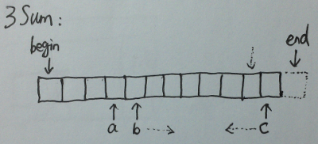

# 3Sum

Given an array S of n integers, are there elements a, b, c in S such that a + b + c = 0? Find all unique triplets in the array which gives the sum of zero.

Note:
Elements in a triplet (a,b,c) must be in non-descending order. (ie, a ≤ b ≤ c)
The solution set must not contain duplicate triplets.

    For example, given array S = {-1 0 1 2 -1 -4},

    A solution set is:
    (-1, 0, 1)
    (-1, -1, 2)

**Java:**
```java
public class Solution {
    public ArrayList<ArrayList<Integer>> threeSum(int[] num) {
        ArrayList<ArrayList<Integer>> result = new ArrayList<ArrayList<Integer>>();
        Arrays.sort(num);
        final int target = 0;

        for (int a = 0; a < num.length - 2; a++) {
            int b = a + 1;
            int c = num.length - 1;
            while (b < c) {
                if (num[a] + num[b] + num[c] < target) {
                    b++;
                } else if (num[a] + num[b] + num[c] > target) {
                    c--;
                } else {
                    ArrayList<Integer> tmp = new ArrayList<Integer>(Arrays.asList(num[a], num[b], num[c]));
                    if (result.indexOf(tmp) < 0) result.add(tmp);
                    b++;
                    c--;
                }
            }
        }
        return result;
    }
}
```

**C++:**



```c
class Solution {
public:
    vector<vector<int>> threeSum(vector<int> &num) {
        vector<vector<int>> result;
        if (num.size() < 3) return result;
        sort(num.begin(), num.end());
        const int target = 0;

        auto last = num.end();
        for (auto a = num.begin(); a < prev(last, 2); a++) {
            auto b = next(a);
            auto c = prev(last);
            while (b < c) {
                if (*a + *b + *c < target) {
                    b++;
                } else if (*a + *b + *c > target) {
                    c--;
                } else {
                    result.push_back({*a, *b, *c});
                    b++;
                    c--;
                }
            }
        }

        // remove duplicate triplets in result
        sort(result.begin(), result.end());
        result.erase(unique(result.begin(), result.end()), result.end());
        return result;
    }
};
```
