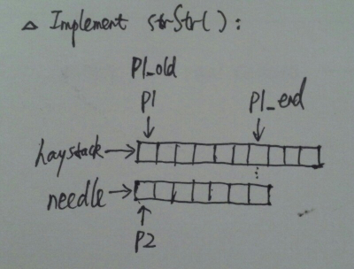

# Implement strStr()

Implement strStr().

Returns a pointer to the first occurrence of needle in haystack, or null if needle is not part of haystack.

**Java:**
```java
public class Solution {
    public String strStr(String haystack, String needle) {
        if (haystack == null || needle == null) return null;

        int index = haystack.indexOf(needle);
        if (index >= 0) return haystack.substring(index);
        else return null;
    }
}
```

**C++:**



```c++
class Solution {
public:
    char *strStr(char *haystack, char *needle) {
        assert(haystack != NULL && needle != NULL);
        if (!*needle) return haystack;

        char *p1, *p2;
        char *p1_end = haystack;
        char *p1_old;

        int n = (int)strlen(needle);
        for (int i = 1; i < n; i++) {
            if (!*p1_end++) return NULL;
        }

        for (p1 = haystack; *p1_end; p1_end++) {
            p1_old = p1;
            p2 = needle;
            while (*p1 && *p2 && *p1 == *p2) {
                p1++;
                p2++;
            }
            if (!*p2) return p1_old;
            p1 = p1_old + 1;
        }
        return NULL;
    }
};
```
