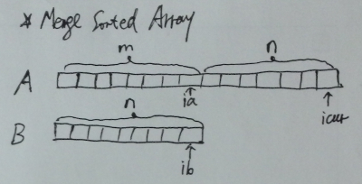

# Merge Sorted Array

Given two sorted integer arrays A and B, merge B into A as one sorted array.

Note:
You may assume that A has enough space (size that is greater or equal to m + n) to hold additional elements from B. The number of elements initialized in A and B are m and n respectively.

**Java:**
```java
public class Solution {
    public void merge(int[] nums1, int m, int[] nums2, int n) {
        int len = m + n;
        while (m >= 1 && n >= 1) nums1[--len] = nums1[m - 1] > nums2[n - 1] ? nums1[m-- - 1] : nums2[n-- - 1];
        while (n >= 1) nums1[--len] = nums2[n-- - 1];
    }
}
```

**C++:**



```c++
class Solution {
public:
    void merge(int A[], int m, int B[], int n) {
        int ia = m - 1;
        int ib = n - 1;
        int icur = m + n - 1;

        while (ia >= 0 && ib >= 0)
          A[icur--] = A[ia] > B[ib] ? A[ia--] : B[ib--];
        while (ib >= 0) A[icur--] = B[ib--];
    }
};
```
