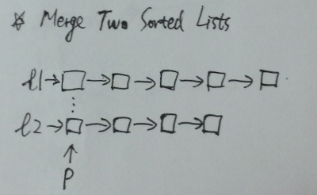

# Merge Two Sorted Lists

Merge two sorted linked lists and return it as a new list. The new list should be made by splicing together the nodes of the first two lists.

**Java:**
```java
/**
 * Definition for singly-linked list.
 * public class ListNode {
 *     int val;
 *     ListNode next;
 *     ListNode(int x) { val = x; }
 * }
 */
public class Solution {
    public ListNode mergeTwoLists(ListNode l1, ListNode l2) {
        ListNode dummy = new ListNode(-1);
        ListNode node = dummy;

        while (l1 != null && l2 != null) {
            if (l1.val < l2.val) {
                node.next = l1;
                l1 = l1.next;
            } else {
                node.next = l2;
                l2 = l2.next;
            }

            node = node.next;
        }

        if (l1 == null) node.next = l2;
        else if (l2 == null) node.next = l1;

        return dummy.next;
    }
}
```

**C++:**



```c++
/**
 * Definition for singly-linked list.
 * struct ListNode {
 *     int val;
 *     ListNode *next;
 *     ListNode(int x) : val(x), next(NULL) {}
 * };
 */
class Solution {
public:
    ListNode *mergeTwoLists(ListNode *l1, ListNode *l2) {
        if (l1 == nullptr) return l2;
        if (l2 == nullptr) return l1;

        ListNode dummy(-1);
        ListNode* p = &dummy;

        while (l1 != nullptr && l2 != nullptr) {
            if (l1->val > l2->val) {
                p->next = l2;
                l2 = l2->next;
            } else {
                p->next = l1;
                l1 = l1->next;
            }
            p = p->next;
        }

        if (l1 == nullptr) p->next = l2;
        else p->next = l1;

        return dummy.next;
    }
};
```
