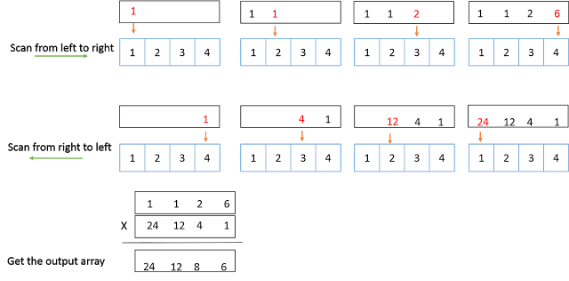

# Product of Array Except Self

Given an array of n integers where n > 1, nums, return an array output such that output[i] is equal to the product of all the elements of nums except nums[i].

Solve it without division and in O(n).

For example, given [1,2,3,4], return [24,12,8,6].

**Analysis:**

一般这种题都可以分解成若干子问题来解决。As defined, output[i] is equal to the product of all the elements of nums except nums[i].

简单的说
  - output[i] =  { i 前面的数的乘积}  X  { i 后面的数的乘积}

- 首先从前往后扫描数组一遍，对每一个i，得到{i 前面的数的乘积}(可以称做output_before)
- 然后在从后往前扫描数组一遍，获得 { i 后面的数的乘积}(可以称做output_after)。
- 将两数相乘即为所求。

举个例子(如下图)，nums = {1,2,3,4},
第一遍，从前往后扫描一遍，得到的output_before = {1, 1, 2, 6}.
从后往前扫描一遍，得到的output_after = {24, 12, 4, 1}.
那么  output [i] = output_before[i] * output_after[i],   output = {24, 12, 8, 6}



**Java:**
```java
public class Solution {
    public int[] productExceptSelf(int[] nums) {
        if (nums.length < 1) return nums;

        int[] products = new int[nums.length];
        int tmp = 1;
        products[0] = tmp;

        for (int i = 1; i < nums.length; i++) {
            tmp *= nums[i - 1];
            products[i] = tmp;
        }

        tmp = 1;
        for (int i = nums.length - 2; i >= 0; i--) {
            tmp *= nums[i + 1];
            products[i] *= tmp;
        }

        return products;
    }
}
```
