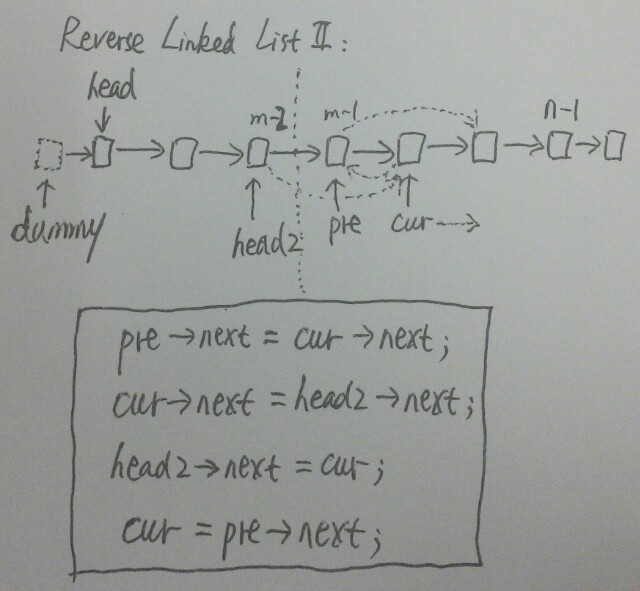

# Reverse Linked List II

Reverse a linked list from position m to n. Do it in-place and in one-pass.

For example:

    Given 1->2->3->4->5->NULL, m = 2 and n = 4,
    return 1->4->3->2->5->NULL.

Note:

    Given m, n satisfy the following condition:
    1 ≤ m ≤ n ≤ length of list.

**Java:**
```java
/**
 * Definition for singly-linked list.
 * public class ListNode {
 *     int val;
 *     ListNode next;
 *     ListNode(int x) { val = x; }
 * }
 */
public class Solution {
    public ListNode reverseBetween(ListNode head, int m, int n) {
        ListNode dummy = new ListNode(-1);
        dummy.next = head;

        // get reverse head
        ListNode preReverseHead = dummy;
        for (int i = 0; i < m - 1; i++) preReverseHead = preReverseHead.next;
        ListNode reverseHead = preReverseHead.next;
        ListNode reverseTail = reverseHead;

        // reverse from element m to n
        ListNode newReverseHead = null;
        for (int i = m; i <= n && reverseHead != null; i++) {
            ListNode next = reverseHead.next;
            reverseHead.next = newReverseHead;
            newReverseHead = reverseHead;
            reverseHead = next;
        }

        // connect reversed segment
        preReverseHead.next = newReverseHead;
        reverseTail.next = reverseHead;

        return dummy.next;
    }
}
```

**C++:**



```c++
/**
 * Definition for singly-linked list.
 * struct ListNode {
 *     int val;
 *     ListNode *next;
 *     ListNode(int x) : val(x), next(NULL) {}
 * };
 */
class Solution {
public:
    ListNode *reverseBetween(ListNode *head, int m, int n) {
        ListNode dummy(-1);
        dummy.next = head;

        ListNode* pre = &dummy;
        for (int i = 0; i < m - 1; i++)
            pre = pre->next;
        ListNode* const head2 = pre;

        pre = pre->next;
        ListNode* cur = pre->next;

        for (int i = m; i < n; i++) {
            pre->next = cur->next;
            cur->next = head2->next;
            head2->next = cur;
            cur = pre->next;
        }

        return dummy.next;
    }
};
```
