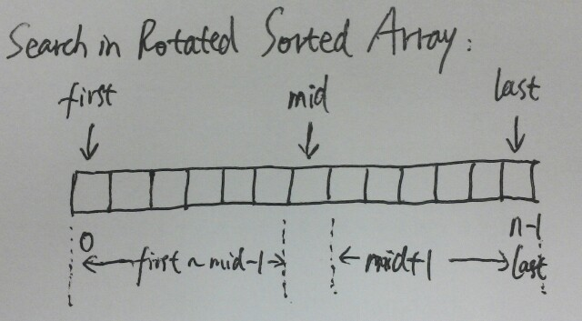

# Search in Rotated Sorted Array

Suppose a sorted array is rotated at some pivot unknown to you beforehand.

    (i.e., ==0 1 2 4 5 6 7== might become ==4 5 6 7 0 1 2==).

You are given a target value to search. If found in the array return its index, otherwise return -1.

You may assume no duplicate exists in the array.

**Java:**
```java

```

**C++:**



```c++
class Solution {
public:
    int search(int A[], int n, int target) {
        int first = 0;
        int last = n - 1;
        while (first <= last) {
            int mid = (first + last) / 2;
            if (A[mid] == target) return mid;

            if (A[first] <= A[mid]) {
                if (A[first] <= target && target <= A[mid])
                    last = mid - 1;
                else
                    first = mid + 1;
            } else {
                if (A[mid] <= target && target <= A[last])
                    first = mid + 1;
                else
                    last = mid - 1;
            }
        }
        return -1;
    }
};
```
