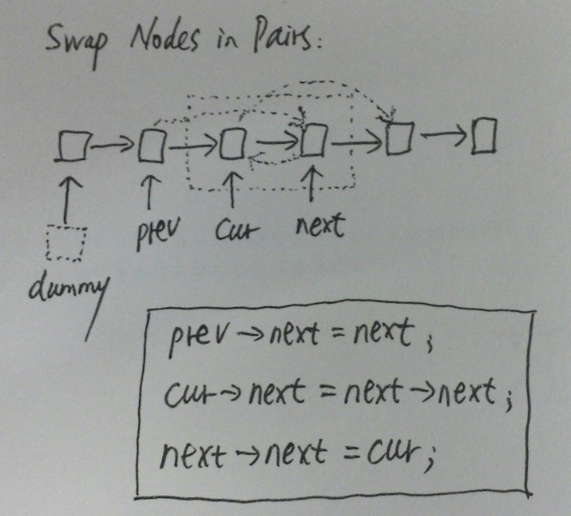

# Swap Nodes in Pairs

Given a linked list, swap every two adjacent nodes and return its head.

    For example,
    Given 1->2->3->4, you should return the list as 2->1->4->3.

Your algorithm should use only constant space. You may not modify the values in the list, only nodes itself can be changed.

**Java:**
```java

```

**C++:**



```c++
/**
 * Definition for singly-linked list.
 * struct ListNode {
 *     int val;
 *     ListNode *next;
 *     ListNode(int x) : val(x), next(NULL) {}
 * };
 */
class Solution {
public:
    ListNode *swapPairs(ListNode *head) {
        if (head == nullptr || head->next == nullptr) return head;
        ListNode dummy(-1);
        dummy.next = head;

        for (ListNode *prev = &dummy, *cur = prev->next, *next = cur->next;
             next;
             prev = cur, cur = cur->next, next = cur ? cur->next : nullptr)
        {
            prev->next = next;
            cur->next = next->next;
            next->next = cur;
        }

        return dummy.next;
    }
};
```
