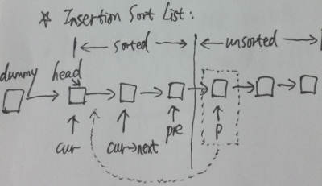

# Insertion Sort List

Sort a linked list using insertion sort.

**Java:**
```java

```

**C++:**



```c++
/**
 * Definition for singly-linked list.
 * struct ListNode {
 *     int val;
 *     ListNode *next;
 *     ListNode(int x) : val(x), next(NULL) {}
 * };
 */
class Solution {
public:
    ListNode *insertionSortList(ListNode *head) {
        if (!head) return NULL;

        ListNode dummy(INT_MIN);
        dummy.next = head;

        ListNode* p;
        ListNode* pre; // previous node of p

        for (p = head->next, pre = head; p; pre = p, p = p->next) {
            for (ListNode * cur = &dummy; cur->next != p; cur = cur->next) {
                if (cur->next->val > p->val) {
                    // insert between cur and cur->next
                    pre->next = p->next;
                    p->next = cur->next;
                    cur->next = p;
                    p = pre;
                    break;
                }
            }
        }

        return dummy.next;
    }
};
```
