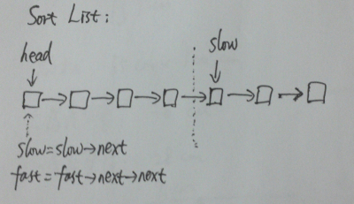

# Sort List

Sort a linked list in O(n log n) time using constant space complexity.

**Java:**
```java
/**
 * Definition for singly-linked list.
 * public class ListNode {
 *     int val;
 *     ListNode next;
 *     ListNode(int x) { val = x; }
 * }
 */
public class Solution {
    public ListNode sortList(ListNode head) {
        if (head == null || head.next == null) return head;

        // step 1. cut the list to two halves
        ListNode prev = null;
        ListNode slow = head;
        ListNode fast = head;

        while (fast != null && fast.next != null) {
            prev = slow;
            slow = slow.next;
            fast = fast.next.next;
        }
        prev.next = null;

        // step 2. sort each half
        ListNode l1 = sortList(head);
        ListNode l2 = sortList(slow);

        // step 3. merge l1 and l2
        return merge(l1, l2);
    }

    private ListNode merge(ListNode l1, ListNode l2) {
        ListNode l = new ListNode(-1);
        ListNode p = l;

        while (l1 != null && l2 != null) {
            if (l1.val < l2.val) {
                p.next = l1;
                l1 = l1.next;
            } else {
                p.next = l2;
                l2 = l2.next;
            }
            p = p.next;
        }

        if (l1 != null) p.next = l1;
        else if (l2 != null) p.next = l2;

        return l.next;
    }
}
```

**C++:**



```c++
/**
 * Definition for singly-linked list.
 * struct ListNode {
 *     int val;
 *     ListNode *next;
 *     ListNode(int x) : val(x), next(NULL) {}
 * };
 */
class Solution {
public:
    ListNode *sortList(ListNode *head) {
        if (head == NULL || head->next == NULL) return head;

        // find the middle node
        ListNode* slow = head;
        ListNode* fast = head;
        while (fast->next && fast->next->next) {
            slow = slow->next;
            fast = fast->next->next;
        }

        // split to two list
        fast = slow;
        slow = slow->next;
        fast->next = NULL;

        // sort two lists
        ListNode* l1 = sortList(head);
        ListNode* l2 = sortList(slow);

        return sortTwoSortedList(l1, l2);
    }

    ListNode *sortTwoSortedList(ListNode *l1, ListNode* l2) {
        if (l1 == NULL) return l2;
        if (l2 == NULL) return l1;

        ListNode dummy(-1);
        ListNode* p = &dummy;

        while (l1 != NULL && l2 != NULL) {
            if (l1->val > l2->val) {
                p->next = l2;
                l2 = l2->next;
            } else {
                p->next = l1;
                l1 = l1->next;
            }
            p = p->next;
        }

        if (l1 == NULL) p->next = l2;
        else p->next = l1;

        return dummy.next;
    }
};
```
