# Sorting Algorithms

## 1. Insertion Sort

#### Straight Insertion Sort
**直接插入排序 (Straight Insertion Sort) 的基本思想是**: 把数组 a[n] 中待排序的 n 个元素看成为一个有序表和一个无序表, 开始时有序表中只包含一个元素 a[0], 无序表中包含有 n-1 个元素 a[1]...a[n-1], 排序过程中每次从无序表中取出第一个元素, 把它插入到有序表中的适当位置, 使之成为新的有序表, 这样经过 n-1 次插入后, 无序表就变为空表, 有序表中就包含了全部 n 个元素, 至此排序完毕。 在有序表中寻找插入位置是采用从后向前的顺序查找的方法。

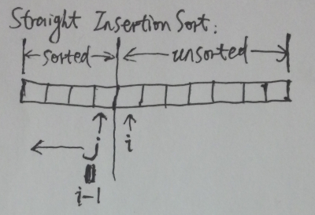
```c
void straight_insertion_sort(int a[], int n) {
    int tmp;
    int i, j;
    for (i = 1; i < n; i++) {
        tmp = a[i];
        for (j = i - 1; j >= 0 && tmp < a[j]; j--) {
            a[j + 1] = a[j];
        }
        a[j + 1] = tmp;
    }
}
```

#### Binary Insertion Sort
在查找插入位置时,若改为折半查找,就是**折半插入排序 (Binary Insertion Sort)**。

```c
void binary_insertion_sort(int a[], int n) {
    int tmp;
    int i, j, left, right, mid;
    for (i = 1; i < n; i++) {
        tmp = a[i];
        left = 0;
        right = i - 1;
        while (left <= right) {
            mid = (left + right) / 2;
            if (tmp < a[mid]) right = mid - 1;
            else left = mid + 1;
        }

        for (j = i - 1; j >= left; j--)
            a[j + 1] = a[j];

        a[left] = tmp;
    }
}
```

#### Shell Sort
**希尔排序 (Shell Sort) 的基本思想是**: 设待排序元素序列有 n 个元素, 首先取一个整数 gap = n / 3 + 1 作为间隔, 将全部元素分为 gap 个子序列, 所有距离为 gap 的元素放在同一个子序列中, 在每一个子序列中分别执行直接插入排序。 然后缩小间隔 gap, 取 gap = gap / 3 + 1， 重复上述的子序列划分和排序工作, 直到最后取 gap = 1, 将所有元素放在同一个序列中排序为止。

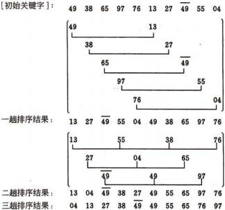
```c
void shell_sort(int a[], int n) {
    int tmp;
    int i, j;
    int gap = n;
    while (gap > 1) {
        gap = gap / 3 + 1;
        for (i = gap; i < n; i++) {
            tmp = a[i];
            for (j = i - gap; j >= 0 && tmp < a[j]; j -= gap)
                a[j + gap] = a[j];
            a[j + gap] = tmp;
        }
    }
}
```

## 2. Exchange Sort

#### Bubble Sort
**冒泡排序 (Bubble Sort) 的基本思想是**: 设待排序元素序列的元素个数为 n, 从后向前两两比较相邻元素的值, 如果发生逆序(即前一个比后一个大), 则交换它们, 直到序列比较完。我们称它为一趟冒泡, 结果是最小的元素交换到待排序序列的第一个位置, 其他元素也都向排序的最终位置移动。下一趟冒泡时前一趟确定的最小元素不参加比较, 待排序序列减少一个元素,下一趟冒泡的结果又把序列中最小的元素交换到待排序序列的第一个位置。这样最多做 n-1 趟冒泡就能把所有元素排好序。

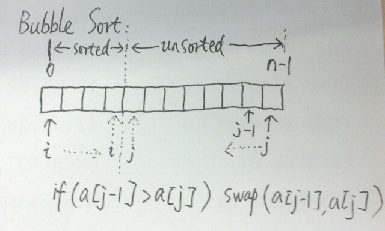
```c
void bubble_sort(int a[], int n) {
    int exchange;
    int tmp;
    int i, j;

    for (i = 0; i < n - 1; i++) {
        exchange = 0;
        for (j = n - 1; j > i; j--) {
            if (a[j - 1] > a[j]) {
                tmp = a[j - 1];
                a[j - 1] = a[j];
                a[j] = tmp;
                exchange = 1;
            }
        }
        if (exchange == 0) return;
    }
}
```

#### Quick Sort
**快速排序 (Quick Sort) 的基本思想是**： 任取待排序元素序列中的某个元素(例如取第一个元素)作为基准, 按照该元素的关键字大小, 将整个元素序列划分为左右两个子序列:左侧子序列中所有元素的关键字都小于基准元素的关键字, 右侧子序列中所有元素的关键字都大于或等于基准元素的关键字, 基准元素则排在这两个子序列中间(这也是该元素最终应该安放的位置)。然后分别对这两个子序列重复施行上述算法, 直到所有的元素都排在相应位置为止。整个快速排序的过程可递归。

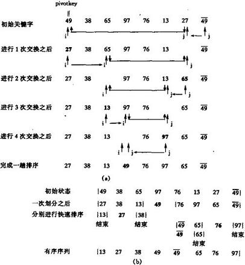
```c
void quick_sort(int a[], int start, int end) {
    if (start >= end - 1) return;

    int i = start;
    int j = end - 1;
    int pivot = a[i];

    while (i < j) {
        while (i < j && a[j] >= pivot) j--;
        a[i] = a[j];
        while (i < j && a[i] <= pivot) i++;
        a[j] = a[i];
    }
    a[i] = pivot;

    quick_sort(a, start, i - 1);
    quick_sort(a, i + 1; end);
}
```

## 3. Selection Sort

#### Straight Selection Sort
**直接选择排序 (Straight Selection Sort) 的基本思想是**： 把数组 a[n] 中待排序的 n 个元素看成为一个有序表和一个无序表, 开始时有序表中没有元素, 无序表中包含有 n 个元素 a[0]...a[n-1], 排序过程中每次从无序表中选出最小的一个元素, 把它插入到有序表中, 这样经过 n 次插入后, 无序表就变为空表, 有序表中就包含了全部 n 个元素, 至此排序完毕。

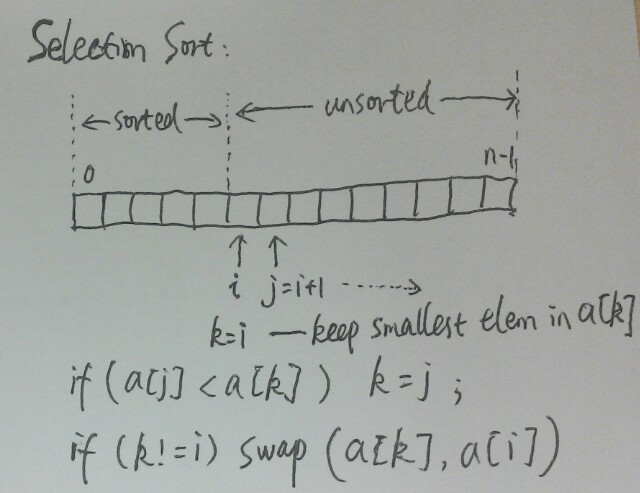
```c
void straight_selection_sort(int a[], int n) {
    int tmp;
    int i, j, k;

    for (i = 0; i < n; i++) {
        k = i;
        for (j = i + 1; j < n; j++)
            if (a[j] < a[k]) k = j;
        if (k != i) {
            tmp = a[i];
            a[i] = a[k];
            a[k] = tmp;
        }
    }
}
```

#### Heap Sort
**堆排序 (Heap Sort) 的基本思想是**： 利用堆（二叉堆）这种数据结构， 将要排序的序列建立为二叉堆， 每次将最后一个元素和堆顶元素互换， 并重新调整剩下的元素为二叉堆， 如此重复直到堆顶成为最后一个元素。

**堆的数组表示**
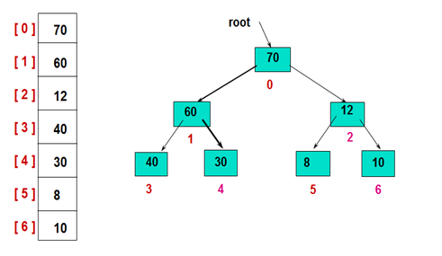

**建堆的过程**
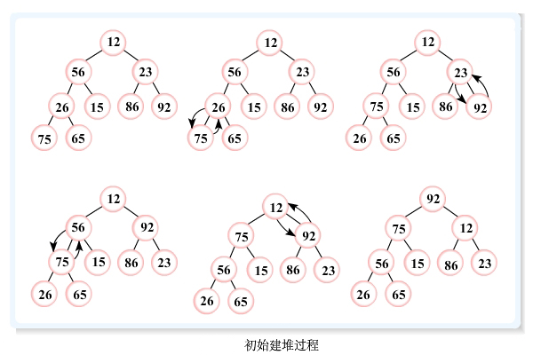

**堆排序的过程**
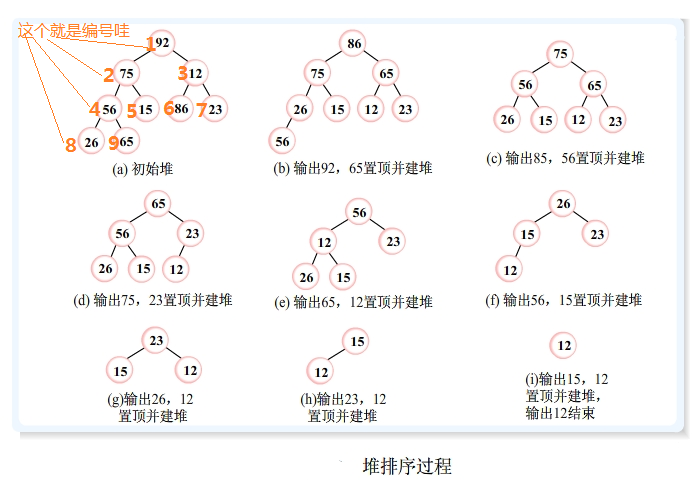
```c
void heap_sort(int a[], int n) {
    // set up max-heap, the max index of non-leaf node is n / 2
    for (int i = n / 2; i >= 0; i--) {
        heap_adjust(a, i, n);
    }

    for (int i = n - 1; i > 0; i--) {
        // swap heap top and the last emelemnt
        int temp = a[i];
        a[i] = a[0];
        a[0] = temp;

        // adjust the left elements to max-heap
        heap_adjust(a, 0, i - 1);
    }
}

// 已知a[start~end]中除了start之外均满足堆的定义
// 本函数进行调整，使a[start~end]成为一个大顶堆
void heap_adjust(int a[], int start, int end) {
    int temp = a[start];

    for (int i = 2 * start + 1; i <= end; i *= 2) {
        // 因为假设根结点的序号为0而不是1，所以i结点左孩子和右孩子分别为2i+1和2i+2
        if (i < end && a[i] < a[i + 1]) { // 左右孩子的比较
            ++i; // i为较大的记录的下标
        }

        if (temp > a[i]) break; // 左右孩子中获胜者与父亲的比较

        // 将孩子结点上位，则以孩子结点的位置进行下一轮的筛选
        a[start]= a[i];
        start = i;
    }

    a[start]= temp; // 插入最开始不和谐的元素
}
```

## 4. Merge Sort
所谓“归并”, 就是将两个或两个以上的有序序列合并成一个有序序列。我们先从最简单的**二路归并排序 (Merge sort)** 入手。**二路归并排序 (Merge Sort) 的基本思想是**：通过递归的方式每次都将待排序元素分成两个有序序列（当序列里只有一个元素时该序列变为有序序列），然后合并这两个有序序列为一个有序序列。

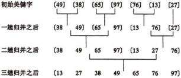
```c
bool merge_sort(int a[], int n) {
    int* pTmpArray = new int[n];
    if (pTmpArray == NULL) return false;
    do_merge_sort(a, pTmpArray, 0, n - 1);
    return true;
}

void do_merge_sort(int a[], int temp[], int start, int end) {
    if (start >= end - 1) return;
    int mid = (start + end) / 2;
    do_merge_sort(a, temp, start, mid);
    do_merge_sort(a, temp, mid, end);
    merge(a, temp, start, mid, end);
}

// merge a[start] ~ a[mid - 1] and a[mid] ~ a[end - 1]
void merge(int a[], int temp[], int start, int mid, int end) {
    int i, j, k;
    for (i = 0; i < end; i++) temp[i] = a[i];
    for(i = start, j = mid, k = start; i < mid && j < end; k++) {
        if (temp[i] < temp[j])
            a[k] = temp[i++];
        else
            a[k] = temp[j++];
    }

    while (i < mid) a[k++] = temp[i++];
    while (j < end) a[k++] = temp[j++];
}
```

## 5. Radix Sort
**基数排序 (Radix sort) 的基本思想是**： 将所有待比较数值(正整数)统一为同样的数位长度,数位较短的数前面补零。 然后, 从最低位开始, 依次进行一次排序。 这样从最低位排序一直到最高位排序完成以后, 数列就变成一个有序序列。

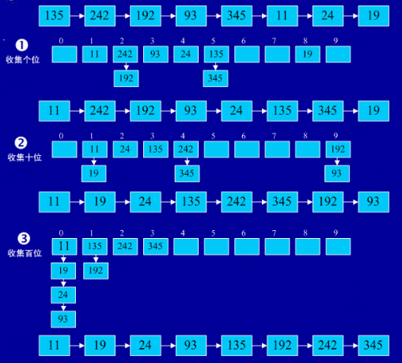
```c
void radix_sort(int a[], int size) {
    int d = max_bit(a, size);
    int i, j, k, range, radix;
    int *c, *b;

    range = 10; /* for counting sort, the range of every bit is 0 - 9 */
    radix = 1;
    c = (int *)malloc(sizeof(int) * range);
    b = (int *)malloc(sizeof(int) * size);

    for (i = 0; i < d; i++, radix *= 10) {
        /* use counting sort */
        /* clear count before every sort */
        for (j = 0; j < range; j++) {
            c[j] = 0;
        }

        /* c[k] content the num of elements which equal to k */
        for (j = 0; j < size; j++) {
            k = (a[j] / radix) % 10;
            c[k]++;
        }

        /* c[j] content the num of elements which equal or less than j */
        for (j = 1; j < range; j++) c[j] += c[j-1];

        /* put a[j] into the space of b[c[k] - 1] */
        for (j = size - 1; j >= 0; j--) {
            k = (a[j] / radix) % 10;
            b[c[k] - 1] = a[j];
            c[k]--;
        }

        /* copy the 'sorted' list to a[j] */
        for (j = 0; j < size; j++) a[j] = b[j];
    }
    free(c);
    free(b);
}

// get the max bit of number
int max_bit(int a[], int size) {
    int i, max, b;

    for (i = 1, max = a[0]; i < size; i++) {
        if (a[i] > max) {
            max = a[i];
        }
    }
    b = 1;
    while (max / 10) {
        b++;
        max /= 10;
    }
    return b;
}
```
## 6. Counting Sort
**计数排序 (Counting Sort) **是一个非基于比较的线性时间排序算法。它对输入的数据有附加的限制条件：

1、输入的线性表的元素属于有限偏序集S；
2、设输入的线性表的长度为n，|S|=k（表示集合S中元素的总数目为k），则k=O(n)。
在这两个条件下，计数排序的复杂性为O(n+k)。

计数排序算法的基本思想是对于给定的输入序列中的每一个元素x，确定该序列中值小于x的元素的个数。一旦有了这个信息，就可以将x直接存放到最终的输出序列的正确位置上。当然，如果有多个元素具有相同的值时，我们不能将这些元素放在输出序列的同一个位置上，因此，上述方案还要作适当的修改。

计数排序是稳定的排序算法。

```c
void counting_sort(int a[], int size) {
    int i, j, min, max, range;
    int *c, *b;

    min = max = a[0];
    for (i = 1; i < size; i++) { /* find the range of input list */
        if (a[i] < min) {
            min = a[i];
        } else if (a[i] > max) {
            max = a[i];
        }
    }
    range = max - min + 1;
    c = (int *)malloc(range * sizeof(int)); /* for temporary storage */
    b = (int *)malloc(size * sizeof(int)); /* for storage sorted list */

    for (i = 0; i < range; i++) {
        c[i] = 0;
    }

    /* c[i] include the num of elements which equal to i */
    for (j = 0; j < size; j++) {
        c[a[j] - min] += 1;
    }

    /* c[i] include the num of elements which less or equal than i */
    for (i = 1; i < range; i++) {
        c[i] += c[i-1];
    }

    for (j = size - 1; j >= 0; j--) {
        b[c[a[j] - min] - 1] = a[j];/* for c style */
        c[a[j] - min] -= 1;
    }

    /* input sorted list to array a. not necessary, we can return the address of array b */
    for (i = 0; i < size; i++) a[i] = b[i];
    free(b);
    free(c);
}
```

## 7. Bucket Sort
**桶排序 (Bucket sort)**或所谓的箱排序，是一个排序算法，工作的原理是将阵列分到有限数量的桶子里。每个桶子再个别排序（有可能再使用别的排序算法或是以递回方式继续使用桶排序进行排序）。桶排序是鸽巢排序的一种归纳结果。当要被排序的阵列内的数值是均匀分配的时候，桶排序使用线性时间（Θ（n））。但桶排序并不是 比较排序，他不受到 O(n log n) 下限的影响。
      例如要对大小为[1..1000]范围内的n个整数A[1..n]排序，可以把桶设为大小为10的范围，具体而言，设集合B[1]存储[1..10]的整数，集合B[2]存储(10..20]的整数，……集合B[i]存储((i-1)*10, i*10]的整数，i = 1,2,..100。总共有100个桶。然后对A[1..n]从头到尾扫描一遍，把每个A[i]放入对应的桶B[j]中。 然后再对这100个桶中每个桶里的数字排序，这时可用冒泡，选择，乃至快排，一般来说任何排序法都可以。最后依次输出每个桶里面的数字，且每个桶中的数字从小到大输出，这样就得到所有数字排好序的一个序列了。
      假设有n个数字，有m个桶，如果数字是平均分布的，则每个桶里面平均有n/m个数字。如果对每个桶中的数字采用快速排序，那么整个算法的复杂度是O(n+m*n/m*log(n/m))=O(n+nlogn-nlogm)
      从上式看出，当m接近n的时候，桶排序复杂度接近O(n)
      当然，以上复杂度的计算是基于输入的n个数字是平均分布这个假设的。这个假设是很强的，实际应用中效果并没有这么好。如果所有的数字都落在同一个桶中，那就退化成一般的排序了。

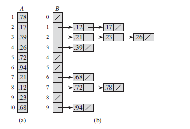

```c
extern void quick_sort(int a[], int p, int q); /* not necessary */

struct barrel {
    int node[10];
    int count; /* the num of node */
};

void bucket_sort(int data[], int size) {
    int max, min, num, pos;
    int i, j, k;
    struct barrel *pBarrel;

    max = min = data[0];
    for (i = 1; i < size; i++) {
        if (data[i] > max) {
            max = data[i];
        } else if (data[i] < min) {
            min = data[i];
        }
    }
    num = (max - min + 1) / 10 + 1;
    pBarrel = (struct barrel*)malloc(sizeof(struct barrel) * num);
    memset(pBarrel, 0, sizeof(struct barrel) * num);

    /* put data[i] into barrel which it belong to */
    for (i = 0; i < size; i++) {
        k = (data[i] - min + 1) / 10;/* calculate the index of data[i] in barrel */
        (pBarrel + k)->node[(pBarrel + k)->count] = data[i];
        (pBarrel + k)->count++;
    }

    pos = 0;
    for (i = 0; i < num; i++) {
        quick_sort((pBarrel+i)->node, 0, (pBarrel+i)->count);/* sort node in every barrel */

        for (j = 0; j < (pBarrel+i)->count; j++) {
            data[pos++] = (pBarrel+i)->node[j];
        }
    }
    free(pBarrel);
}
```

## 8. Summary

|排序算法|平均时间|最差时间|稳定度|额外空间|备注说明|
|------|------|------|------|------|------|
|直接插入排序|O(n^2^)|O(n^2^)|稳定|O(1)|n小时较好|
|折半插入排序|O(n^2^)|O(n^2^)|稳定|O(1)|n小时较好|
|希尔排序|N/A|N/A|不稳定|O(1)|n小时较好|
|冒泡排序|O(n^2^)|O(n^2^)|稳定|O(1)|n小时较好|
|快速排序|O(nlgn)|O(n^2^)|不稳定|O(lgn)|n大时较好|
|简单选择排序|O(n^2^)|O(n^2^)|不稳定|O(1)|n小时较好|
|堆排序|O(nlogn)|O(nlogn)|不稳定|O(1)|n大时较好|
|归并排序|O(nlgn)|O(nlogn)|稳定|O(n)|n大时较好|
|基数排序|O(n)|O(n)|稳定|O(n+k)|输入序列限制|
|计数排序|O(n)|O(n)|稳定|O(n+k)|输入序列限制|
|桶排序|O(n)|O(n)|稳定|O(n)|输入序列限制|

> 假设在数组中有两个元素 Ai , Aj , i < j,即 Ai 在 Aj 之前, 且 Ai = Aj , 如果在排序之后, Ai 仍然在 Aj 的前面, 则称这个排序算法是**稳定**的, 否则称这个排序算法是**不稳定**的。
